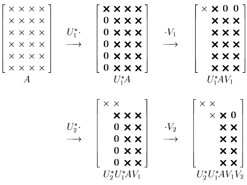

[Álgebra Linear Numérica](../../index.md) · [Calculando a SVD](../index.md)

<!-- wiki:original:inicio -->

# Bidiagonalização de Galub-Kahan

A ideia é aplicar matrizes unitárias distintas na esquerda de $A$ e na sua direita, e advinha que tipo de matrizes usamo? Exatamente: **Refletores de Householder**. A ideia é aplicar refletores a esquerda de $A$ para colocar zeros abaixo da diagonal principal e a direita para aplicar zeros após a diagonal superior de $A$:

*Figura 21. Bidiagonalização de Galub-Kahan exemplificada*

<!-- wiki:original:fim -->

## Percurso de estudo

[Trilha: A2](../../../../trilhas/algebra-linear-numerica/a2.md) · [Apresentação e contexto da fonte](../../../../trilhas/algebra-linear-numerica/a2.md#apresentacao-original)

- Anterior: [Divisão em duas fases](../divisao-em-duas-fases/index.md)
- Próximo: [Métodos de Bidiagonalização mais eficientes](../metodos-de-bidiagonalizacao-mais-eficientes/index.md)
