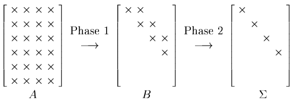

[Álgebra Linear Numérica](../../index.md) · [Calculando a SVD](../index.md)

<!-- wiki:original:inicio -->

# Divisão em duas fases

Porém, nós vimos algoritmos de autovalores para matrizes tridiagonais, e $H$ não é tridiagonal, como podemos ver. Então o que fazemos? Nós dividimos o processo de achar a SVD em duas etapas, uma de tridiagonalização (Ou bidiagonalização, como veremos), e uma de diagonalização (Achar os autovalores da matriz bidiagonalizada)

*Figura 20. As fases de um algoritmo de SVD*

<!-- wiki:original:fim -->

## Percurso de estudo

[Trilha: A2](../../../../trilhas/algebra-linear-numerica/a2.md) · [Apresentação e contexto da fonte](../../../../trilhas/algebra-linear-numerica/a2.md#apresentacao-original)

- Anterior: [Redução para um problema de Autovalores](../reducao-para-um-problema-de-autovalores/index.md)
- Próximo: [Bidiagonalização de Galub-Kahan](../bidiagonalizacao-de-galub-kahan/index.md)
