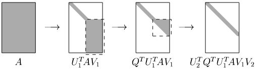

[Álgebra Linear Numérica](../../index.md) · [Calculando a SVD](../index.md)

<!-- wiki:original:inicio -->

# Métodos de Bidiagonalização mais eficientes

Um método mais rápido que podemos aplicar quando $m > n$ é a *Bidiagonalização de Lawson-Hanson-Chan*, que consiste em aplicar a bidiagonalização de Galub-Kahan em $R$ da fatoração QR de $A$. Pois assim reduzimos o problema para uma bidiagonalização numa matriz triangular, veja:

*Figura 22. Bidiagonalização LHC exemplificada*

Isso gera uma redução na quantidade de operações gastas para fazer o algoritmo. O problema é que, de acordo com o livro, isso só vale a pena quando $m > \frac{5}{3}n$. O interessante seria generalizar isso para o caso $m > n$. E isso é possível!

A ideia para essa generalização é não fazer a fatoração QR no inicio do algoritmo, mas em pontos adequados do algoritmo. Mas que pontos são esses? Conforme vamos fazendo a bidiagonalização, a proporção de $m$ e $n$ vai alterando a cada passo do algoritmo, como assim? Imagine que estamos aplicando o algoritmo numa matriz $10000 \times 30$, no segundo passo do algoritmo, perceba que vamos aplicar na matriz $9999 \times 29$, se fizermos a proporção de ambos: $$\begin{array}{r} \frac{10000}{30} \approx 333,33 \\ \frac{9999}{29} \approx 344,79 \\ \frac{9998}{28} \approx 357,07 \end{array}$$

Perceba que a proporção só aumenta pois eu estou sempre aplicando em matrizes com $m$ muito grande. O livro fala que o que fazemos é aplicar a fatoração QR no $k$-ésimo passo quando: $$\frac{m - k}{n - k} = 2$$ Veja a ilustração do processo:

*Figura 23. Aplicação da QR em pontos-chave da iteração*

<!-- wiki:original:fim -->

## Percurso de estudo

[Trilha: A2](../../../../trilhas/algebra-linear-numerica/a2.md) · [Apresentação e contexto da fonte](../../../../trilhas/algebra-linear-numerica/a2.md#apresentacao-original)

- Anterior: [Bidiagonalização de Galub-Kahan](../bidiagonalizacao-de-galub-kahan/index.md)
- Próximo: [Fase 2](../fase-2/index.md)
