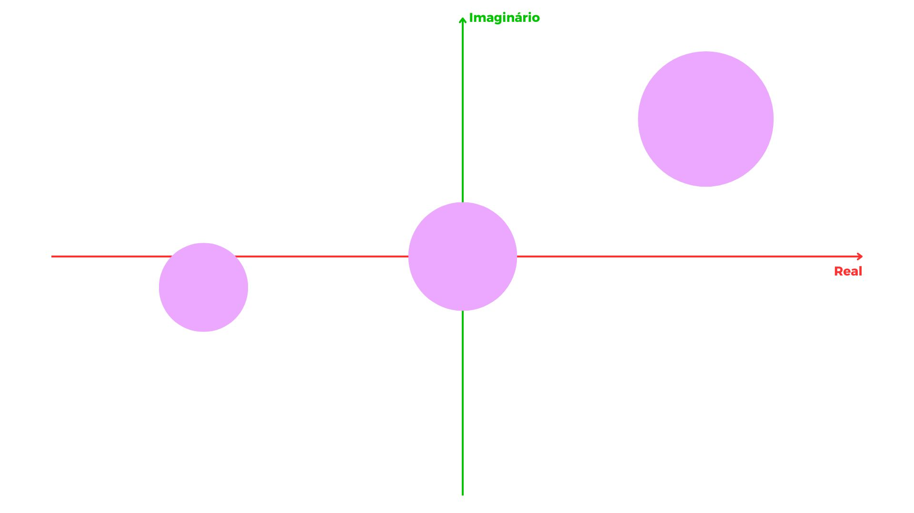

[Álgebra Linear Numérica](../index.md)

<!-- wiki:original:inicio -->

# Discos de Gershgorin

------------------------------------------------------------------------

Os Discos de Gershgorin é um método de estimar **onde** estão os autovalores de uma matriz complexa no plano de **Argand-Gauss** (Aquele plano que representa os complexos). Como assim? Vamos pegar uma matriz aleatória $A \in {\mathbb{C}}^{3 \times 3}$, eu sei que ela tem, no máximo, 3 autovalores. Aplicando o teorema dos discos (Vou explicar posteriormente como aplicar, vamos só entender a ideia) eu obtive o seguinte resultado:

*Figura 19. Ilustração dos Discos de Gershgorin de uma matriz $3 \times 3$*

Isso significa que os autovalores da minha matriz $A$ estão em **algum lugar** dentro desses círculos roxos. Mas qual é a utilidade disso? Na verdade é muito útil, pois nos dá uma noção de **shifts** para utilizarmos em algoritmos

**Teorema**

Os autovalores de uma matriz complexa $A = \left\lbrack a_{ij} \right\rbrack \in {\mathbb{C}}^{m \times m}$ estão contidos na união dos discos: $$\bigcup_{i = 1}^{m}\left\{ z \in {\mathbb{C}}:\vert z - a_{ii}\vert  \leq \sum_{j \neq i}\vert a_{ij}\vert  \right\}$$

**Demonstração**

Dada uma matriz $A \in {\mathbb{C}}^{m \times m}$ e um autovetor $v$ de $A$ tal que $Av = \lambda v$ e seja $v_{i}$ a entrada de maior magnitude de $v$, temos: $$\begin{array}{r} \sum_{j = 1}^{m}A_{ij}v_{j} = \lambda v_{i} \\ A_{ii}v_{i} + \sum_{j \neq i}^{m}A_{ij}v_{j} = \lambda v_{i} \\ \sum_{j \neq i}^{m}A_{ij}v_{j} = \lambda v_{i} - A_{ii}v_{i} \\ \frac{1}{v_{i}}\sum_{j \neq i}^{m}A_{ij}v_{j} = \lambda - A_{ii} \\ \vert \frac{1}{v_{i}}\sum_{j \neq i}^{m}A_{ij}v_{j}\vert  = \vert \lambda - A_{ii}\vert \end{array}$$

Por desigualdade triangular, reescrevemos como: $$\sum_{j \neq i}^{m}\vert A_{ij}\frac{v_{j}}{v_{i}}\vert  \geq \vert \lambda - A_{ii}\vert$$

Veja que, como $v_{i}$ é a entrada de maior magnitude de $v$, temos que $\vert \frac{v_{j}}{v_{i}}\vert  \leq 1$ $\forall j$. Isso quer dizer que: $$\sum_{j \neq i}^{m}\vert A_{ij}\frac{v_{j}}{v_{i}}\vert  \leq \sum_{j \neq i}^{m}\vert A_{ij}\vert$$

Ou seja, podemos reescrever como: $$\sum_{j \neq i}^{m}\vert A_{ij}\vert  \geq \vert \lambda - A_{ii}\vert$$

Isso quer dizer que o autovalor $\lambda$ está localizado dentro de um disco com centro $A_{ii}$ e raio $\sum_{j \neq i}^{m}\vert A_{ij}\vert$

------------------------------------------------------------------------

<!-- wiki:original:fim -->

## Percurso de estudo

[Trilha: A2](../../../trilhas/algebra-linear-numerica/a2.md) · [Apresentação e contexto da fonte](../../../trilhas/algebra-linear-numerica/a2.md#apresentacao-original)

- Anterior: [Estabilidade e Precisão](../algoritmo-qr-com-shifts/estabilidade-e-precisao/index.md)
- Próximo: [Outros algoritmos de Autovalores](../outros-algoritmos-de-autovalores/index.md)
