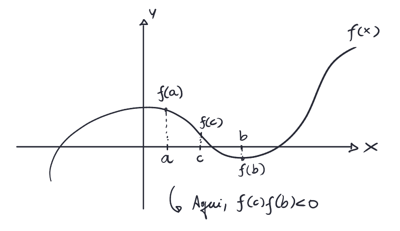
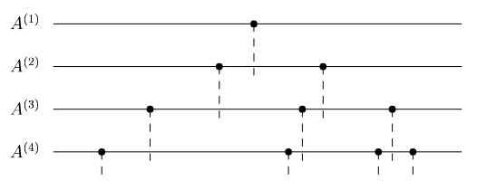

[Álgebra Linear Numérica](../../index.md) · [Outros algoritmos de Autovalores](../index.md)

<!-- wiki:original:inicio -->

# Bisection

Antes de tudo, vou explicar o que é o algoritmo de Bisection. Ele é um algoritmo pra estimar as raízes de uma função.

Temos uma função $f(x)$ e queremos estimar suas raízes. Então pegamos uma região $\lbrack a,b\rbrack$ de forma que $f(a) < 0$ e $f(b) > 0$ (Ou o contrário). Pelo TVI, isso significa que uma raíz $f(\delta) = 0$ é tal que $\delta \in \lbrack a,b\rbrack$. Pegamos então o ponto médio do intervalo $c = \frac{a + b}{2}$ e calculamos $f(c)$. Daí, fazemos a seguinte análise:

- Se $f(a)f(c) < 0$, então a raíz $\delta$ está a esquerda de $c$, então eu vou fazer o processo novamente no intervalo $\lbrack a,c\rbrack$. Se não, então a raíz não está no intervalo $\lbrack a,c\rbrack$

- Se $f(b)f(c) < 0$, então a raíz $\delta$ está a direita de $c$, então eu vou fazer o processo novamente no intervalo $\lbrack c,b\rbrack$. Se não, então a raíz não está no intervalo $\lbrack c,b\rbrack$

Essa é a ideia para achar os autovalores, aplicamos isso no polinômio característico. Ué, mas usar o polinômio não era uma ideia ruim de autovalor? Na real que a ideia ruim é achar a raíz do polinômio pelos seus **coeficientes**, isso sim é instável. No método de bisection a gente não precisa calcular isso.

Vamos definir algumas coisas antes de continuar com o algoritmo.

Chame de $A^{(j)}$ a submatriz principal de $A$ com tamanho $j \times j$ e tenha que $A \in {\mathbb{R}}^{m \times m}$ é tridiagonal, simétrica e não-redutível (0 fora da diagonal, com exceção das diagonais superior e inferior) $$A = \begin{pmatrix} a_{1} & b_{1} \\ b_{1} & a_{2} & b_{2} \\ & b_{2} & a_{3} & \ddots \\ & & \ddots & \ddots & b_{m - 1} \\ & & & b_{m - 1} & a_{m} \end{pmatrix}$$

Tenha também o seguinte teorema (É um exercício do livro)

**Teorema**

Se $A \in {\mathbb{C}}^{m \times m}$ é tridiagonal, hermitiana e as entradas acima e abaixo da diagonal são diferentes de 0, então os autovalores de $A$ são todos distintos

Esse ponto é muito importante. Por conta dele, podemos organizar os autovalores de $A^{(k)}$ como: $$\lambda_{1}^{(k)} < \lambda_{2}^{(k)} < \ldots < \lambda_{m}^{(k)}$$

Então é possível provar que $\lambda_{j}^{(k + 1)} < \lambda_{j}^{(k)} < \lambda_{j + 1}^{(k + 1)}$, veja a figura para ter uma noção visual:

Por conta disso eu consigo dizer quantos autovalores de uma matriz são positivos ou negativos, etc. Imagina a seguinte matriz:

$$\begin{pmatrix} 1 & 1 \\ 1 & 0 & 1 \\ & 1 & 2 & 1 \\ & & 1 & - 1 \end{pmatrix}$$

E vamos analisar a seguinte sequência (Lembre-se que $\det(A) = \prod_{i = 1}^{m}\lambda_{i}$):

- $\det(A^{(1)}) = 1 \Rightarrow$ 0 autovalores negativos

- $\det(A^{(2)}) = - 1 \Rightarrow$ 1 autovalor negativo

- $\det(A^{(3)}) = - 3 \Rightarrow$ 1 autovalor negativo

- $\det(A^{(4)}) = 4 \Rightarrow$ 2 autovalores negativos

**Definição: Sequência de Sturm**

A sequência de Sturm é definida por: $$1,\det(A^{(1)}),\det(A^{(2)}),\ldots,\det(A^{(m)})$$

É fácil notar que a quantidade de autovalores negativos de $A$ está ligado a quantas vezes o sinal do determinante muda na sequência de Sturm (de 0 e + para - ou de - para 0 ou +). Mas por que isso é interessante? Eu falei e falei mas não estou vendo muito a utilidade disso.

Por conta dessas estimações, conseguimos, por exemplo, saber quantos autovalores estão dentro de um intervalo $\lbrack a,b\rbrack$. Vamos fazer a inserção de um shift $xI$. Vamos calcular os autovalores de $A - xI$, mas por quê? Acontece que os autovalores de $A - xI$ são $\lambda - x$, ou seja, se eu pegar todos os valores de $\lambda - x < 0 \Leftrightarrow \lambda < x$, logo, eu consigo estimar a quantidade de autovalores de $A$ no intervalo $\lbrack - \infty,x\rbrack$

Também podemos fazer uma pequena troca e fazer um passo-a-passo mais conciso. Se vermos como $A$ é formada, temos que: $$\det(A^{(k)}) = a_{k}\det(A^{(k - 1)}) - b_{k - 1}^{2}\det(A^{(k - 2)})$$

Se trocarmos $\det(A^{(k)})$ por $\det(A^{(k)} - xI) = p^{(k)}(x)$ $$p^{(k)}(x) = \left( a_{k} - x \right)p^{(k - 1)}(x) - b_{k - 1}^{2}p^{(k - 2)}(x)$$

E se definirmos $p^{( - 1)}(x) = 0$ e $p^{(0)}(x) = 1$, conseguimos, uma fórmula de recorrência para $k = 1,2,\ldots,m$

<!-- wiki:original:fim -->

## Percurso de estudo

[Trilha: A2](../../../../trilhas/algebra-linear-numerica/a2.md) · [Apresentação e contexto da fonte](../../../../trilhas/algebra-linear-numerica/a2.md#apresentacao-original)

- Anterior: [Algoritmo de Jacobi](../algoritmo-de-jacobi/index.md)
- Próximo: [Dividir para Conquistar](../dividir-para-conquistar/index.md)
