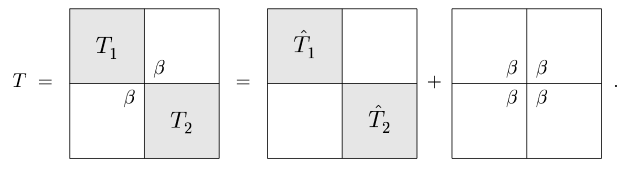

[Álgebra Linear Numérica](../../index.md) · [Outros algoritmos de Autovalores](../index.md)

<!-- wiki:original:inicio -->

# Dividir para Conquistar

Esse método consiste em pegar a matriz tridiagonal e subdividi-la em matrizes menores que são mais fáceis de se trabalhar. A ideia principal é a seguinte. Temos $T \in {\mathbb{R}}^{m \times m}$ com $m \geq 2$ simétrica, tridiagonal e irredutível (No sentido que os valores fora da diagonal são diferentes de 0). Então podemos dividir a matriz $T$ da seguinte forma:

Fazemos essa divisão em que $T_{1}$ é $n \times n$ e $T_{2}$ é $m - n \times m - n$. A diferença de $T_{1}$ para ${\hat{T}}_{1}$ é que o elemento $t_{nn}$ foi substituido por $t_{nn} - \beta$ e a diferença de $T_{2}$ para ${\hat{T}}_{2}$ é que o elemento $t_{n + 1n + 1}$ foi trocado por $t_{n + 1n + 1} - \beta$. Após fazer essa divisão, a gente vai subdividindo ${\hat{T}}_{j}$ da mesma forma que fizemos com $T$, de forma que no final vamos ter uma matriz $1 \times 1$ (A qual sabemos com certeza quem é o autovalor).

Beleza, mas como que isso vai me ajudar? É possível mostrar que, sabendo os autovalores de ${\hat{T}}_{j}$, conseguimos achar os autovalores de $T$. Mostrando isso, acaba que isso vira um caso de recursão, já que, ao acharmos o autovalor da matriz $1 \times 1$ (Trivial), vamos subindo até o caso $m \times m$ ($T$).

Vamos supor que conhecemos os autovalores de ${\hat{T}}_{j}$. Vamos então supor a seguinte diagonalização: $\hat{T} = Q_{j}D_{j}Q_{j}^{T}$. Podemos então fazer a seguinte transformação de similaridade: $$T = \begin{pmatrix} Q_{1} \\ & Q_{2} \end{pmatrix}\left( \begin{pmatrix} D_{1} \\ & D_{2} \end{pmatrix} + \beta zz^{T} \right)\begin{pmatrix} Q_{1}^{T} \\ & Q_{2}^{T} \end{pmatrix}$$

Onde $z^{T} = \begin{pmatrix} q_{1}^{T} & q_{2}^{T} \end{pmatrix}$, onde $q_{1}^{T}$ é a última linha de $Q_{1}$ e $q_{2}^{T}$ é a última linha de $Q_{2}$. O segundo termo do interior da matriz pode ser dificil de visualizar. O primeiro é bem intuitivo de que vai se transformar em $\begin{pmatrix} {\hat{T}}_{1} \\ & {\hat{T}}_{2} \end{pmatrix}$, mas o segundo não é tão intuitivo. Vou tentar explicar melhor.

Pelo que definimos antes, podemos visualizar $Q_{1}$ e $Q_{2}$ como $$Q_{1} = \begin{pmatrix} & \vdots \\ - & q_{1} & - \end{pmatrix}\text{  e  }Q_{2} = \begin{pmatrix} - & q_{2} & - \\ & \vdots \end{pmatrix}$$

Vamos ver o que acontece com a multiplicação: $$\begin{array}{r} \begin{pmatrix} Q_{1} \\ & Q_{2} \end{pmatrix}\beta\begin{pmatrix} q_{1} \\ q_{2} \end{pmatrix}\begin{pmatrix} q_{1}^{T} & q_{2}^{T} \end{pmatrix}\begin{pmatrix} Q_{1}^{T} \\ & Q_{2}^{T} \end{pmatrix} \\ \beta\begin{pmatrix} Q_{1}q_{1} \\ & Q_{2}q_{2} \end{pmatrix}\begin{pmatrix} q_{1}^{T}Q_{1}^{T} \\ & q_{2}^{T}Q_{2}^{T} \end{pmatrix} \\ \beta\begin{pmatrix} 0 \\ \vdots \\ 1 \\ 1 \\ \vdots \\ 0 \end{pmatrix}\begin{pmatrix} 0.\ldots & 1 & 1 & \ldots & 0 \end{pmatrix} \\ \begin{pmatrix} 0 \\ & \ddots \\ & & \beta & \beta \\ & & \beta & \beta \\ & & & & \ddots \\ & & & & & 0 \end{pmatrix} \end{array}$$

Que é justamente a matriz que tinhamos antes, então a fatoração está correta! Beleza, então eu só preciso achar os autovalores de $$\begin{pmatrix} D_{1} \\ & D_{2} \end{pmatrix} + \beta zz^{T}$$ já que ela é similar a $T$ ($\begin{pmatrix} Q_{1}^{T} \\ & Q_{2}^{T} \end{pmatrix}\begin{pmatrix} Q_{1} \\ & Q_{2} \end{pmatrix} = I$). Mas como que eu faço isso? Em vez de trabalhar com o caso especifico de $z$, vamos generalizar para qualquer vetor $w$.

**Teorema: Equação Secular**

Queremos achar os autovalores de $D + ww^{T}$ onde $D$ é uma matriz diagonal com entradas distintas ([\[tridiagonal-distinct-eigenvalues\]](../bisection/index.md#tridiagonal-distinct-eigenvalues)), então esses autovalores são as raízes da função $$f(\lambda) = 1 + \sum_{j = 1}^{m}\frac{w_{j}^{2}}{d_{j} - \lambda}$$ Onde $d_{j}$ são as entradas de $D$ e $w_{j}$ as entradas de $w$

**Demonstração**

Vamos supor que $q$ é um autovetor de $D + ww^{T}$, então temos: $$\begin{array}{r} \left( D + ww^{T} \right)q = \lambda q \\ Dq - \lambda q + ww^{T}q = 0 \\ (D - \lambda I)q + ww^{T}q = 0 \\ q + (D - \lambda I)^{- 1}ww^{T}q = 0 \\ w^{T}q + w^{T}(D - \lambda I)^{- 1}w\left( w^{T}q \right) = 0 \\ \left( 1 + w^{T}(D - \lambda I)^{- 1}w \right)\left( w^{T}q \right) = 0 \end{array}$$ Se abrirmos $1 + {w^{T(D - \lambda I)}}^{- 1}w$ na mão vamos obter $f(\lambda)$ que falei anteriormente, ou seja, a expressão total fica $f(\lambda)\left( w^{T}q \right) = 0$, porém, se $w^{T}q = 0$, então $q$ seria autovetor de $D$ (Só olhar a primeira equação), ou seja, $f(\lambda) = 0$

------------------------------------------------------------------------

<!-- wiki:original:fim -->

## Percurso de estudo

[Trilha: A2](../../../../trilhas/algebra-linear-numerica/a2.md) · [Apresentação e contexto da fonte](../../../../trilhas/algebra-linear-numerica/a2.md#apresentacao-original)

- Anterior: [Bisection](../bisection/index.md)
- Próximo: [Calculando a SVD](../../calculando-a-svd/index.md)
