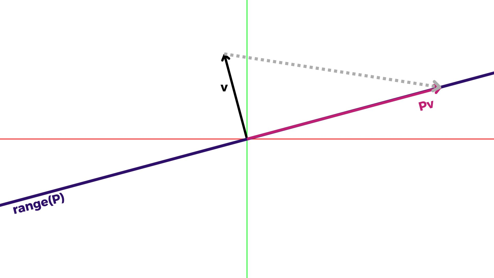

[Álgebra Linear Numérica](../index.md)

<!-- wiki:original:inicio -->

# Projetores

------------------------------------------------------------------------

$P \in {\mathbb{C}}^{m \times n}$ é dito um **Projetor** se

$$P^{2} = P$$

também chamado *idempotente*. Você pode se confundir pensando apenas em projeções ortogonais, aquelas em que pegamos o vetor e o projetamos de forma a formar um ângulo de 90 graus no espaço projetado! Mas estamos falando de **todas** as projeções, incluindo as não ortogonais.

Imagine que colocamos uma luz naquele vetor, ele lançará uma sombra em algum lugar, mas você concorda comigo que podemos obter essa sombra de alguma forma, certo? Vamos ver um exemplo em 2D:

Como você pode ver, o vetor tracejado indica a direção em que a luz está projetando a sombra de $v$ sobre $P$. Podemos expressar essa direção como $Pv - v$. É importante lembrar que, se você está deitado no chão, não terá uma sombra, certo? Ou melhor ainda, sombras não têm sombras! Traduzindo isso para o nosso contexto:

**Teorema**

Se $v \in C(P)$, então $Pv = v$

**Demonstração**

Todo $v \in C(P)$ pode ser expresso como $v = Px$ para algum $x$, isso significa $Pv = P^{2}x = Px = v$

Observe que, se aplicarmos a projeção na direção que tínhamos antes

$$P(Pv - v) = P^{2}v - Pv = Pv - Pv = 0$$

Isso significa que $Pv - v \in$ null$(P)$. Também observe que podemos reescrever a direção como

$$Pv - v = (P - I)v = - (I - P)v$$

Veja que coisa ainda mais estranha!

$$(I - P)^{2} = I - 2P + P^{2} = I - P$$

Isso significa que $I - P$ também é um projetor! Um projetor que projeta na direção da projeção de $P$.

<!-- wiki:original:fim -->

## Tópicos desta página

1. [Projetores complementares](projetores-complementares/index.md)
2. [Projetores ortogonais](projetores-ortogonais/index.md)
3. [Projeção ortogonal sobre um vetor](projecao-ortogonal-sobre-um-vetor/index.md)
4. [Projeção com base ortonormal](projecao-com-base-ortonormal/index.md)
5. [Projeção em base arbitrária](projecao-em-base-arbitraria/index.md)

## Percurso de estudo

[Trilha: A1](../../../trilhas/algebra-linear-numerica/a1.md) · [Apresentação e contexto da fonte](../../../trilhas/algebra-linear-numerica/a1.md#apresentacao-original)

- Anterior: [Propriedades de matrizes com SVD](../svd/propriedades-de-matrizes-com-svd/index.md)
- Próximo: [Projetores complementares](projetores-complementares/index.md)
