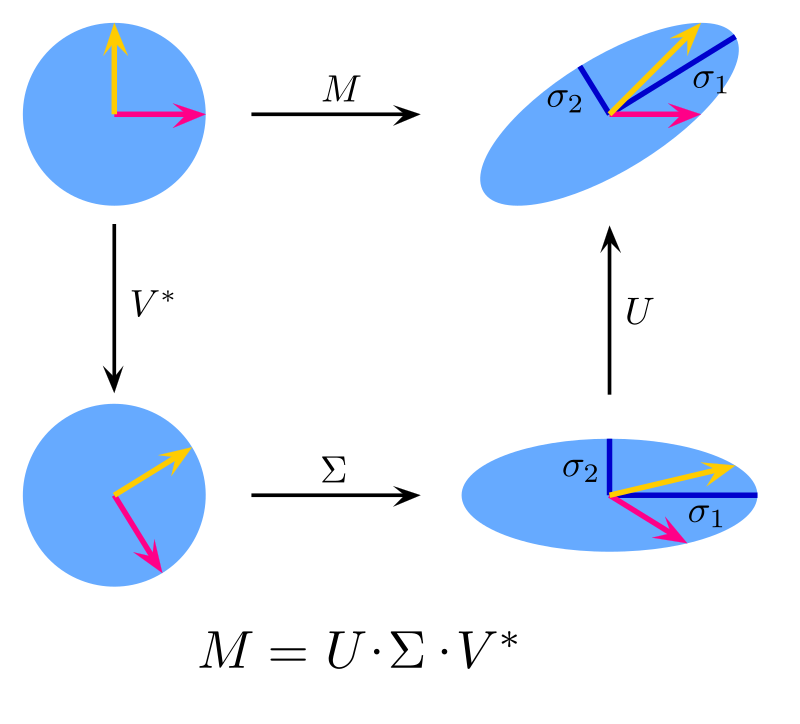

[Álgebra Linear Numérica](../index.md)

<!-- wiki:original:inicio -->

# SVD

------------------------------------------------------------------------

**Aviso rápido:** Quando começarmos a falar sobre a fatoração em si, vamos falar sobre matrizes em ${\mathbb{C}}^{m \times n}$ com $m \geq n$, porque é o mais comum quando falamos de problemas reais, raramente são situações com mais variáveis do que equações.

Aaaaaah, a SVD, por que ela existe? O que significa? Lembre-se que, em Álgebra Linear, quando temos uma base de um Espaço Vetorial e uma Transformação Linear, sabemos como a Transformação Linear afeta **cada** vetor naquele Espaço Vetorial? Não? Deixe-me refrescar sua memória:

**Teorema**

Dada $\left\{ a_{j} \right\}$ $(1 \leq j \leq n)$ sendo a base de um Espaço Vetorial e $T$ uma Transformação Linear nesse espaço, se sabemos como $T$ afeta os vetores da base, sabemos como $T$ afeta **cada** vetor nesse espaço.

**Demonstração**

Sendo $v$ um vetor no Espaço Vetorial descrito, sabemos que $v$ pode ser expresso como

$v = \alpha_{1}a_{1} + \ldots + \alpha_{n}a_{n}$

Aplicando $T$ em $v$

$T(v) = T\left( \alpha_{1}a_{1} + \ldots + \alpha_{n}a_{n} \right) \Rightarrow T(v) = \alpha_{1}T\left( a_{1} \right) + \ldots + \alpha_{n}T\left( a_{n} \right)$

Isso implica que, se conhecemos uma base do Espaço Vetorial e como $T$ a afeta, sabemos como $T$ afeta cada vetor no espaço.

CERTO! Memória refrescada, por que eu disse isso? Lembre-se que matrizes são transformações lineares? Então, se temos uma base $\left\{ s_{j} \right\}$ de um Espaço Vetorial $S$, podemos saber o que acontece com cada combinação linear de $\left\{ s_{j} \right\}$ se aplicarmos $A$ nela, certo? Certo!

Podemos resumir as operações que fazemos em vetores em duas: **esticar** e **rotacionar**, então, basicamente, quando aplicamos uma transformação linear em um vetor, estamos rotacionando-o e depois esticando-o.

Ok, mas por que estou dizendo isso? Onde diabos está a S.V.D? Bem, eu basicamente já descrevi a S.V.D para você! Quando aplicamos $A$ como uma transformação linear, se fizermos as operações descritas anteriormente, você concorda que podemos decompor $A$ como um produto de matrizes ortogonais e matrizes diagonais? O quê? Por quê? Quando? Espere, jovem Padawan! Lembre-se que eu disse que uma transformação linear pode ser resumida em esticar e rotacionar vetores? Você lembra que tipo de matrizes fazem EXATAMENTE o que eu disse? Sim, matrizes ortogonais fazem rotações e matrizes diagonais fazem alongamento.

Agora podemos introduzir aquela visualização clássica de como a S.V.D funciona, imagine uma base ortonormal em ${\mathbb{R}}^{2}$, veja o que acontece se aplicarmos $A$ nela:

 (Troque o M na imagem por A)

Com base nisso, podemos definir que, dada $A \in {\mathbb{C}}^{m \times n}$:

$Av_{j} = \sigma_{j}u_{j}$

Onde $v_{j}$ e $u_{j}$ são de duas bases ortonormais diferentes e $\sigma_{j} \in {\mathbb{C}}$.

<!-- wiki:original:fim -->

## Tópicos desta página

1. [Forma reduzida](forma-reduzida/index.md)
2. [SVD completa](svd-completa/index.md)
3. [Definição formal](definicao-formal/index.md)
4. [Mudança de base](mudanca-de-base/index.md)
5. [S.V.D vs Decomposição por Autovalores](s-v-d-vs-decomposicao-por-autovalores/index.md)
6. [Propriedades de matrizes com SVD](propriedades-de-matrizes-com-svd/index.md)

## Conteúdos relacionados

- [Principal Component Analysis — Aprendizado de Máquina](../../aprendizado-de-maquina/principal-component-analysis/index.md)

## Percurso de estudo

[Trilha: A1](../../../trilhas/algebra-linear-numerica/a1.md) · [Apresentação e contexto da fonte](../../../trilhas/algebra-linear-numerica/a1.md#apresentacao-original)

- Anterior: [Generalização das normas de matrizes](../normas/generalizacao-das-normas-de-matrizes/index.md)
- Próximo: [Forma reduzida](forma-reduzida/index.md)
