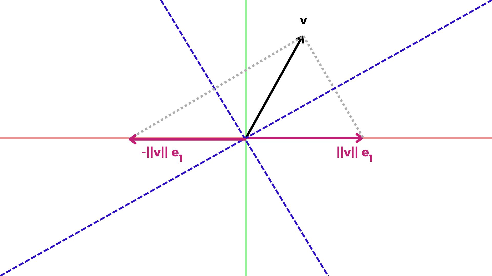

[Álgebra Linear Numérica](../../index.md) · [Triangularização de Householder](../index.md)

<!-- wiki:original:inicio -->

# O Melhor de Dois Refletores

Na verdade, podemos ter muitos refletores de Householder, por exemplo, no caso complexo, podemos projetar $v$ em qualquer vetor $z\| v\| e_{1}$ com $\vert z\vert  = 1$. No caso real, temos duas alternativas:

Então, o que devo escolher? Qual vetor é melhor para meu algoritmo? Todos serão a mesma coisa? Na verdade, há uma melhor opção que você pode escolher! Matematicamente, todos são a mesma coisa, mas para estabilidade numérica (insensibilidade a erros de arredondamento), escolheremos o $z\| v\| e_{1}$ que não está muito próximo de $v$, para alcançar isso, projetaremos em $- \text{sign}\left( v_{1} \right)\| v\| e_{1}$ onde $v_{1}$ é a primeira entrada de $v$, isso significa:

$$w = - \text{sign}\left( v_{1} \right)\| v\| e_{1} - v \vee w = \text{ sign}\left( v_{1} \right)\| v\| e_{1} + v$$

E podemos definir que:

$$\text{ sign}(0) = 1$$

Só para esclarecer por que fizemos essa escolha, imagine que o ângulo entre $v$ e $\| v\| e_{1}$ é MUITO PEQUENO, isso significa que, quando fazemos $\| v\| e_{1} - v$, estamos subtraindo quantidades próximas, dependendo de quais quantidades, isso poderia nos levar a cálculos imprecisos, levando a grandes erros

<!-- wiki:original:fim -->

## Percurso de estudo

[Trilha: A1](../../../../trilhas/algebra-linear-numerica/a1.md) · [Apresentação e contexto da fonte](../../../../trilhas/algebra-linear-numerica/a1.md#apresentacao-original)

- Anterior: [Refletores de Householder](../refletores-de-householder/index.md)
- Próximo: [O Algoritmo](../o-algoritmo/index.md)
