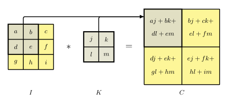

[Aprendizado de Máquina](../../index.md) · [Convolutional Neural Networks (CNN)](../index.md)

<!-- wiki:original:inicio -->

# Equivariância em Translação

Imagine que estamos tentando identificar um rosto em uma imagem, se o rosto estiver em uma posição diferente na imagem, a rede ainda deve ser capaz de reconhecê-lo. Nossa rede neural precisa ser capaz de capturar essa propriedade, mas como? Se um filtro é capaz de identificar uma borda em uma região da imagem, ele deve ser capaz de identificar a mesma borda em qualquer outra região da imagem. Isso significa que os filtros devem ser aplicados a toda a imagem, permitindo que a rede aprenda padrões invariantes à posição do objeto na imagem. Essa propriedade é chamada de **equivariância em translação**, e é uma das principais vantagens das CNNs em relação às redes neurais tradicionais.

**Definição: Feature Map/Convolução**

Para uma imagem $I$ com intensidades de pixel $I(j,k)$ e um filtro $K$ com valores $K(l,m)$, a feature map $C$ tem valores de ativação: $$C(j,k) = \sum_{l}\sum_{m}I(j + l,k + m)K(l,m)$$ é comum representar essa operação como $C = I \ast K$, onde $\ast$ denota a operação de convolução. A feature map é uma representação da imagem original, onde cada valor de ativação representa a presença de um padrão específico na região correspondente da imagem. Vale também ressaltar que essa operação, mesmo se chamando convolução, difere da convolução matemática tradicional.

Se $I \in {\mathbb{R}}^{H \times W}$ e $K \in {\mathbb{R}}^{h \times w}$, então $C \in {\mathbb{R}}^{(H - h + 1) \times (W - w + 1)}$

*Figura 5. Representação visual da operação de convolução, onde a feature map $C$ é obtida aplicando o filtro $K$ à imagem $I$*

<!-- wiki:original:fim -->

## Percurso de estudo

[Trilha: A2](../../../../trilhas/aprendizado-de-maquina/a2.md) · [Apresentação e contexto da fonte](../../../../trilhas/aprendizado-de-maquina/a2.md#apresentacao-original)

- Anterior: [Filtros](../filtros/index.md)
- Próximo: [Padding](../padding/index.md)
