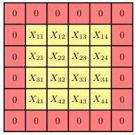

[Aprendizado de Máquina](../../index.md) · [Convolutional Neural Networks (CNN)](../index.md)

<!-- wiki:original:inicio -->

# Padding

Podemos ver da [\[convolution-representation\]](../equivariancia-em-translacao/index.md#convolution-representation) que a feature map $C$ é menor que a imagem original $I$. Isso ocorre porque a convolução é aplicada apenas às regiões da imagem onde o filtro pode ser completamente sobreposto. Para evitar essa redução de tamanho, podemos aplicar **padding** à imagem original, adicionando uma borda de zeros ao redor da imagem após uma normalização (Assim, o 0 representa o valor médio de pixel da imagem). Isso permite que o filtro seja aplicado a todas as regiões da imagem, incluindo as bordas, resultando em uma feature map do mesmo tamanho que a imagem original. Se minha imagem $I$ tem dimensões $H \times W$ e o filtro $K$ tem dimensões $M \times M$, então a feature map $C$ terá dimensões $(H - M + 1) \times (W - M + 1)$, se eu aplicar um padding de tamanho $P$, então a feature map $C$ terá dimensões $(H - M + 1 + 2P) \times (W - M + 1 + 2P)$. Isso se chama uma **padding válido**. Quando o padding é escolhido de forma que o tamanho da feature map seja o mesmo que o tamanho da imagem original, chamamos de **padding completo** ($P = (M - 1)/2$). O padding é uma técnica importante em CNNs, pois permite que a rede aprenda padrões em todas as regiões da imagem, incluindo as bordas.

*Figura 6. Padding de $1$ pixel aplicado à uma imagem $4 \times 4$, transformando ela em uma imagem $6 \times 6$ com uma borda de zeros ao redor da imagem original*

<!-- wiki:original:fim -->

## Percurso de estudo

[Trilha: A2](../../../../trilhas/aprendizado-de-maquina/a2.md) · [Apresentação e contexto da fonte](../../../../trilhas/aprendizado-de-maquina/a2.md#apresentacao-original)

- Anterior: [Equivariância em Translação](../equivariancia-em-translacao/index.md)
- Próximo: [Convoluções com Stride](../convolucoes-com-stride/index.md)
