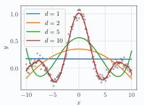

[Aprendizado de Máquina](../../index.md) · [Regressão Linear](../index.md)

<!-- wiki:original:inicio -->

# Modelo com expansão de base

O método de mínimos quadrados aplicado a modelos lineares é atraente por sua simplicidade e pelo fato de admitir uma solução ótima analítica. No entanto, a consideração que a relação entre as variáveis de entrada e de saída é linear pode não ser válida em diversos problemas. Um das formas de combinar a vantagem de termos uma solução ótima analítica com um modelo mais geral e flexível do que o linear é utilizar uma transformação não-linear das variáveis de entrada.

Nessa abordagem, de forma geral, o primeiro passo consiste em transformar as variáveis de entrada $x$ através de uma função $\Phi:{\mathbb{R}}^{D} \rightarrow {\mathbb{R}}^{M}$ , em que normalmente $M$ é maior que $D$. Em seguida, aplicamos um transformação linear sobre as variáveis transformadas para obtermos as predições $\hat{y}$ para as variáveis de saída $y$. Ou seja, considere as variáveis transformadas $z ≔ \Phi(x)$, o modelo preditivo é dado por: $$\hat{y} = \theta^{T}z = \theta^{T}\Phi(x)$$ onde o vetor $\theta \in {\mathbb{R}}^{M}$ denota os parâmetros do modelo

Note que o modelo é não linear com relação às entradas originais $x$, mas é linear no espaço das variáveis $z$. Quando a transformação $\Phi$ é fixa, sem parâmetros a serem aprendidos, o modelo é dito ser linear nos parâmetros. Nesses casos, a solução de mínimos quadrados é obtida simplesmente substituindo a matriz original de regressores $X$ por uma matriz $Z = \left\lbrack z_{1},\ldots,z_{N} \right\rbrack^{T}$ de entradas transformadas na equação [\[hat-theta-ls\]](../o-problema/index.md#hat-theta-ls): $${\hat{\theta}}_{\text{LS }} = \left( Z^{T}Z \right)^{- 1}Z^{T}y$$ A transformação $\Phi$ atua como um pré-processamento das entradas $x_{1},\ldots,x_{N}$ . A seguir, estudaremos algumas das escolhas mais comuns para $\Phi$

**Por que $M > D$?**: As variáveis de entrada $x$ representam atributos de um objeto sob o qual queremos realizar predições. Em geral quando aplicamos a transformação não-linear $\Phi$ queremos encontrar novos atributos $z$ que permitam ao modelo linear ser preciso. Dessa forma, é natural trabalharmos em espaços com dimensões maiores, aumentando a chance de encontrarmos atributos relevantes. Vale ressaltar que isso não constitui uma regra. Conforme veremos adiante, o aumento do valor M pode gerar problemas, especialmente quando temos poucas amostras proporcionalmente a $M$

## Polinômios

Funções de expansão de base podem ser utilizadas para construir modelos polinômiais. Para entradas e saídas escalares, podemos descrever um modelo de regressão polinomial de grau dois como: $$\hat{y} = \theta_{3} + \theta_{2}x + \theta_{1}x^{2} = \theta^{T}\Phi(x) = \theta^{T}z$$ onde $z = \Phi(x)$ é dado por: $$z = \Phi(x) = \begin{pmatrix} x^{2} \\ x \\ 1 \end{pmatrix}$$ O mesmo pode ser feito para entradas multivariadas (A função $\Phi$ fica um pouco mais complexa) e qualquer expansão de grau polinomial finito. Por exemplo, para entradas bidimensionais, obtemos um modelo de grau 2 se: $$\Phi(x) = \begin{pmatrix} x_{1}^{2} \\ x_{2}^{2} \\ x_{1}x_{2} \\ x_{1} \\ x_{2} \\ 1 \end{pmatrix}$$

**Exemplo: Regressão Polinomial em funções não-lineares**

Considere o problema de regressão univariada $(D = 1)$ em que as entradas pertencem ao intervalo $\lbrack - 10,10\rbrack$ e a função alvo é dada por $f(x) = \sin(x)/x$, também conhecida como função *sinc*. Além disso, utilizamos um conjunto de dados com $200$ pares de entrada-saída $\left( x_{i},y_{i} \right)$, em que as saídas estão corrompidas por um ruído aditivo gaussiano, ou seja, $y = f(x) + \varepsilon$ com $\varepsilon \sim N(0,0.05)$. Nesse exemplo, empregamos modelos polinomiais com grau $d \in \left\{ 1,2,5,10 \right\}$.

A Figura abaixxo mostra as predições obtidas com os diferentes modelos. Observe que, para $d = 1$, temos o modelo de regressão linear básico que estudamos anteriormente, e a aproximação consiste em uma reta. Note que, à medida que aumentamos o grau do polinômio, o modelo se torna mais flexível, conseguindo aproximar melhor os dados (represen- tados por pequenos círculos pretos), e portanto o melhor modelo possui $d = 10$ (curva em vermelho)

## Funções de base radiais

Vamos agora estudar um novo formato para a transformação $\Phi$. De forma simples, ele consiste em escolher $M$ pontos $c_{1},c_{2},\ldots,c_{M}$ do ${\mathbb{R}}^{D}$, também chamado de centros ou protótipos, e então criar o vetor de regressores $z = \Phi(x)$ combinando funções radiais em torno de cada um dos centros.

**Definição: Função radial no RR^D**

Dada uma métrica $\| \cdot \|$ no ${\mathbb{R}}^{D}$ e $c \in {\mathbb{R}}^{D}$, dizemos que $f_{c}:{\mathbb{R}}^{D} \rightarrow {\mathbb{R}}$ é radial se existe uma função $f:\lbrack 0,\infty) \rightarrow {\mathbb{R}}$ tal que $f_{c}(x) = f\left( \| x - c\| \right)$

Podemos então construir uma transformação $\Phi$ que utiliza $M$ funções radiais da forma: $$\Phi(x) = \begin{pmatrix} f_{c_{1}}(x) \\ f_{c_{2}}(x) \\ \vdots \\ f_{c_{M}}(x) \end{pmatrix} = \begin{pmatrix} f\left( \| x - c_{1}\| \right) \\ f\left( \| x - c_{2}\| \right) \\ \vdots \\ f\left( \| x - c_{M}\| \right) \end{pmatrix}$$

Quando as funções $f_{c_{1}}(x),...f_{c_{M}}(x)$ são linearmente independentes, e a matriz $$\begin{pmatrix} f_{c_{1}}\left( c_{1} \right) & f_{c_{2}}\left( c_{1} \right) & \ldots & f_{c_{M}}\left( c_{1} \right) \\ f_{c_{1}}\left( c_{2} \right) & f_{c_{2}}\left( c_{2} \right) & \ldots & f_{c_{M}}\left( c_{2} \right) \\ \vdots \\ f_{c_{1}}\left( c_{M} \right) & f_{c_{2}}\left( c_{M} \right) & \ldots & f_{c_{M}}\left( c_{M} \right) \end{pmatrix}$$ é não-singular, essas funções são chamadas de funções de base radiais (radial basis functions, RBFs). modelo de regressão linear com transformações através de funções de base radiais constitui uma classe de rede neurais chamada redes RBF [(Broomhead & Lowe, 1988)](https://sci2s.ugr.es/keel/pdf/algorithm/articulo/1988-Broomhead-CS.pdf)

A completa definição da transformação $\Phi$ envolve duas escolhas: a localização dos centros $c_{1},\ldots,c_{M}$ e a função de base radial.

**Escolhendo os centros**. Um das formas mais simples de escolher $M$ protótipos consiste em selecionar aleatoriamente entradas $x_{i}$ do próprio conjunto de dados. Nessa abordagem, o conjunto de centros é um subconjunto $\left\{ c_{1},...,c_{M} \right\} \subseteq \left\{ x_{1},...,x_{N} \right\}$ qualquer de tamanho $M$.

No entanto, a estratégia mais comum e que se tornou padrão consiste em selecionar centros de forma a capturar a densidade dos vetores de entrada. Para isso, normalmente empregamos métodos de análise de agrupamentos (clustering), tais como o k-médias (Lloyd, 1982). A discussão sobre o impacto da escolha dos centros está fora do escopo deste material

**Escolhendo a função de base radial**. Existem diversas escolhas possíveis para $f_{c_{i}}$ , algumas das mais notórias são:

1.  Gaussiana:

$$f_{c_{i}}(x) = e^{- \gamma\| x - c_{i}\|_{2}^{2}}$$ onde $\gamma > 0$ é uma constante;

2.  Multi-quadrática:

$$f_{c_{i}}(x) = \sqrt{1 + \varepsilon\| x - c_{i}\|_{2}^{2}}$$ onde $\varepsilon > 0$ é uma constante.

**Redes RBF e interpolação**: As redes RBF foram originalmente propostas para resolver problemas de interpolação: Dado um conjunto de $N$ pares entrada saída $\left( x_{i},y_{i} \right)$, queremos encontrar uma função $g$ tal que $$g\left( x_{i} \right) = y_{i},\text{\quad\quad}i = 1,...,N$$

Escolhendo $g$ tal que $g(x) = \theta^{T}\Phi(x) = \theta^{T}z$ com $N$ funções de base radiais e $c_{i} = x_{i}$ para todo $i = 1,\ldots,N$ , a matriz de regressores $Z:Z_{ij} = f_{c_{j}}\left( x_{i} \right)$ é quadrada e a condição de interpolação equivale ao sistema linear: $$Z\theta = y\text{ com }Z = \begin{pmatrix} f_{c_{1}}\left( x_{1} \right) & f_{c_{2}}\left( x_{1} \right) & \ldots & f_{c_{N}}\left( x_{1} \right) \\ f_{c_{1}}\left( x_{2} \right) & f_{c_{2}}\left( x_{2} \right) & \ldots & f_{c_{N}}\left( x_{2} \right) \\ \vdots \\ f_{c_{1}}\left( x_{N} \right) & f_{c_{2}}\left( x_{N} \right) & \ldots & f_{c_{N}}\left( x_{N} \right) \end{pmatrix}$$ Dessa forma, obtemos um interpolador com a rede RBF desde que a matriz $Z$ seja não-singular. Micchelli (1986) mostrou que matrizes $Z$ formadas usando tanto funções radiais gaussianas quanto multi-quadráticas são não-singulares (possuem inversa), e a única condição para isso é que os centros (ou equivalentemente as entradas) sejam distintos. Como consequência, no caso em que $M < N$ e os centros são um subconjunto das entradas, a matriz $Z^{T}Z$ utilizada na solução dos mínimos quadrados possui inversa.

**Exemplo: Redes RBF**

Este exemplo ilustra o impacto do número de funções de base na aproximação realizada por redes RBF com função radial Gaussiana. Para isso, vamos utilizar novamente o problema de regressão com função alvo *sinc*, com exatamente a mesma configuração descrita no último exemplo. Os centros das RBFs foram selecionados de forma igualmente espaçados no intervalo $\lbrack - 10,10\rbrack$.

A Figura abaixo (lado esquerdo) mostra a aproximação obtida usando uma rede RBF com $M \in \left\{ 5,20 \right\}$ e $\gamma = 1$. Note que o modelo com $k = 20$ aproxima melhor os dados. O aumento no número de funções de base aumenta a flexibilidade do modelo em se ajustar aos dados. Na Figura à direita, percebemos que o aumento no valor de $\gamma$ produz funções radiais com variância (ou largura de banda) pequena, resultando em um aspecto oscilatório da curva de aproximação

------------------------------------------------------------------------

<!-- wiki:original:fim -->

## Percurso de estudo

[Trilha: A1](../../../../trilhas/aprendizado-de-maquina/a1.md) · [Apresentação e contexto da fonte](../../../../trilhas/aprendizado-de-maquina/a1.md#apresentacao-original)

- Anterior: [Perspectiva Probabilística](../perspectiva-probabilistica/index.md)
- Próximo: [Regressão Logística](../../regressao-logistica/index.md)
