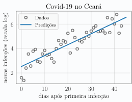

[Aprendizado de Máquina](../../index.md) · [Regressão Linear](../index.md)

<!-- wiki:original:inicio -->

# O Problema

Suponha que você recebe um conjunto de dados $D$ com $N$ pares ordenados $\left( x_{n},y_{n} \right)$, no qual $x_{n} \in {\mathbb{R}}^{D}$ são as entradas (ou variáveis independentes), e $y_{n} \in {\mathbb{R}}$ são amostras de uma variável de saída (ou variável dependente). Suponha ainda que cada variável de saída pode ser descrita aproximadamente como uma combinação afim do seu respectivo vetor de entradas, isto é: $$y_{n} = \sum_{j = 1}^{D}\theta_{j}x_{nj} + \theta_{0} + \varepsilon_{n} = \theta^{T}x_{n} + \varepsilon_{n}$$ onde $\varepsilon_{n} \in {\mathbb{R}}$ é uma variável que reflete o grau de incerteza na observação de $y_{n}$

**Nota**: A partir daqui, insermos um $1$ no vetor $x$ para representar o *bias*, então vamos redefinir $x_{n} ≔ \left( 1,x_{n1},\ldots,x_{nD} \right)^{T}$ e $\theta ≔ \left( \theta_{0},\theta_{1},\ldots,\theta_{D} \right)^{T}$, de modo que a expressão acima possa ser escrita de forma mais compacta como $y_{n} = \theta^{T}x_{n} + \varepsilon_{n}$.

Uma das maneiras mais comuns de obter uma estimativa $\hat{\theta}$ para $\theta$ é obter o aquele que minimiza a média (ou a soma) dos erros quadráticos entre as predições ${\hat{y}}_{n} ≔ {\hat{\theta}}^{T}x_{n}$ e as saídas observadas $y_{n}$: $${\hat{\theta}}_{\text{LS }} ≔ \text{ argmin}_{\theta \in {\mathbb{R}}^{D + 1}}\left\{ \mathcal{l}(\theta) ≔ \frac{1}{N}\sum_{n = 1}^{N}\left( y_{n} - \theta^{T}x_{n} \right)^{2} \right\}$$ Esse método de otimização é chamado de **mínimos quadrados ordinários** Podemos escrever a função de custo $\mathcal{l}$ de forma matricial como: $$\begin{aligned} \mathcal{l}(\theta) & = \frac{1}{N}\| y - X\theta\|_{2}^{2} \\ & = \frac{1}{N}(y - X\theta)^{T}(y - X\theta) \\ & = \frac{1}{N}\left( y^{T}y - 2\theta^{T}X^{T}y + \theta^{T}X^{T}X\theta \right) \end{aligned}$$

Note que, quando $X^{T}X$ é positiva definida, a função de custo $\mathcal{l}$ é estritamente convexa, o que garante a existência de um único mínimo global. Podemos encontrar uma solução analítica para ${\hat{\theta}}_{\text{LS}}$ derivando $\mathcal{l}$ e igualando a zero: $$\begin{aligned} \nabla_{\theta}\mathcal{l}(\theta) & = \frac{1}{N}\left( - 2X^{T}y + 2X^{T}X\theta \right) = 0 \\ & \Rightarrow {\hat{\theta}}_{\text{LS }} = \left( X^{T}X \right)^{- 1}X^{T}y \end{aligned}$$

**E se $X^{T}X$ não for positiva definida?**: Considere o caso em que $N > D$. Para que a inversa exista, precisamos que todas as colunas de $X$, nossas variáveis preditoras, sejam linarmente independentes. Caso contrário, não podemos calcular a inversa na Equação [\[hat-theta-ls\]](#hat-theta-ls). No entanto, essas variáveis não agregam nenhuma informação ao nosso modelo de regressão, e podemos pré-processar os dados de maneira a remover atributos redundantes. Uma outra alternativa, é substituir a inversa de $X^{T}X$ pela inversa de $X^{T}X + \alpha I$, para algum pequeno escalar $\alpha$ positivo. É possível provar que $X^{T}X + \alpha I$ sempre possui inversa (verifique!)

**Casos $N = D$ e $N < D$**: No caso em que o número de dados é igual ao número atributos ($N = D$), existe uma solução ótima única, com $\mathcal{l} = 0$, se a matriz $X$ possuir inversa. Nesses casos, a função linear resultante, com ${\hat{\theta}}_{\text{LS }} = X^{- 1}y$, intersecta todos as observações $D$.

Quando $N < D$, no caso mais geral, o problema admite infinitas soluções com $\mathcal{l} = 0$. Quando as linhas de $X$ são linearmente independentes — $\text{posto}(X) = N$ — uma opção comum é achar a solução que possui a menor norma L2, dada por ${\hat{\theta}}_{\text{MN }} = X^{T}\left( XX^{T} \right)^{- 1}y$

**Em bancos de dados massivos**: Quando $N$ é um grande número, armazenar a matriz $X$ nas camadas de memória mais velozes de um computador se torna impraticável e, portanto, calcular ${\hat{\theta}}_{\text{LS}}$ usando a Equação [\[hat-theta-ls\]](#hat-theta-ls) não é computacionalmente viável. Nesse caso, podemos utilizar SGD para minimizar $\mathcal{l}$. Para tal, note que pode-se escrever $\mathcal{l}(\theta) = \sum\mathcal{l}_{n}(\theta)$, no qual definimos $\mathcal{l}_{n}(\theta) ≔ \frac{1}{N}\left( y_{n} - \theta^{T}x_{n} \right)^{2}$

**Exemplo: Regressão Linear Simples**

No ano 2020, o mundo foi tomado por uma pandemia do vírus Sars-Cov-2, causando milhões de infeções e centenas de milhares de mortos. No dia 29 de abril, a infeção ainda não havia atingido seu estado crítico no Ceará.

Neste exemplo, utilizamos um modelo linear para descrever o logaritmo do número de novas infeções diárias no Ceará como uma função do número de dias que se passaram desde a data na qual o primeiro caso de infecção foi reportado. Uma das utilidades de um modelo como esse é produzir estimativas para o número de novos infectados nos próximos dias, o que pode auxiliar epidemiologistas e gestores públicos em seus processos de tomada de decisão.

Vale a pena ressaltar que em geral a dinâmica de contágios em uma epidemia possui um ponto de inflexão no qual número de novos casos começa a diminuir. Portanto, um modelo linear como esse não descreve todo o processo epidemiológico e seu uso deve ser validado por um especialista.

**Exemplo: Antiruido**

O método de mínimos quadrados pode ser utilizado para remoção de ruído (denoising). Suponha que você recebe um sinal digital ruidoso $s_{r}(t)$ em que $t$ denota um instante de tempo discreto e $t = 1,\ldots,T$. Estamos interessados em encontrar a versão não ruidosa $s(t)$ de $s_{r}(t)$.

Um sinal ruidoso $s_{r}(t)$ pode ser decrito como um sinal suave $s(t)$ adicionado de um ruído de alta frequência $r(t)$:

Queremos encontrar um sinal $s$ que seja:

- Similar ao sinal ruidoso

- Suave (a diferença entre os valores do sinal em instantes sucessivos seja pequena)

Com essas propriedades em mente, podemos propor uma função custo a se minimizar da forma: $$\min\limits_{s \in {\mathbb{R}}^{T}}\underset{\text{ similar ao sinal ruidoso}}{\underbrace{\| s - s_{r}\|^{2}}} + \underset{\text{ suavidade}}{\underbrace{\mu\sum_{t = 1}^{T - 1}\left( s(t + 1) - s(t) \right)^{2}}}$$ onde $s$ é a representação vetorial do sinal $s(t)$. O termo $\mu$ controla o peso que queremos dar a propriedade da suavidade. Essa função custo pode ser colocada na forma $\min\limits_{s}\| y - Xs\|^{2}$ escolhendo: $$X = \begin{pmatrix} I_{T \times T} \\ \sqrt{\mu}D_{T - 1 \times T} \end{pmatrix},D = \begin{pmatrix} - 1 & 1 & 0 & \ldots & 0 \\ 0 & - 1 & 1 & \ldots & 0 \\ \vdots & 0 & - 1 & 1 & 0 \\ 0 & 0 & \ldots & - 1 & 1 \end{pmatrix},y = \begin{pmatrix} s_{r} \\ 0 \\ 0 \\ \vdots \\ 0 \end{pmatrix} \in {\mathbb{R}}^{2T - 1}$$

Nesse formato, o valor ótimo $s^{\ast}$ para o sinal $s$ é obtido com a solução de mínimos quadrados $s^{\ast} = \left( X^{T}X \right)^{- 1}X^{T}y$. As figuras abaixo mostram a solução ótima para valores de $\mu \in \left\{ 0,100,20000 \right\}$. Para $\mu = 0$, a solução ótima é o próprio sinal ruidoso. Com $\mu = 20000$, o sinal fica muito suave, tendendo a um sinal constante. Finalmente, para $\mu = 100$, temos um sinal filtrado com eliminação da componente de ruído.

<!-- wiki:original:fim -->

## Percurso de estudo

[Trilha: A1](../../../../trilhas/aprendizado-de-maquina/a1.md) · [Apresentação e contexto da fonte](../../../../trilhas/aprendizado-de-maquina/a1.md#apresentacao-original)

- Anterior: [Regressão Linear](../index.md)
- Próximo: [Perspectiva Probabilística](../perspectiva-probabilistica/index.md)
