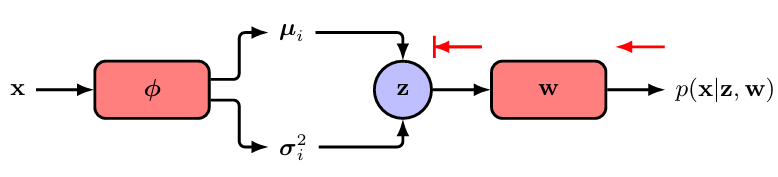

[Aprendizado de Máquina](../../index.md) · [Variational Autoencoders](../index.md)

<!-- wiki:original:inicio -->

# Autoencoders Variacionais

Agora chegamos na brincadeira de gente grande. Nós já vimos que, a função de verossimilhança de um modelo com variáveis latentes dada por: $$p\left( x\vert w \right) = \int p\left( x\vert z,w \right)p(z)dz$$ onde $p\left( x\vert z,w \right)$ é definida por uma rede neural profunda, é intratável pois a integral em $z$ não tem forma fechada. Os autoencoders variacionais (VAEs) resolvem esse problema utilizando uma aproximação variacional para a posteriori $p\left( z\vert x,w \right)$, que é definida por outra rede neural profunda. A ideia é otimizar os parâmetros do modelo para maximizar a verossimilhança dos dados, enquanto simultaneamente aproximamos a posteriori das variáveis latentes. Existem 3 conceitos-chave dentro dos VAEs:

1.  Utilizar o **ELBO** (Evidence Lower Bound) para aproximar a verossimilhança dos dados

2.  **Inferência Amortizada** onde um segundo modelo, a **rede encoder**, é usada para aproximar a distribuição posteriori das variáveis latentes no passo **E** em vez de calcular para cada ponto

3.  Fazer o treino da rede encoder tratável utilizando do **truque da reparametrização**

Considere um modelo generativo com distribuição $p\left( x\vert z,w \right)$ governado pela saída de uma rede $g(w,z)$ (Por exemplo, $g(w,z)$ retorna a média de uma distribuição gaussiana). Considere também $p(z) \sim N(0,I)$ sobre $z \in {\mathbb{R}}^{M}$

Lembrando do documento da A1, vimos que: $$\ln p\left( x\vert w \right) = \mathcal{L}(w) + \text{ KL}\left( q(z)\| p\left( z\vert x,w \right) \right)$$ onde $\mathcal{L}(w)$ é o ELBO e $q(z)$ é a distribuição aproximada das variáveis latentes e $\mathcal{L}(w)$ é dado por: $$\mathcal{L}(w) = \int q(z)\ln\frac{p\left( x\vert z,w \right)p(z)}{q(z)}dz$$ e $\text{KL}\left( p\| q \right)$ é definido como: $$\text{ KL}\left( p\| q \right) = \int p(z)\ln\frac{p(z)}{q(z)}dz$$

Pelo que tinhamos visto no primeiro documento, sabemos que $\ln p\left( x\vert w \right) \geq \mathcal{L}$ (Por isso o nome EVIDENCE **LOWER BOUND**). Mesmo que $\ln p\left( x\vert w \right)$ seja intratável, podemos aproximar ela utilizando de $\mathcal{L}$ aproximado por **monte carlo**.

Considere o conjunto de dados $x_{1},\ldots,x_{N}$. Temos então que $$\ln p\left( D\vert w \right) = \sum_{n = 1}^{N}\mathcal{L}_{n} + \sum_{n = 1}^{N}\text{ KL}\left( q_{n}\left( z_{n}\vert x_{n} \right)\| p\left( z_{n}\vert x_{n},w \right) \right)$$

onde $$\mathcal{L}_{n} = \int q_{n}\left( z_{n}\vert x_{n} \right)\ln\left\{ \frac{p\left( x_{n}\vert z_{n},w \right) \cdot p\left( z_{n} \right)}{q_{n}\left( z_{n}\vert x_{n} \right)} \right\} dz_{n}$$

Perceba que agora, cada $x_{n}$ tem sua variável latente, o que indica que cada variável $z_{n}$ tem sua distribuição $q_{n}\left( z_{n}\vert x_{n} \right)$. Como a equação [\[elbo-dataset-likelihood\]](#elbo-dataset-likelihood) é mantida independente da escolha de $q_{n}\left( z_{n}\vert x_{n} \right)$, podemos escolher $q_{n}\left( z_{n}\vert x_{n} \right)$ para cada ponto $x_{n}$ de forma à maximizar $\mathcal{L}_{n}$ ou, equivalentemente, minimizar $\text{KL}\left( q_{n}\left( z_{n}\vert x_{n} \right)\| p\left( z_{n}\vert x_{n},w \right) \right)$. EM GMMs, conseguimos achar $q_{n}\left( z_{n}\vert x_{n} \right)$ de forma exata ($q_{n}\left( z_{n}\vert x_{n} \right) = p\left( z_{n}\vert x_{n},w \right)$) $$p\left( z_{n}\vert x_{n},w \right) = \frac{p\left( x_{n}\vert z_{n},w \right)p\left( z_{n} \right)}{p\left( x_{n}\vert w \right)}$$

o numerador é trivial de calcular, mas o denominador é intratável. Então precisamos de um método diferente para aproximar $q_{n}\left( z_{n}\vert x_{n} \right)$.

## Inferência Amortizada

Nessa abordagem, nós treinamos **uma única** rede neural para aproximar todas as posterioris $p\left( z_{n}\vert x_{n},w \right)$, chamada de **Encoder Network**. Essa abordagem se chama **inferência amortizada** que requer um encoder que gera uma única distribuição $q\left( z\vert x,\varphi \right)$ condicionada em $x$, onde $\varphi$ são os parâmetros da rede neural. Nessa abordagem, a função-objetivo (dada pelo ELBO) depende tanto de $\varphi$ quanto de $w$, assim ela faz a otimização conjunta dos parâmetros com abordagens baseadas em gradiente.

*Figura 6. Arquitetura de um autoencoder variacional*

Um encoder variacional é então composto por duas redes, um **encoder** que mapeia do espaço dos dados para um espaço latente e um **decoder** que mapeia do espaço latente de volta para o espaço dos dados e ambas as redes são treinadas simultaneamente para maximizar o ELBO.

Certo, mas agora temos que decidir ao menos qual espaço latente nós gostariamos de mapear nossos dados pra termos uma base, correto? Sim! Uma escolha muito comum de se usar para o encoder é uma Gaussiana $N\left( \mu_{j},\sigma_{j}^{2}I \right)$ onde $\mu_{j}$ e $\sigma_{j}$ são outputs de uma rede neural $$q\left( z\vert x,\varphi \right) = \prod_{j = 1}^{M}N\left( z_{j}~\vert ~\mu_{j}(x,\varphi),\sigma_{j}^{2}(x,\varphi) \right)$$

## Truque da Reparametrização

Infelizmente, temos que o lower bound ainda é intratável $$\mathcal{L}_{n}(w,\varphi) = \int q\left( z_{n}\vert x_{n},\varphi \right)\ln\left\{ \frac{p\left( x_{n}\vert z_{n},w \right)p\left( z_{n} \right)}{q\left( z_{n}\vert x_{n},\varphi \right)} \right\} dz_{n}$$ porque envolve integrar sobre as variáveis latentes $\left\{ z \right\}$ e ele depende de forma complexa dos parâmetros da rede neural. Porém, podemos decompor essa integral em duas partes: $$\mathcal{L}_{n}(w,\varphi) = {\mathbb{E}}_{z_{n} \sim q}\left\lbrack \ln p\left( x_{n}\vert z_{n},w \right) \right\rbrack - \text{ KL}\left( q\left( z_{n}\vert x_{n},\varphi \right)\| p\left( z_{n} \right) \right)$$

Se nós escolhemos $q\left( z_{n}\vert x_{n},\varphi \right)$ como uma Gaussiana, e $p\left( z_{n} \right)$ também, então a divergência KL entre elas tem uma forma fechada, que é dada por: $$\text{ KL}\left( q\left( z_{n}\vert x_{n},\varphi \right)\| p\left( z_{n} \right) \right) = \frac{1}{2}\sum_{j = 1}^{M}\left\{ 1 + \ln\sigma_{j}^{2}\left( x_{n},\varphi \right) - \sigma_{j}^{2}\left( x_{n},\varphi \right) - \mu_{j}^{2}\left( x_{n},\varphi \right) \right\}$$ Já com relação à primeira parte, podemos tentar aproximar ela utilizando **monte carlo** $${\mathbb{E}}_{z_{n} \sim q}\left\lbrack \ln p\left( x_{n}\vert z_{n},w \right) \right\rbrack = \int q\left( z_{n}\vert x_{n},\varphi \right)\ln p\left( x_{n}\vert z_{n},w \right)dz_{n} \approx \frac{1}{L}\sum_{l = 1}^{L}\ln p\left( x_{n}\vert z_{n}^{(l)},w \right)$$ onde $\left\{ z_{n}^{(l)} \right\}$ são amostras de $q\left( z_{n}\vert x_{n},\varphi \right)$. Toda essa equação [\[elbo-decomposition\]](#elbo-decomposition) é diferenciável com relação a $w$, no entanto, ela tem uma relação complexa em $\varphi$ para ser facilmente diferenciável.

*Figura 7. Esquema de como o erro se espalha no autoencoder. O fato de $z$ depender de $\varphi$ de forma complexa impede que o gradiente seja propagado através do processo de amostragem.*

Para consertar isso, utilizamos do **truque da reparametrização**. Nessa abordagem, nós não vamos amostrar $z_{n}^{(l)}$ diretamente. Em vez disso, vamos amostrar $\varepsilon \sim N(0,1)$. Após amostrar $\varepsilon$, nós podemos reparametrizar $z_{n}^{(l)}$ como: $$z_{nj}^{(l)} = \mu(x_{n},\varphi) + \sigma(x_{n},\varphi) \cdot \varepsilon_{nj}^{(l)}$$ pois sabemos que $z_{n}^{(l)} \sim N\left( \mu(x_{n},\varphi),\sigma^{2}\left( x_{n},\varphi \right) \right)$. Dessa forma, a amostragem de $z_{n}^{(l)}$ é feita de forma diferenciável com relação a $\varphi$, permitindo que o gradiente seja propagado através do processo de amostragem. Dessa forma, a função de erro do autoencoder variacional, depois de todas nossas premissas, é dada por: $$\mathcal{L} = \sum_{n}\left\{ \frac{1}{2}\sum_{j = 1}^{M}\left\{ 1 + \ln\sigma_{nj}^{2} - \sigma_{nj}^{2} - \mu_{nj}^{2} \right\} + \frac{1}{L}\sum_{l = 1}^{L}\ln p\left( x_{n}\vert z_{n}^{(l)},w \right) \right\}$$ onde, para simplificar a notação, nós escrevemos $\mu_{nj} = \mu_{j}\left( x_{n},\varphi \right)$ e $\sigma_{nj} = \sigma_{j}\left( x_{n},\varphi \right)$ e $z_{n}^{(l)} = \mu(x_{n},\varphi) + \sigma(x_{n},\varphi) \cdot \varepsilon^{(l)}$.

*Figura 8. Esquema de como o erro se espalha no autoencoder após o truque da reparametrização. Como a amostragem não depende mais de $\varphi$, o gradiente pode ser propagado através do processo de amostragem.*

**Treinamento do VAE**

1.  **function** *train_VAE*($D$, $w$, $\varphi$) {

    1.  **for** $x_{n} \in D$ {

        1.  $\mathcal{L} \leftarrow 0$

        2.  **for** $j \in \left\{ 1,2,\ldots,M \right\}$ {

            1.  $\varepsilon_{nj} \sim N(0,1)$

            2.  $z_{nj} \leftarrow \mu_{nj} + \sigma_{nj} \cdot \varepsilon_{nj}$

            3.  $\mathcal{L} \leftarrow \mathcal{L} + \frac{1}{2}\left( 1 + \ln\sigma_{nj}^{2} - \sigma_{nj}^{2} - \mu_{nj}^{2} \right)$

        3.  }

        4.  $\mathcal{L} \leftarrow \mathcal{L} + \ln p\left( x_{n}\vert z_{n},w \right)$

        5.  $w \leftarrow w - \eta \ast \nabla_{w}\mathcal{L}$

        6.  $\varphi \leftarrow \varphi - \eta \ast \nabla_{\varphi}\mathcal{L}$

2.  }

------------------------------------------------------------------------

<!-- wiki:original:fim -->

## Percurso de estudo

[Trilha: A3](../../../../trilhas/aprendizado-de-maquina/a3.md) · [Apresentação e contexto da fonte](../../../../trilhas/aprendizado-de-maquina/a3.md#apresentacao-original)

- Anterior: [Autoencoders Determinísticos](../autoencoders-deterministicos/index.md)
- Próximo: [Generative Adversarial Networks](../../generative-adversarial-networks/index.md)
