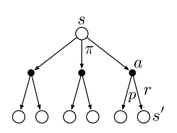
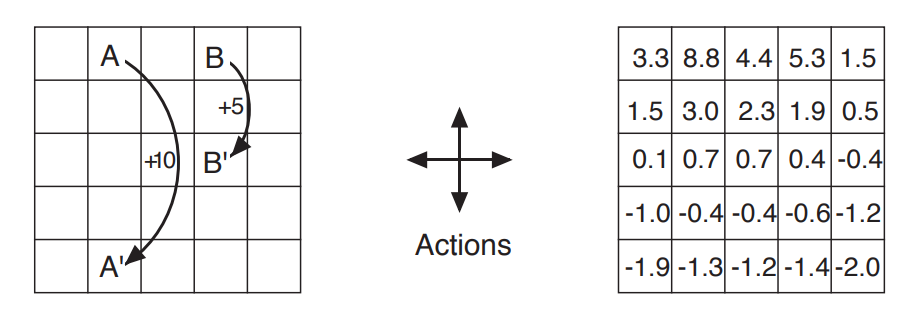
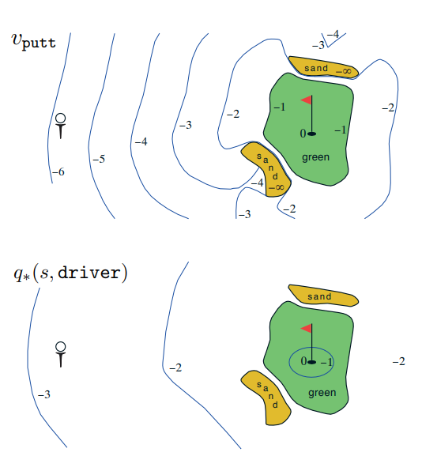

[Aprendizado por Reforço](../../index.md) · [Processos de Decisão de Markov Finitos](../index.md)

<!-- wiki:original:inicio -->

# Políticas e Funções de valor

Quase todos os algoritmos de Aprendizado por Reforço envolvem a estimação de funções de valor - funções de estados (ou de pares estado-ação) - que estimam o quão bom é para o agente estar em um determinado estado. Essa noção de “quão bom” é definida em termos de recmpensas futuras que podem ser esperadas, ou em termos de retorno esperado.

Assim, as funções de valor são definidas com respeito a modos particulares de agir, chamados políticas. Uma política é um mapeamento de estados para probabilidades de selecionar cada ação possível. Se o agente está seguindo a política $\pi$ no tempo $t$, então $\pi(a\vert s)$ é a probabilidade de que $A_{t} = a$ e $S_{t} = s$.

A função de valor de um estado $s$ em uma política $\pi$, denotado $v_{\pi}(s)$ é o valor esperado quando começamos em $s$ e seguindo $\pi$ depois disso. Para MDPs, conseguimos definir $v_{\pi}$ formalmente como:

$$v_{\pi}(s)\dot{=}{\mathbb{E}}_{\pi}\left\lbrack G_{t}\vert S_{t} = s \right\rbrack = {\mathbb{E}}_{\pi}\left\lbrack \sum_{k = 0}^{\infty}\gamma^{k}R_{t + k + 1}\vert S_{t} = s \right\rbrack,\text{  para todo }s \in \mathcal{S}$$

onde ${\mathbb{E}}_{\pi}\left\lbrack . \right\rbrack$ denota a esperança de uma variável aleatória dado que o agente segue uma política $\pi$, e $t$ é qualquer passo. Nós chamamos a função $v_{\pi}$ de função de valor de estado para a política $\pi$.

Similarmente, podemos definir o valor de tomar a ação $a$ no estado $s$ sobre a política $\pi$, denotada $q_{\pi}(s,a)$, como a esperança partindo de $s$, tomando a ação $a$, e depois disso seguir a política $\pi$ como:

$$q_{\pi}(s,a)\dot{=}{\mathbb{E}}_{\pi}\left\lbrack G_{t}\vert S_{t} = s,A_{t} = a \right\rbrack = {\mathbb{E}}_{\pi}\left\lbrack \sum_{k = 0}^{\infty}\gamma^{k}R_{t + k + 1}\vert S_{t} = s,A_{t} = a \right\rbrack$$

e chamamos $q_{\pi}$ de função de valor da ação para a política $\pi$.

Como as funções de valor são esperanças, entçao elas podem ser estimadas a partir de experiência, ou seja, se um agente segua a política $\pi$ e mantém uma média, então essa média convergirá para o valor do estado, à medida que o número de vezes em que o estado é encontrado tende ao infinito (claro uso da Lei dos Grandes Números).

O único problema é que, se houverem muitos estados, pode não ser muito prático manter médias separadas para cada estado individualmente. Nesse caso, o agente deveria representar $v_{\pi}\text{  e  }q_{\pi}$ como funções parametrizadas(menos parâmetros do que estados) e ajustar os parâmetros de modo a corresponder melhor aos retornos observados.

Uma propriedade legal das funções de valor são que elas mantém relações recursivas, o que sempre traz benefícios computacionalmente. Especificamente, para qualquer política $\pi$ e qualquer estado $s$, vale que:

$$\begin{aligned} v_{\pi}(s) & \dot{=}{\mathbb{E}}_{\pi}\left\lbrack G_{t}\vert S_{t} = s \right\rbrack \\ & = {\mathbb{E}}_{\pi}\left\lbrack R_{t + 1} + \gamma G_{t + 1}\vert S_{t} = s \right\rbrack \\ & = \sum_{a}\pi(a\vert s)\sum_{s}'\sum_{r}p\left( s',r~\vert ~s,a \right)\left\lbrack r + \gamma{\mathbb{E}}\left\lbrack G_{t + 1}\vert S_{t + 1} = s' \right\rbrack \right\rbrack \\ & = \sum_{a}\pi(a\vert s)\sum_{r,s'}p\left( s',r\vert s,a \right)\left\lbrack r + \gamma v_{\pi}(s') \right\rbrack,\text{  para todo }s \in \mathcal{S} \end{aligned}$$

Note que na última equação não juntamos duas somas, de todos os valores de $s'$ e de todos os valores $r$. Note ainda que a expressão final pode ser facilmente lida como um valor esperado. Ela é, na verdade, uma soma sobre todos os valores das três variáveis, $a,s'\text{  e  }r$.

A equação [\[belman\]](#belman) é chamada de Equação de Bellman para $v_{\pi}$. Pense em olhar para frente a partir de um estado até seus possíveis estados sucessores (olhe a imagem).

*Figura 12. Diagrama intuitivo da Equação de Bellman.*

Cada círculo aberto representa um estado, e cada círculo preenchido representa um par estado-ação. Começando do estado $s$, o agente pode tomar qualquer uma dentre várias ações (de acordo com a política $\pi$). A partir dessas ações, o ambiente pode responder com um de vários possíveis estados $s'$, junto com uma recompensa $r$, dependendo de sua dinâmica, que é dada pela função $p$.

A equação de Bellman faz a média sobre todas as probabilidades, ponderando cada uma pela chance de ocorrer, e ela afirma que o valor do estado inicial deve ser igual ao valo esperado (descontado) do próximo estado esperado, mais a recompensa esperada ao longo do caminho. Existe apenas uma solução $v_{\pi}$ que satisfaz a equação.

**Exemplo**

GridWorld - Mundo ganancioso

A figura abaixo (esquerda) mostra um GridWorld de um MDP simples e finito. O objetivo do desafio é partir do espaço A” ou B” e chegar em suas respectivas recompensas A e B. Logo, podemos definir que cada estado é cada quadrado (posição da matriz), e que a cada estado temos 4 escolhas de ação: Esquerda, direita, cima, baixo.

Ainda, se o agente chegar a A, ele recebe +10 de recompensa e é teletransportado a A’. O mesmo acontece para B e B” com recompensa +5. Qualquer outra ação que o leve no quadriculado mas não no objetivo recompensa 0. Caso a ação o faça sair do quadriculado, ele permanece no quadriculado anterior, e recebe uma recompensa -1.

Na figura à direita, temos a tabela de valores de estado $v_{\pi}(s)$ para uma política equiprovável - o agente escolhe qualquer ação com probabilidade $\frac{1}{4}$ (isso significa que $\pi(a\vert s) = \frac{1}{4}$). A figura mostra o retorno médio esperado se o estado começar naquele estado e seguir uma política aleatória.

*Figura 13. Exemplo do algoritmo GridWorld.*

Vamos para outro exemplo um pouco mais difícil:

**Exemplo**

Golfe

*Figura 14. Exemplo do algoritmo para simular um jogo de golfe, imagem superior usa apenas a tacada putter, enquanto a imagem inferior usa $q_{\ast}(s,a)$, com $a$ sendo a tacada driver.*

Para formular o ato de jogar um buraco de golfe como uma tarefa de RL, contamos uma penalidade de -1 para cada tacada até que acertemos a bola no buraco, recebendo a recompensa 0. O estado é a localização da bola, e as ações são a forma como miramos e escolhemos o taco.

Vamos supor que a mira já está determinada, e consideremos apenas a escolha do taco, que pode ser putter (curta distância) ou driver (longa distância). A imagem superior ao lado mostra uma possível função de valor de estado $v_{\text{putt }}(s)$, para política que sempre usa o putter.

De qualquer ponto do green, supomos que podemos fazer um putt (acertar o buraco); esses estados têm valor −1. Fora do green, não conseguimos chegar ao buraco apenas no putter, então o valor é mais negativo.

Como mostrado na primeira imagem do exemplo, o contorno da imagem mostra a distância do objetivo e, usando o taco putter, notamos que partindo do início, precisariamos de 6 tacadas até chegar ao buraco. Ainda, no segundo exemplo, notamos que usando a tacada driver, precisaríamos apenas de 3 tacadas para chegar ao buraco. Porém, note que temos a areia, que traz a recompensa negativa de $- \infty$.

Como a areia está apenas perto do buraco, e, sabendo que a tacada driver consegue jogar a bola mais longe mas com menos precisão, é esperado que o agente aprenda a melhor política $\pi_{\ast}$ que combinaria as duas, usando o driver no começo e o putter no fim

<!-- wiki:original:fim -->

## Percurso de estudo

[Trilha: Revisão geral](../../../../trilhas/aprendizado-por-reforco/revisao-geral.md) · [Apresentação e contexto da fonte](../../../../trilhas/aprendizado-por-reforco/revisao-geral.md#apresentacao-original)

- Anterior: [Notação Unificada para Tarefas Contínuas e episódicas](../notacao-unificada-para-tarefas-continuas-e-episodicas/index.md)
- Próximo: [Políticas Ótimas e Funções de Valor Ótimas](../politicas-otimas-e-funcoes-de-valor-otimas/index.md)
