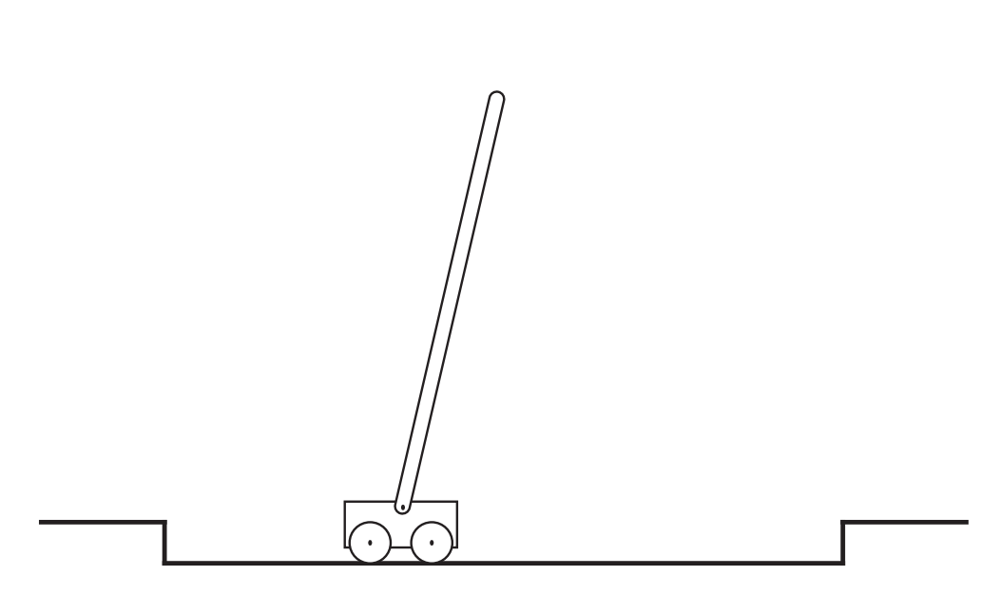

[Aprendizado por Reforço](../../index.md) · [Processos de Decisão de Markov Finitos](../index.md)

<!-- wiki:original:inicio -->

# Retornos e episódios 

Como explicado até agora, a meta do agente é maximizar a recompensa cumulativa do agente ao longo da execução. Mas como definir isso formalmente? O retorno esperado, denominado $G_{t}$, após o tempo $t$, pode ser definido no caso simples como:

$$G_{t}\dot{=}R_{t + 1} + R_{t + 2} + R_{t + 3} + \ldots + R_{T}$$

Onde $T$ é o passo final. Essa formulação faz sentido em aplicações nas quais existe uma noção natural de término, ou seja, quando a interação entre o agente e o ambiente se divide em subsequências, que chamamos de episódios — como partidas de um jogo, travessias de um labirinto ou qualquer tipo de interação repetida. Cada episódio termina em um estado especial chamado estado terminal, seguido de um reinício para um estado inicial padrão.

Mesmo que os episódios terminem de formas diferentes (por exemplo, vitória ou derrota em um jogo), o próximo episódio começa independentemente de como o anterior terminou. Assim, podemos considerar que todos os episódios terminam em um mesmo estado terminal, apenas com recompensas diferentes para os diferentes resultados.

Tarefas com episódios desse tipo são chamadas de tarefas episódicas. Em tarefas episódicas, às vezes precisamos distinguir o conjunto de todos os estados não terminais, denotado por $\mathcal{S}$, do conjunto de todos os estados incluindo o terminal, denotado por $\mathcal{S^{+}}$.O tempo de término $T$ é uma variável aleatória, que normalmente varia de episódio para episódio.

Por outro lado, em muitos casos, a interação entre o agente e o ambiente não se divide naturalmente em episódios identificáveis, mas continua indefinidamente, sem limite de tempo. Por exemplo, isso seria o modo natural de formular uma tarefa de controle de processo contínuo, ou uma aplicação em um robô de longa duração. Chamamos essas de tarefas contínuas (continuing tasks).

Note que no caso de tarefas contínuas teríamos uma soma infinita de termos de valores de recompensas, o que poderia causar $G_{t} = \infty$. Mas não é exatamente isso que queremos. Assim, adicionamos um novo conceito que precisamos, chamado de desconto, da forma:

$$G_{t}\dot{=}R_{t + 1} + \gamma R_{t + 2} + \gamma^{2}R_{t + 3} + \ldots = \sum_{k = 0}^{\infty}\gamma^{k}R_{t + k + 1}$$

onde $0 \leq \gamma \leq 1$, chamado de taxa de desconto. Esse parâmetro faz com que recompensas futuras valham menos, mantendo $G_{t + 1}$ finito mesmo em tarefas infinitas e expressa a ideia intuitiva que recompensas imediatas valem mais do que futuras.

Ainda, note que, se $\gamma < 1$, a soma infinita tem um valor finito, desde que a sequência de recompensas seja limitada. Se $\gamma = 0$, o agente é chamado de míope, pois se preocupa apenas em maximizar recompensas imediatas, seu objetivo então se torna apenas escolher $A_{t}$ de modo a maximizar $R_{t + 1}$.

Por fim, note que $$\begin{aligned} G_{t} & = R_{t + 1} + \gamma R_{t + 2} + \gamma^{2}R_{t + 3} + \gamma^{3}R_{t + 4} + \ldots \\ & = R_{t + 1} + \gamma\left( R_{t + 2} + \gamma_{t + 3} + \gamma^{2}R_{t + 4} + \ldots \right) \\ & = R_{t + 1} + \gamma G_{t + 1} \end{aligned}$$

e isso funciona para todos os instantes de tempo $t < T$, mesmo que a terminação ocorra em $t + 1$, se definirmos $G_{T} = 0$.

**Exemplo**

Equilíbrio de um Pêndulo (Pole-Balancing)

O objetivo nesta tarefa é aplicar forças a um carrinho que se move ao longo de um trilho, de modo a manter uma haste presa ao carrinho sem cair. Considera-se que ocorre falha quando a haste ultrapassa um certo ângulo limite a partir da vertical ou quando o carrinho sai dos trilhos. Após cada falha, a haste é reposta na posição vertical.

Esta tarefa pode ser tratada como episódica, em que os episódios naturais são as tentativas repetidas de equilibrar a haste. A recompensa neste caso poderia ser +1 a cada passo de tempo em que não ocorre falha, de modo que o retorno em cada instante seria igual ao número de passos até a falha. Nesse caso, conseguir equilibrar a haste para sempre implicaria em um retorno infinito.

Alternativamente, poderíamos tratar o equilíbrio da haste como uma tarefa contínua, usando desconto. Nesse caso, a recompensa seria $- 1$ a cada falha e zero nos outros momentos. O retorno em cada instante seria então relacionado a $- \gamma^{K}$, onde $K$ é o número de passos de tempo antes da falha.

Em qualquer dos casos, o retorno é maximizado mantendo a haste equilibrada pelo maior tempo possível.

*Figura 10. Imagem representativa do exemplo*

<!-- wiki:original:fim -->

## Percurso de estudo

[Trilha: Revisão geral](../../../../trilhas/aprendizado-por-reforco/revisao-geral.md) · [Apresentação e contexto da fonte](../../../../trilhas/aprendizado-por-reforco/revisao-geral.md#apresentacao-original)

- Anterior: [Metas e recompensas](../metas-e-recompensas/index.md)
- Próximo: [Notação Unificada para Tarefas Contínuas e episódicas](../notacao-unificada-para-tarefas-continuas-e-episodicas/index.md)
