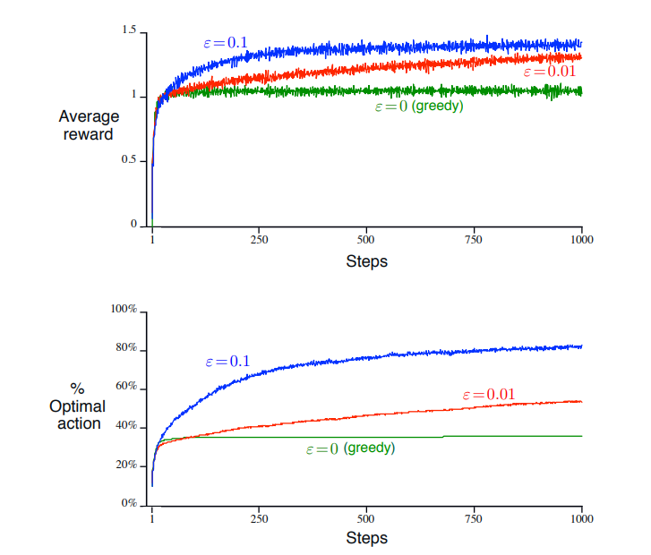

[Aprendizado por Reforço](../../index.md) · [Soluções de métodos tabulares](../index.md)

<!-- wiki:original:inicio -->

# O banco de teste de 10 braços

Para avaliar o efeito de um método totalmente ganancioso de um método $\varepsilon$-ganancioso, nós os compararemos numericamente em um conjunto de problemas. Esse foi um conjunto de 2000 problemas do bandido $k$-armado com $k = 10$. Para cada valor da ação, $q_{\ast}(a) \sim {\mathbb{N}}(0,1)$, $a = 1,\ldots,10$(lembre que como $k = 10$, temos 10 ações possíveis). Então, quando um método de aprendizado era aplicado e selecionava a ação $A_{t}$ no instante $t$, a recompensa real $R_{t} \sim {\mathbb{N}}(q_{\ast}(a),1)$, ou seja, uma distribuição normal centrada em $q_{\ast}(a)$ e variância 1.

*Figura 3. Um exemplo do problema do bandido $10$-armado. O valor real $q_{\ast}(a)$ de cada uma das dez ações foi selecionado de acordo com uma distribuição normal com média zero e variância unitária e as recompensas reais foram selecionadas de acordo com uma distribuição normal de média $q_{\ast}(a)$ e variância unitária, conforme sugerido por essas distribuições em cinza.*

Para qualquer método de aprendizado, nós podemos mensurar a performance e o comportamento realizando 1000 ações para cada bandido $10$-armado. Isso é uma execução, faremos 2000 delas, pois temos 2000 bandidos $10$-armados diferentes e tiraremos a média como estimativa.

A Figura 4 compara um método totalmente ganancioso com outros dois métodos $\varepsilon$-ganancioso($\varepsilon = 0.01$ e $\varepsilon = 0.1$).Todos os métodos performaram usando a média amostral. o gráfico de cima mostra o crescimento dá recompensa média com a experiência dos passos e o de baixo a porcentagem de ações ótimas.

Note como acontece basicamente tudo o que falamos até agora, ou seja, no extremo começo, a ação completamente gananciosa ganha, porém, depois, perde para todos os dois métodos $\varepsilon$-greedy. Além, note que a recompensa média do método completamente ganancioso se estagna em 1, enquanto o método menos ganancioso tem um valor médio de $1,5$, muito próximo do valor máximo da figura 3. Ainda, perceba como a porcentagem de ações ótimas do método ganancioso fica completamente estagnada, enquanto a do $0,1$-greedy chega em valores maiores que 80%.

O autor termina dizendo que em casos determinísticos, ou seja, quando a variância é 0, significa que o valor de todas as ações tem o mesmo valor, logo, o método completamente ganancioso funciona melhor. No caso contrário(não determinístico), temos uma variância(considere uma maior que 1) então usar um método $\varepsilon$-greedy será melhor para otimizar o valor das ações.

Ainda, em casos não estacionários, ou seja, quando o valor das ações pode mudar, significa que o $\varepsilon$-greedy é ainda mais importante, já que fixar-se numa ação que muda de valor é pior, sabendo que ela pode decair ainda mais, e o agente nunca saberá qual é a maior recompensa.

<!-- wiki:original:fim -->

## Percurso de estudo

[Trilha: Revisão geral](../../../../trilhas/aprendizado-por-reforco/revisao-geral.md) · [Apresentação e contexto da fonte](../../../../trilhas/aprendizado-por-reforco/revisao-geral.md#apresentacao-original)

- Anterior: [Métodos baseados em valores de ações](../metodos-baseados-em-valores-de-acoes/index.md)
- Próximo: [Implementação incremental](../implementacao-incremental/index.md)
