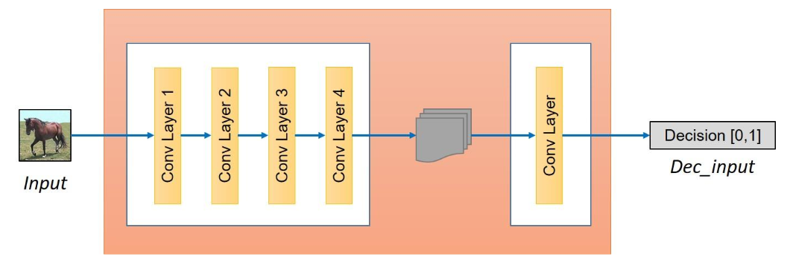

[Aprendizado Profundo](../../../index.md) · [Generative Adversarial Networks (GANs)](../../index.md) · [CycleGANs (Tradução sem dados pareados)](../index.md)

<!-- wiki:original:inicio -->

# Arquitetura de CycleGANs

Já vimos os tipos de redes dentro dos CycleGANs, mas como elas se comportam internamente? Na verdade utilizamos de algumas arquiteturas clássicas de redes neurais, como **ResNet** e **U-Net**, para construir os geradores e discriminadores. A escolha da arquitetura depende do tipo de dados e da complexidade da tarefa de tradução de imagem.

*Figura 62. Arquitetura dos geradores em CycleGANs*

Dentro do bloco de transformação, é utilizado um bloco de **ResNet** com **residual blocks**, que permite que a rede aprenda funções de mapeamento mais complexas e facilita o treinamento de redes profundas.

*Figura 63. Arquitetura dos discriminadores em CycleGANs*

Já no discriminador, se é utilizada uma estrutura de **PatchGAN**, que classifica cada **patch** da imagem como real ou falsa, em vez de classificar a imagem inteira. Isso permite que o discriminador se concentre em detalhes locais e aprenda a distinguir melhor entre imagens reais e geradas.

*Figura 64. Arquitetura dos discriminadores em CycleGANs*

<!-- wiki:original:fim -->

## Percurso de estudo

[Trilha: A1](../../../../../trilhas/aprendizado-profundo/a1.md) · [Apresentação e contexto da fonte](../../../../../trilhas/aprendizado-profundo/a1.md#apresentacao-original)

- Anterior: [Função objetivo completa](../funcao-objetivo-completa/index.md)
- Próximo: [Outras aplicações de GANs](../../outras-aplicacoes-de-gans/index.md)
