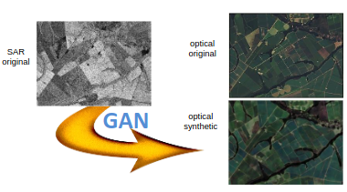

[Aprendizado Profundo](../../../index.md) · [Generative Adversarial Networks (GANs)](../../index.md) · [GANs Condicionais (cGANs)](../index.md)

<!-- wiki:original:inicio -->

# Aplicações das cGANs

## Sensoriamento remoto

**Problema**: Imagens ópticas de satélite sofrem com cobertura de nuvens, enquanto dados de Radar de Abertura Sintética (SAR) penetram nuvens e funcionam em qualquer condição meteorológica, mas são difíceis de interpretar

**Solução**: O modelo recebe a imagem SAR como condição $x$ e sintetiza a imagem óptica correspondente $G(x)$, permitindo a observação contínua da superfície terrestre mesmo com interferência atmosférica

*Figura 59. Exemplo de aplicação de cGANs em sensoriamento remoto*

## Síntese Controlável de Lesões de Pele para Aumento de Dados

**Desafio**: Falta de dados rotulados e diversidade de formas/texturas para treinar redes de segmentação de câncer de pele.

**Abordagem cGAN**: Utiliza **Curvas de Bézier aleatórias** para gerar a máscara de formato da lesão. Tira retalhos de textura (**texture patches**) para áreas de pele e de lesão. A cGAN sintetiza dermoscopias altamente realistas combinando a forma geométrica e as texturas\[4\].

**Resultado**: O uso dessas amostras sintéticas no treinamento elevou significativamente a acurácia de modelos como U-Net, PSPNet e DeepLabv3

*Figura 60. Exemplo de aplicação de cGANs em síntese controlável de lesões de pele*

<!-- wiki:original:fim -->

## Percurso de estudo

[Trilha: A1](../../../../../trilhas/aprendizado-profundo/a1.md) · [Apresentação e contexto da fonte](../../../../../trilhas/aprendizado-profundo/a1.md#apresentacao-original)

- Anterior: [Arquitetura Clássica](../arquitetura-classica/index.md)
- Próximo: [CycleGANs (Tradução sem dados pareados)](../../cyclegans-traducao-sem-dados-pareados/index.md)
