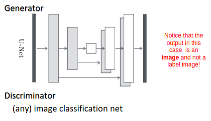

[Aprendizado Profundo](../../../index.md) · [Generative Adversarial Networks (GANs)](../../index.md) · [GANs Condicionais (cGANs)](../index.md)

<!-- wiki:original:inicio -->

# Arquitetura Clássica

*Figura 58. Arquitetura de uma cGAN clássica (pix2pix)*

A arquitetura clássica de cGANs é a *pix2pix*, que é uma abordagem de tradução de imagem para imagem supervisionada. Nessa arquitetura, o gerador é tipicamente uma rede do tipo **U-Net**, que possui conexões de **skip** entre as camadas correspondentes do encoder e do decoder, permitindo que informações de baixo nível sejam preservadas durante a geração da imagem.

<!-- wiki:original:fim -->

## Percurso de estudo

[Trilha: A1](../../../../../trilhas/aprendizado-profundo/a1.md) · [Apresentação e contexto da fonte](../../../../../trilhas/aprendizado-profundo/a1.md#apresentacao-original)

- Anterior: [Formulação da Loss](../formulacao-da-loss/index.md)
- Próximo: [Aplicações das cGANs](../aplicacoes-das-cgans/index.md)
