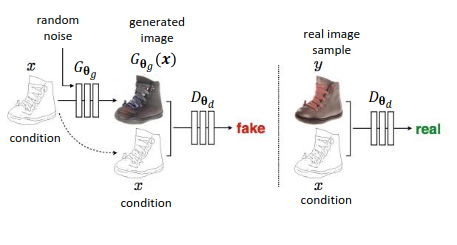

[Aprendizado Profundo](../../index.md) · [Generative Adversarial Networks (GANs)](../index.md)

<!-- wiki:original:inicio -->

# GANs Condicionais (cGANs)

No modelo original de GANs, o gerador produz amostras a partir de um vetor de ruído estocástico $z \sim p(z)$. Isso remove o possível controle que poderíamos ter sobre o gerador, por exemplo, se eu quiser especificar que quero gerar uma imagem de um gato, eu não consigo, eu tenho que torcer para que o gerador me dê a imagem de um gato quando eu solicitar.

*Figura 57. Arquitetura de uma cGAN*

Para solucionar esse problema, foi introduzido o conceito de **GANs condicionais (cGANs)**([Mirza and Osindero 2014](../../referencias/index.md#ref-cgans)), onde tanto o gerador quanto o discriminador recebem informações adicionais $y$ como entrada. Essa informação adicional pode ser qualquer coisa, como rótulos de classe, atributos ou até mesmo outra imagem.

<!-- wiki:original:fim -->

## Tópicos desta página

1. [Formulação da Loss](formulacao-da-loss/index.md)
2. [Arquitetura Clássica](arquitetura-classica/index.md)
3. [Aplicações das cGANs](aplicacoes-das-cgans/index.md)

## Percurso de estudo

[Trilha: A1](../../../../trilhas/aprendizado-profundo/a1.md) · [Apresentação e contexto da fonte](../../../../trilhas/aprendizado-profundo/a1.md#apresentacao-original)

- Anterior: [Evolução Arquitetural e uso em inferência](../introducao-as-gans/evolucao-arquitetural-e-uso-em-inferencia/index.md)
- Próximo: [Formulação da Loss](formulacao-da-loss/index.md)
