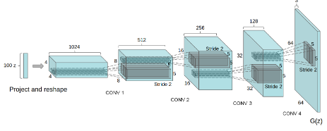

[Aprendizado Profundo](../../../index.md) · [Generative Adversarial Networks (GANs)](../../index.md) · [Introdução às GANs](../index.md)

<!-- wiki:original:inicio -->

# Evolução Arquitetural e uso em inferência

**DCGANs (Deep Convolutional GANs)**([Radford et al. 2016](../../../referencias/index.md#ref-dcgans)), são uma evolução das GANs originais que substituem as camadas totalmente conectadas por arquiteturas convolucionais profundas. No gerador, utilizam-se convoluções transpostas (**deconvs**) onde a maioria das camadas é estabilizada por **Batch Normalization**

*Figura 56. Arquitetura de uma DCGAN*

Uma vez concluído o treinamento, o discriminador é descartado e utiliza-se exclusivamente a rede geradora para sintetizar novas amostras a partir de vetores de ruído $z$

<!-- wiki:original:fim -->

## Percurso de estudo

[Trilha: A1](../../../../../trilhas/aprendizado-profundo/a1.md) · [Apresentação e contexto da fonte](../../../../../trilhas/aprendizado-profundo/a1.md#apresentacao-original)

- Anterior: [Dinâmica de Treinamento e Ajuste do Gradiente](../dinamica-de-treinamento-e-ajuste-do-gradiente/index.md)
- Próximo: [GANs Condicionais (cGANs)](../../gans-condicionais-cgans/index.md)
