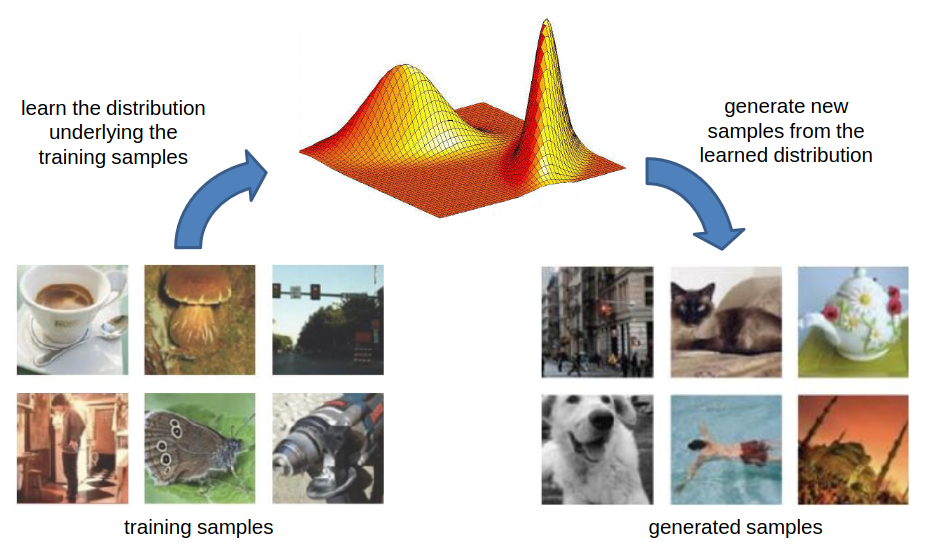

[Aprendizado Profundo](../../index.md) · [Generative Adversarial Networks (GANs)](../index.md)

<!-- wiki:original:inicio -->

# Motivação e Modelos Generativos

Essa categoria de modelos de machine learning tem crescido exponencialmente nos últimos tempos, tanto pela ideia intuitiva e elegante para o treinamento da rede quanto pelos seus resultados impressionantes em diversas tarefas, como geração de imagens, tradução de estilo, super-resolução e síntese de dados.

Antes de realmente entrarmos no conceito de GANs, precisamos entender o que ela propõe a ser, um **modelo generativo**. Modelos generativos são modelos de aprendizado de máquina que aprendem a gerar novos dados a partir de uma **distribuição** de dados existente. Eles são capazes de capturar a complexidade e a diversidade dos dados de treinamento, permitindo a criação de novas amostras que se assemelham aos dados originais.

*Figura 54. Ilustração de como os modelos generativos funcionam*

No entanto, existe um obstáculo oculto nessa abordagem. A distribuição dos dados visuais da vida real residem em um espaço de **alta dimensionalidade** e **muito complexo**, por conta disso, é extremamente difícil modelar essa distribuição de forma explícita. Por exemplo, a distribuição de imagens de rostos humanos é altamente complexa, com variações em expressões faciais, iluminação, ângulos de visão e características individuais. Modelar essa distribuição explicitamente exigiria uma quantidade enorme de dados e uma modelagem matemática sofisticada.

É daí que entram as GANs, que propõem uma abordagem alternativa. Em vez de aproximar ou estimar $p_{\text{data}}$ diretamente, elas aprendem uma **função de transformação**, onde a partir de uma distribuição simples e **conhecida**, usamos essa função de transformação para gerar as amostras que se assemelham com as da vida real.

É importante destacar que essa função de transformação **não é trivial**, por isso que utilizamos **redes profundas** para as aproximar

<!-- wiki:original:fim -->

## Percurso de estudo

[Trilha: A1](../../../../trilhas/aprendizado-profundo/a1.md) · [Apresentação e contexto da fonte](../../../../trilhas/aprendizado-profundo/a1.md#apresentacao-original)

- Anterior: [Generative Adversarial Networks (GANs)](../index.md)
- Próximo: [Introdução às GANs](../introducao-as-gans/index.md)
