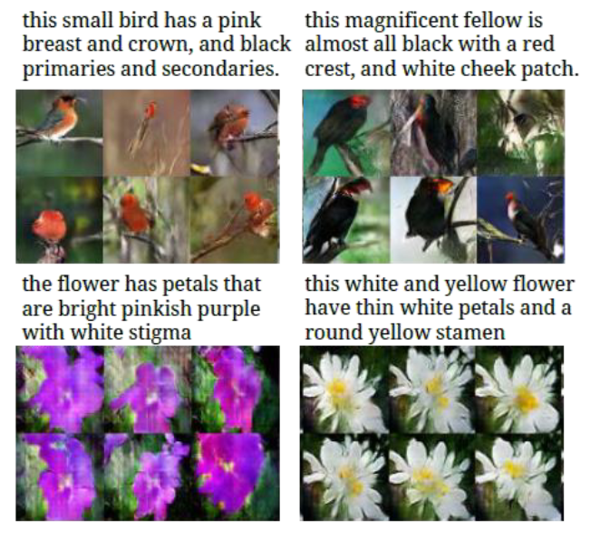

[Aprendizado Profundo](../../../index.md) · [Generative Adversarial Networks (GANs)](../../index.md) · [Outras aplicações de GANs](../index.md)

<!-- wiki:original:inicio -->

# Síntexe de texto para imagem

*Figura 65. Exemplo de aplicação de GANs em síntese de texto para imagem*

*Figura 66. Exemplo de aplicação de GANs em síntese de texto para imagem*

<!-- wiki:original:fim -->

## Percurso de estudo

[Trilha: A1](../../../../../trilhas/aprendizado-profundo/a1.md) · [Apresentação e contexto da fonte](../../../../../trilhas/aprendizado-profundo/a1.md#apresentacao-original)

- Anterior: [Outras aplicações de GANs](../index.md)
- Próximo: [Super-resolução de imagens](../super-resolucao-de-imagens/index.md)
