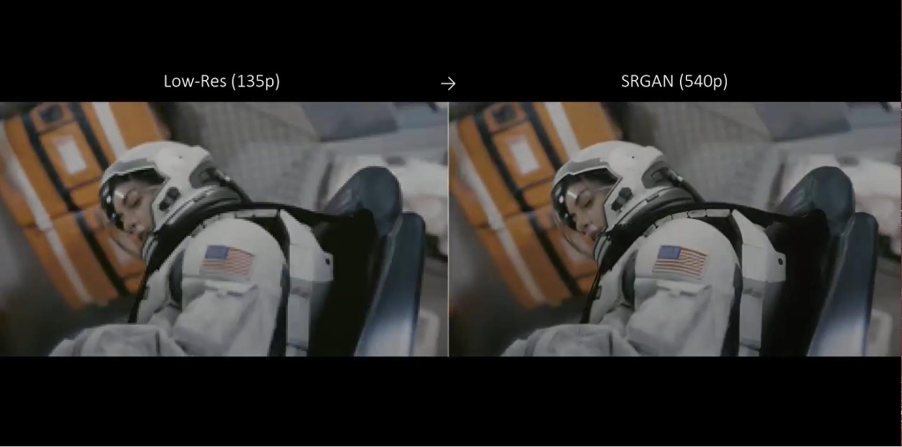

[Aprendizado Profundo](../../../index.md) · [Generative Adversarial Networks (GANs)](../../index.md) · [Outras aplicações de GANs](../index.md)

<!-- wiki:original:inicio -->

# Super-resolução de imagens

*Figura 67. Exemplo de aplicação de GANs em super-resolução de imagens*

<!-- wiki:original:fim -->

## Percurso de estudo

[Trilha: A1](../../../../../trilhas/aprendizado-profundo/a1.md) · [Apresentação e contexto da fonte](../../../../../trilhas/aprendizado-profundo/a1.md#apresentacao-original)

- Anterior: [Síntexe de texto para imagem](../sintexe-de-texto-para-imagem/index.md)
- Próximo: [The GAN Zoo](../the-gan-zoo/index.md)
