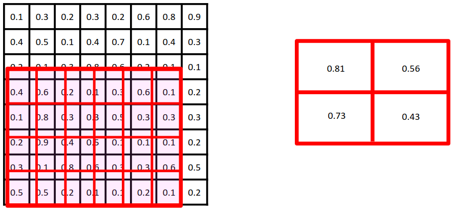

[Aprendizado Profundo](../../../index.md) · [Object Detection](../../index.md) · [Redes de Dois Estágios e Segmentação de Instâncias: Mask R-CNN](../index.md)

<!-- wiki:original:inicio -->

# Alinhamento de Características com RoIAlign

Temos um problema, o próximo passo (a rede geradora de máscara) espera um **feature map** de tamanho fixo, mas as propostas de regiões geradas pela RPN podem ter tamanhos variados. Para resolver isso, a Mask R-CNN utiliza o **RoIAlign**, que é uma técnica que extrai características de regiões de interesse (RoIs) do **feature map** da backbone, garantindo que cada RoI seja representada por um **feature map** de tamanho fixo.

A primeira abordagem utilizada era a **RoIPooling**, que dividia a região de interesse em uma grade de células e aplicava **max pooling** em cada célula para obter um valor representativo. No exemplo da [\[roi-pooling-example-1\]](#roi-pooling-example-1), temos uma imagem de tamanho $8 \times 8$ e a região vermelha destacada é a região de interesse com tamanho $6 \times 4$, no entanto a rede geradora de máscara espera uma **feature map** de tamanho $2 \times 2$, então dividimos a região de interesse em uma grade de $2 \times 2$ células, e aplicamos **max pooling** em cada célula para obter um valor representativo. O problema é que a divisão da região de interesse em células pode não ser exata, resultando em perda de informações e desajustes na localização das características.

Veja por exemplo a [\[roi-pooling-example-2\]](#roi-pooling-example-2). Nesse caso, a região de interesse (borda vermelha) não cai exatamente na divisão dos pixeis, na verdade ela para na metade de um, e isso **pode acontecer** como já discutimos anteriormente. Nesses casos, o **RoIPooling** arredonda os valores para o inteiro mais próximo (borda azul), resultando em perda de informações e desajustes na localização das características. Para resolver esse problema, a Mask R-CNN utiliza o **RoIAlign**, que utiliza interpolação bilinear para calcular os valores das células da grade, garantindo que as características sejam alinhadas corretamente com a região de interesse.

*Figura 33. Exemplo de RoIPooling com região de interesse alinhada com a grade de células*

*Figura 34. Exemplo de RoIPooling com região de interesse desalinhada com a grade de células*

*Figura 35. Exemplo de RoIAlign com região de interesse alinhada com a grade de células*

<!-- wiki:original:fim -->

## Percurso de estudo

[Trilha: A1](../../../../../trilhas/aprendizado-profundo/a1.md) · [Apresentação e contexto da fonte](../../../../../trilhas/aprendizado-profundo/a1.md#apresentacao-original)

- Anterior: [Geração de propostas com a RPN (Region Proposal Network)](../geracao-de-propostas-com-a-rpn-region-proposal-network/index.md)
- Próximo: [Predições em Paralelo (R-CNN + FCN)](../predicoes-em-paralelo-r-cnn-fcn/index.md)
