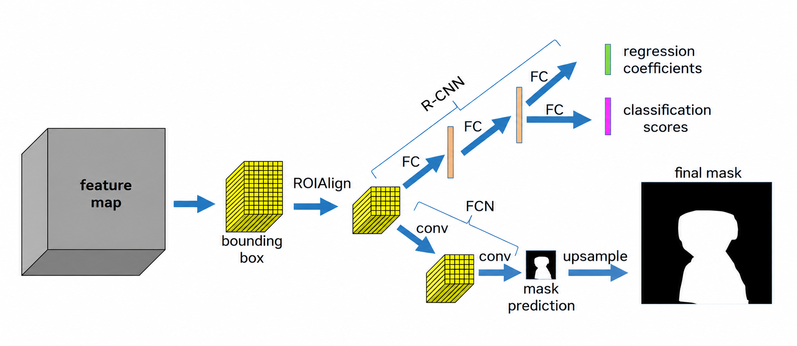

[Aprendizado Profundo](../../../index.md) · [Object Detection](../../index.md) · [Redes de Dois Estágios e Segmentação de Instâncias: Mask R-CNN](../index.md)

<!-- wiki:original:inicio -->

# Predições em Paralelo (R-CNN + FCN)

Depois que o **RoIAlign** é aplicado, cada proposta de região é representada por um **feature map** de tamanho fixo. Esse **feature map** é então passado para dois ramos **paralelos** da Mask R-CNN:

*Figura 36. Arquitetura da Mask R-CNN com predições em paralelo*

- **R-CNN**: Responsável por prever a classe do objeto e refinar a caixa delimitadora. Ele utiliza uma série de camadas totalmente conectadas para processar o **feature map** da proposta de região e gerar as predições de classe e caixa.

- **FCN**: Responsável por gerar a máscara binária do objeto. Ele utiliza uma série de camadas convolucionais para processar o **feature map** da proposta de região e gerar a máscara binária correspondente. A saída do FCN é uma máscara de tamanho fixo (por exemplo, $28 \times 28$ pixels) que representa a forma do objeto dentro da caixa delimitadora. Essa máscara é então redimensionada para se ajustar à caixa delimitadora refinada, permitindo que a Mask R-CNN produza uma segmentação precisa da instância do objeto.

*Figura 37. Arquitetura da Mask R-CNN com predições em paralelo*

------------------------------------------------------------------------

<!-- wiki:original:fim -->

## Percurso de estudo

[Trilha: A1](../../../../../trilhas/aprendizado-profundo/a1.md) · [Apresentação e contexto da fonte](../../../../../trilhas/aprendizado-profundo/a1.md#apresentacao-original)

- Anterior: [Alinhamento de Características com RoIAlign](../alinhamento-de-caracteristicas-com-roialign/index.md)
- Próximo: [Recurrent Neural Networks (RNNs)](../../../recurrent-neural-networks-rnns/index.md)
