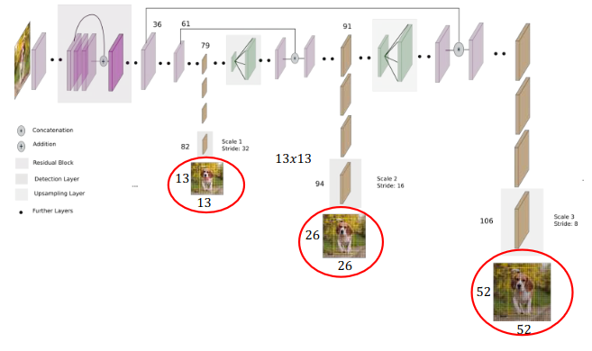

[Aprendizado Profundo](../../../index.md) · [Object Detection](../../index.md) · [Redes de Estágio Único (Single-Shot): A Família YOLO](../index.md)

<!-- wiki:original:inicio -->

# Evolução Arquitetural

## YOLOv1 & YOLO9000

Arquiteturas iniciais, foi na YOLO9000 onde as anchor boxes foram introduzidas e, em vez de prever diretamente prosição e tamanho das caixas, a rede aprende a prever **offsets** para ajustar as **anchor boxes** pré-definidas.

## YOLOv3

Aumento da profundidade da rede, de $53$ camadas para $106$ camadas. Adição de skip connections para melhorar a propagação do gradiente e permitir que a rede aprenda representações mais complexas. Introdução de **multi-scale predictions**, onde a rede prevê caixas em três escalas diferentes, permitindo detectar objetos de tamanhos variados.

*Figura 31. Arquitetura da YOLOv3*

<!-- wiki:original:fim -->

## Percurso de estudo

[Trilha: A1](../../../../../trilhas/aprendizado-profundo/a1.md) · [Apresentação e contexto da fonte](../../../../../trilhas/aprendizado-profundo/a1.md#apresentacao-original)

- Anterior: [Supressão Não-Máxima (Non-Maximum Suppression - NMS)](../supressao-nao-maxima-non-maximum-suppression-nms/index.md)
- Próximo: [Loss Function](../loss-function/index.md)
