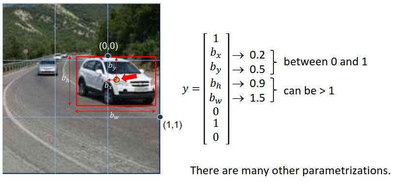

[Aprendizado Profundo](../../../index.md) · [Object Detection](../../index.md) · [Redes de Estágio Único (Single-Shot): A Família YOLO](../index.md)

<!-- wiki:original:inicio -->

# Parametrização do vetor de saída

Para cada célula da grade, o YOLO prevê um vetor de saída que contém informações sobre os objetos detectados. Esse vetor inclui: $$y = \left\lbrack p_{\text{obj}},b_{x},b_{y},b_{h},b_{w},c_{1},c_{2},\ldots,c_{C} \right\rbrack$$

- **$p_{\text{obj}}$**: Probabilidade de que a célula contenha um objeto

- **$\left( b_{x},b_{y},b_{h},b_{w} \right)$**: Coordenadas da caixa delimitadora (x, y, largura, altura). $b_{x},b_{y} \in \lbrack 0,1\rbrack$, representando a posição relativa do centro da caixa em relação à célula. Por exemplo, se $b_{x} = 0.5$ e $b_{y} = 0.5$, então a caixa de âncora está exatamente no centro da célular.$b_{h}$ e $b_{w}$ representam a altura e largura relativas à caixa, mas podem ser maiores que $1$ (a caixa pode ser maior que a célula).

  

  *Figura 28. Exemplo de caixa delimitadora prevista pelo YOLO*

- **$\left( c_{1},c_{2},\ldots,c_{C} \right)$**: Probabilidades de cada classe

<!-- wiki:original:fim -->

## Percurso de estudo

[Trilha: A1](../../../../../trilhas/aprendizado-profundo/a1.md) · [Apresentação e contexto da fonte](../../../../../trilhas/aprendizado-profundo/a1.md#apresentacao-original)

- Anterior: [Fundamentos do YOLO](../fundamentos-do-yolo/index.md)
- Próximo: [Caixas de Ancoragem (Anchor Boxes)](../caixas-de-ancoragem-anchor-boxes/index.md)
