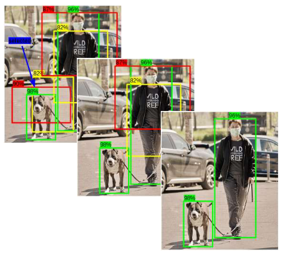

[Aprendizado Profundo](../../../index.md) · [Object Detection](../../index.md) · [Redes de Estágio Único (Single-Shot): A Família YOLO](../index.md)

<!-- wiki:original:inicio -->

# Supressão Não-Máxima (Non-Maximum Suppression - NMS)

Na prática, é bem fácil perceber que vai acontecer de várias caixas serem selecionadas para o mesmo objeto, e isso é um problema. Para resolver isso, utilizamos a técnica para escolher a caixa que melhor representa o objeto, descartando as demais. A técnica é chamada de **Non-Maximum Suppression (NMS)**, e funciona da seguinte forma:

1.  **Filtragem por confiança**: Descartamos todas as caixas cuja probabilidade de conter um objeto seja menor que um limiar pré-definido (ex: 0.5)

2.  **Seleção da melhor caixa**: Entre as caixas restantes, selecionamos a caixa com a maior probabilidade de conter um objeto (maior pontuação de confiança $p_{\text{obj}}$)

3.  **Eliminação de duplicatas**: Elimina as outras caixas da mesma classe que possuem uma sobreposição $\text{IoU} \geq 0.5$ com a caixa selecionada

4.  Repete o processo iterativamente para as caixas restantes de cada classe

*Figura 30. Exemplo de supressão não-máxima*

Vale ressaltar que esse **pós-processamento** é feito com **todas** as caixas de ancoragem previstas, tanto as que foram atribuidas dentro de uma mesma célula (uma única célula atribui diferentes anchor boxes pro mesmo objeto) quanto as geradas por células vizinhas (várias células podem prever o mesmo objeto). O objetivo é garantir que cada objeto seja representado por uma única caixa delimitadora final.

<!-- wiki:original:fim -->

## Percurso de estudo

[Trilha: A1](../../../../../trilhas/aprendizado-profundo/a1.md) · [Apresentação e contexto da fonte](../../../../../trilhas/aprendizado-profundo/a1.md#apresentacao-original)

- Anterior: [Caixas de Ancoragem (Anchor Boxes)](../caixas-de-ancoragem-anchor-boxes/index.md)
- Próximo: [Evolução Arquitetural](../evolucao-arquitetural/index.md)
