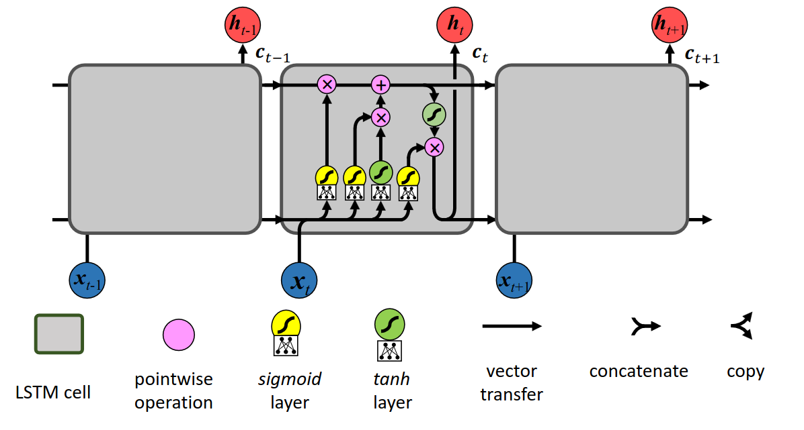

[Aprendizado Profundo](../../index.md) · [Recurrent Neural Networks (RNNs)](../index.md)

<!-- wiki:original:inicio -->

# Long-short Term Memory (LSTM)

Veio para corrigir as limitações presentes na RNN simples, introduzindo uma arquitetura de célula mais complexa que permite que a rede aprenda a manter ou esquecer informações ao longo do tempo.

Enquanto a RNN simples possui apenas um estado oculto $h_{t}$, a LSTM possui dois estados,um estado oculto $h_{t}$ e um estado de célula $c_{t}$ que atua como uma “esteira rolante” (**conveyor belt**) que carrega a informação relevante ao longo da sequência temporal com alterações mínimas.

*Figura 50. Arquitetura de uma célula LSTM*

Podemos estruturar a seguinte comparação: Na RNN Simples, tinhamos que $h_{t}$ era dado por $$h_{t} = \tanh(W\begin{pmatrix} h_{t - 1} \\ x_{t} \end{pmatrix})$$ enquanto na LSTM, temos que: $$\begin{array}{r} \begin{pmatrix} f \\ i \\ s \\ {\widetilde{c}}_{t} \end{pmatrix} = \begin{pmatrix} \sigma \\ \sigma \\ \sigma \\ \tanh \end{pmatrix}W^{T}\begin{pmatrix} h_{t - 1} \\ x_{t} \end{pmatrix} \\ W = \begin{pmatrix} W_{f} \\ W_{i} \\ W_{s} \\ W_{c} \end{pmatrix} \\ c_{t} = f \odot c_{t - 1} + i \odot {\widetilde{c}}_{t} \\ h_{t} = s \odot \tanh(c_{t}) \end{array}$$

Mas o que são esse bando de informação extra que a gente adicionou? Para controlar aquilo que entra, permanece e sai do estado celular $c_{t}$, a LSTM utiliza de três portas (**gates**), onde cada porta consiste em uma camada de **rede neural** com **ativação sigmoide** combinada com uma operação de multiplicação ponto a ponto (**pointwise**). As portas e componentes são dividos em

- **Porta de esquecimento ($f_{t}$)**: Quantidade de informação a apagar do estado celular passado

- **Porta do input ($i_{t}$)**: Quantidade de nova informação a adicionar ao estado celular

- **Valores candidatos (${\widetilde{c}}_{t}$)**: Valores propostos para serem adicionados ao estado celular

- **Porta de saída/seleção ($s_{t}$)**: Quantidade do estado celular a revelar como saída no estado oculto

Vamos passar com um pouco mais de calma em cada passo dessa nova arquitetura. Para cada passo temporal $t$ a célula recebe a entrada atual $x_{t}$, o estado oculto anterior $h_{t - 1}$ e o estado celular anterior $c_{t - 1}$.

Primeiro decidimos quais informações do estado celular anterior $c_{t - 1}$ devem ser esquecidas. Isso é feito através da porta de esquecimento $f_{t}$, que utiliza uma função sigmoide para gerar valores entre 0 e 1, onde 0 significa “esquecer completamente” e 1 significa “manter completamente”. A equação para a porta de esquecimento é: $$f_{t} = \sigma(W_{f}\begin{pmatrix} h_{t - 1} \\ x_{t} \end{pmatrix} + b_{f})$$

Então a célula calcula um novo vetor de valores candidatos ${\widetilde{c}}_{t}$, que contém informações que poderiam ser adicionadas ao estado celular. Isso é feito através de uma função tangente hiperbólica, que gera valores entre -1 e 1. A equação para os valores candidatos é: $${\widetilde{c}}_{t} = \tanh(W_{c}\begin{pmatrix} h_{t - 1} \\ x_{t} \end{pmatrix} + b_{c})$$

Então calculamos a porta de input $i_{t}$, que decide quais valores candidatos devem ser adicionados ao estado celular. Isso é feito através de uma função sigmoide, que gera valores entre 0 e 1. A equação para a porta de input é: $$i_{t} = \sigma(W_{i}\begin{pmatrix} h_{t - 1} \\ x_{t} \end{pmatrix} + b_{i})$$

O novo estado celular $c_{t}$ é calculado combinando a memória antiga filtrada com os novos candidatos filtrados ($\odot$ representa a multiplicação elemento a elemento): $$c_{t} = f_{t} \odot c_{t - 1} + i_{t} \odot {\widetilde{c}}_{t}$$

Depois o portão de seleção vai decidir quais partes do estado celular $c_{t}$ devem ser reveladas como saída. A porta de seleção $s_{t}$ é calculada usando uma função sigmoide: $$s_{t} = \sigma(W_{s}\begin{pmatrix} h_{t - 1} \\ x_{t} \end{pmatrix} + b_{s})$$

então aplicamos $s_{t}$ ao estado celular $c_{t}$ passando por uma função tangente hiperbólica para gerar o novo estado oculto $h_{t}$: $$h_{t} = s_{t} \odot \tanh(c_{t})$$

<!-- wiki:original:fim -->

## Tópicos desta página

1. [A inovação no Fluxo do Gradiente](a-inovacao-no-fluxo-do-gradiente/index.md)

## Percurso de estudo

[Trilha: A1](../../../../trilhas/aprendizado-profundo/a1.md) · [Apresentação e contexto da fonte](../../../../trilhas/aprendizado-profundo/a1.md#apresentacao-original)

- Anterior: [Limitações da RNN](../limitacoes-da-rnn/index.md)
- Próximo: [A inovação no Fluxo do Gradiente](a-inovacao-no-fluxo-do-gradiente/index.md)
