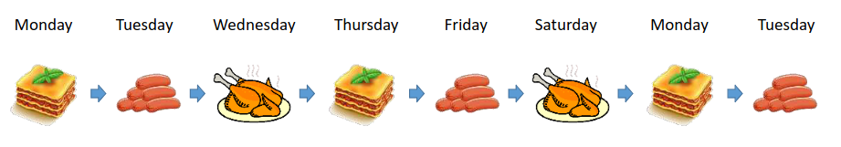
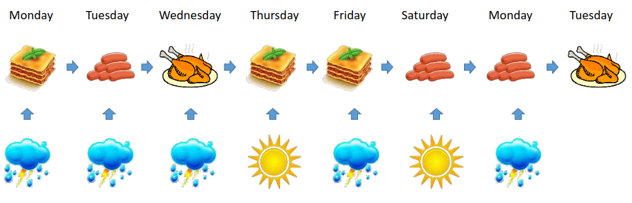
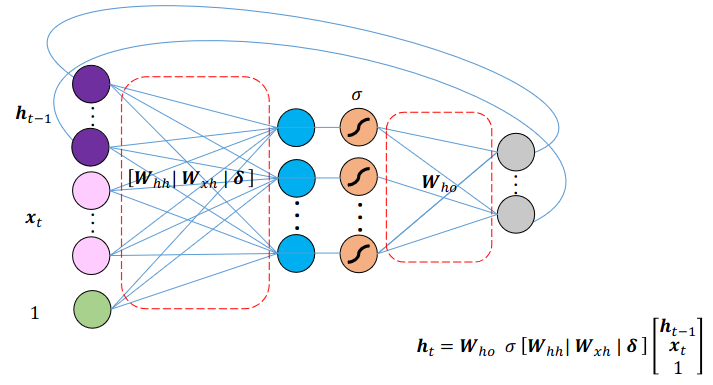

[Aprendizado Profundo](../../index.md) · [Recurrent Neural Networks (RNNs)](../index.md)

<!-- wiki:original:inicio -->

# Simple RNN (Vanilla RNN)

É o modelo mais básico de RNN, onde cada célula da rede recebe a entrada atual e o estado oculto da etapa anterior, processando essas informações para gerar uma saída e atualizar o estado oculto para a próxima etapa da sequência.

Antes de partir para a estrutura matemática em si, vamos ver esse simples exemplo: Imagine uma cafeteria, e a [\[rnn-example\]](#rnn-example) representa a sequência de pratos principais que um cliente pode pedir ao longo de uma semana. Cada dia da semana representa uma etapa da sequência. A RNN é capaz de capturar essa dependência sequencial, permitindo que a rede aprenda padrões de pedidos ao longo do tempo.

*Figura 38. Exemplo de RNN em uma cafeteria*

Podemos interpretar cada um dos pratos principais como vetores **one-hot** $$\text{ Lasanha } = \lbrack 1,0,0\rbrack\text{\quad\quad}\text{ Salsicha } = \lbrack 0,1,0\rbrack\text{\quad\quad}\text{ Frango } = \lbrack 0,0,1\rbrack$$

E perceba que a seguinte relação é apresentada $$\text{ Lasanha } \rightarrow \text{ Salsicha } \rightarrow \text{ Frango } \rightarrow \text{ Lasanha } \rightarrow \text{ Salsicha } \rightarrow \text{ Frango } \rightarrow \text{ Lasanha }$$

Conseguimos facilmente representar essa rotatividade utilizando de uma matriz de transição: $$\begin{array}{r} X = \begin{pmatrix} 0 & 0 & 1 \\ 1 & 0 & 0 \\ 0 & 1 & 0 \end{pmatrix} \\ X\text{ Lasanha } = \text{ Salsicha }\text{\quad\quad}X\text{ Salsicha } = \text{ Frango }\text{\quad\quad}X\text{ Frango } = \text{ Lasanha } \end{array}$$

Considere agora a influência de uma variável externa na decisão do restaurante com relação ao prato do dia, digamos o **clima**. Agora além dos vetores de pratos principais, temos também vetores **one-hot** representando o clima: $$\text{ Sol } = \lbrack 1,0\rbrack\text{\quad\quad}\text{ Chuva } = \lbrack 0,1\rbrack$$

Agora a rede depende tanto das informações de **histórico** (pratos anteriores) quanto das informações de **contexto** (clima atual). A rede agora aprende a prever isso através de **duas** matrizes

- $W_{hh}$: Matriz que aprende as regras da sequência do cardápio, ela responde a pergunta “Se ontem foi servido Frango, qual seria a mesma comida e qual será a próxima?”

*Figura 39. Exemplo de RNN em uma cafeteria com influência do clima*

- $W_{xh}$: Matriz que aprende a influência do clima na decisão do cardápio, ela responde a pergunta “Se hoje está chovendo, devo manter a escolha de comida ou mudar para a próxima da sequência?”

Mas como a rede toma a decisão? A cada passo temporal (dia $t$), a rede utiliza a seguinte fusão: **Consulta a memória** pegando a comida do dia anterior $h_{t - 1}$ e multiplica por $W_{hh}$ para entender a tendência do cardápio, **lê o presente** pegando o clima atual $x_{t}$ e multiplica pela matriz $W_{xh}$, depois **soma e aplica ativação** e **gera a saída**, o novo estado oculto $h_{t}$ que passa por uma matriz final $W_{ho}$ que decide qual será a comida do dia $t$.

Definindo de forma mais formal, a RNN pode ser definida pela seguinte estrutura $$h_{t} = f_{\theta}\left( h_{t - 1},x_{t} \right) = \tanh(W_{hh}h_{t - 1} + W_{xh}x_{t} + b_{h})$$

e a saída no instante $t$ é dada por $$o_{t} = W_{ho}h_{t} + b_{o}$$

Podemos representar toda essa estruturação em bloco da seguinte forma $$\begin{array}{r} h_{t} = \text{ NL}\left( \left\lbrack W_{hh}\vert W_{xh}\vert b_{h} \right\rbrack\begin{pmatrix} h_{t - 1} \\ x_{t} \\ 1 \end{pmatrix} \right) \\ o_{t} = \left\lbrack W_{ho}\vert b_{o} \right\rbrack\begin{pmatrix} h_{t} \\ 1 \end{pmatrix} \end{array}$$

*Figura 40. Bloco de uma RNN*

<!-- wiki:original:fim -->

## Tópicos desta página

1. [Arquitetura](arquitetura/index.md)
2. [RNN Unroling](rnn-unroling/index.md)
3. [Tipos de mapeamento sequencial](tipos-de-mapeamento-sequencial/index.md)

## Percurso de estudo

[Trilha: A1](../../../../trilhas/aprendizado-profundo/a1.md) · [Apresentação e contexto da fonte](../../../../trilhas/aprendizado-profundo/a1.md#apresentacao-original)

- Anterior: [Introdução e Modelagem de Dados Sequenciais](../introducao-e-modelagem-de-dados-sequenciais/index.md)
- Próximo: [Arquitetura](arquitetura/index.md)
