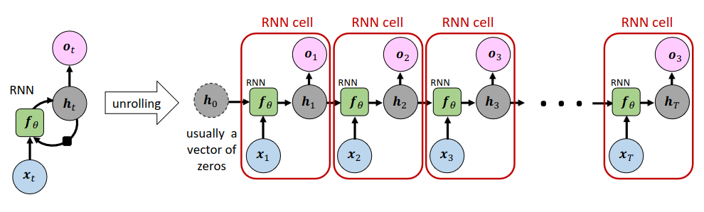

[Aprendizado Profundo](../../../index.md) · [Recurrent Neural Networks (RNNs)](../../index.md) · [Simple RNN (Vanilla RNN)](../index.md)

<!-- wiki:original:inicio -->

# RNN Unroling

Baseado na arquitetura mostrada, podemos escolher que o output da rede seja o **output** de cada passo temporal, ou apenas o **output** do último passo temporal. A primeira abordagem é útil quando queremos prever uma sequência de saídas, enquanto a segunda abordagem é útil quando queremos prever uma única saída baseada em toda a sequência de entradas.

Baseado nisso, conseguimos desenvelopar o parâmetro de tempo da RNN, mostrando como a rede processa cada elemento da sequência ao longo do tempo. Esse processo é conhecido como **unrolling** da RNN, e nos permite visualizar claramente como as informações fluem através da rede em cada passo temporal.

*Figura 42. Desenrolando uma RNN*

<!-- wiki:original:fim -->

## Percurso de estudo

[Trilha: A1](../../../../../trilhas/aprendizado-profundo/a1.md) · [Apresentação e contexto da fonte](../../../../../trilhas/aprendizado-profundo/a1.md#apresentacao-original)

- Anterior: [Arquitetura](../arquitetura/index.md)
- Próximo: [Tipos de mapeamento sequencial](../tipos-de-mapeamento-sequencial/index.md)
