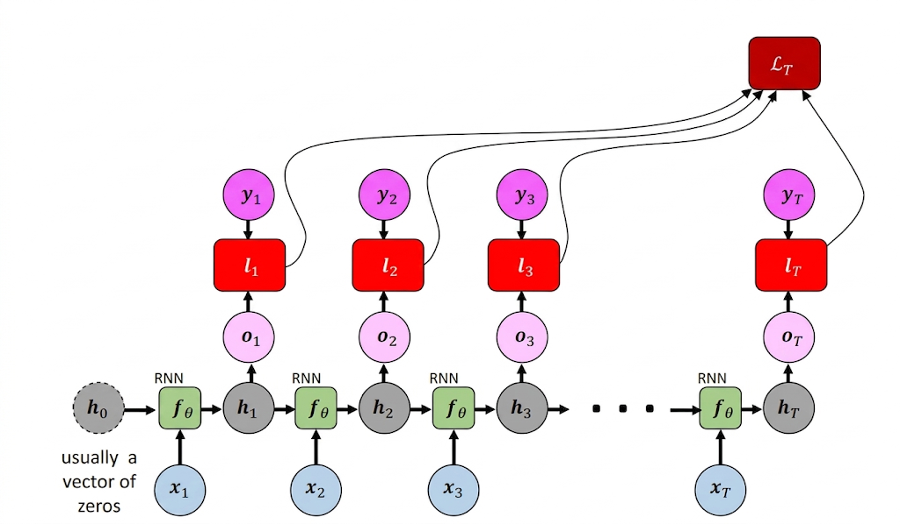
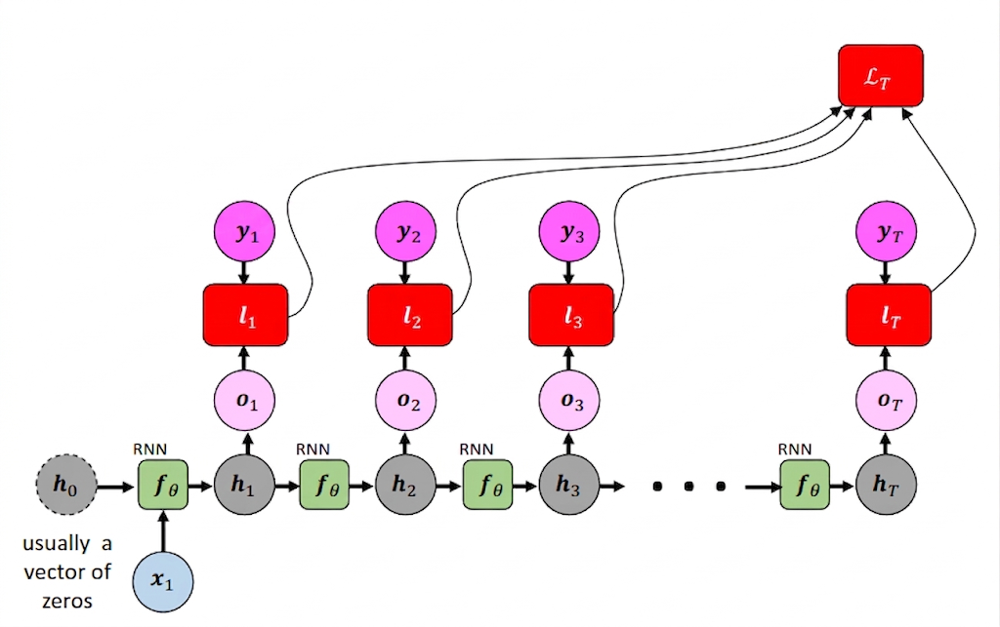

[Aprendizado Profundo](../../../index.md) · [Recurrent Neural Networks (RNNs)](../../index.md) · [Simple RNN (Vanilla RNN)](../index.md)

<!-- wiki:original:inicio -->

# Tipos de mapeamento sequencial

- **Many-to-many**: Existem duas variações, a primeira é quando a entrada e a saída são sequências de comprimentos iguais. Por exemplo, os momentos de um vídeo e a categoria que aquele momento se encaixa (drama, terror, etc.)

  

  *Figura 43. Exemplo de mapeamento many-to-many*

  A segunda variação é quando a entrada e a saída são sequências de comprimentos diferentes. Por exemplo, uma frase em inglês e sua tradução em português.

  

  *Figura 44. Exemplo de mapeamento many-to-many*

- **One-to-many**: Quando o modelo recebe uma única entrada e gera uma sequência de saídas. Por exemplo, uma imagem e a legenda que descreve a imagem.

  

  *Figura 45. Exemplo de mapeamento one-to-many*

- **Many-to-one**: Quando o modelo recebe uma sequência de entradas e gera uma única saída. Por exemplo, uma sequência de palavras e a classificação da sentença.

  

  *Figura 46. Exemplo de mapeamento many-to-one*

<!-- wiki:original:fim -->

## Percurso de estudo

[Trilha: A1](../../../../../trilhas/aprendizado-profundo/a1.md) · [Apresentação e contexto da fonte](../../../../../trilhas/aprendizado-profundo/a1.md#apresentacao-original)

- Anterior: [RNN Unroling](../rnn-unroling/index.md)
- Próximo: [Treinamento e Problemas de Gradiente na RNN](../../treinamento-e-problemas-de-gradiente-na-rnn/index.md)
