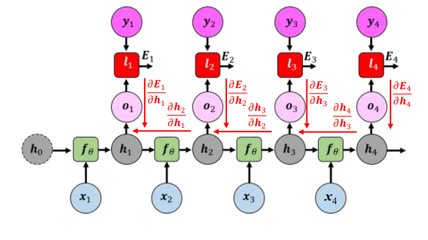

[Aprendizado Profundo](../../../index.md) · [Recurrent Neural Networks (RNNs)](../../index.md) · [Treinamento e Problemas de Gradiente na RNN](../index.md)

<!-- wiki:original:inicio -->

# Backpropagation Through Time (BPTT)

Como cada célula da RNN é uma camada da rede neural, o processo de unrolling da RNN ao longo do tempo cria uma rede profunda, onde cada passo temporal é tratado como uma camada separada com o diferencial que os mesmos parâmetros são usados em todos os passos.

Em uma tarefa com saída de múltiplos passos temporais (many-to-many), o erro global $E$ é acumulado e calculado a cada instante temporal $t$ $$E = \sum_{t = 1}^{T}E_{t}$$

Para atualizar a matriz de pesos compartilhada $W_{hh}$ precisamos calcular a derivada parcial de $E$ em relação a $W_{hh}$. Pela regra da cadeia, o erro $E_{t}$ em um determinado instante $t$ depende não apenas da célula no instante $t$, mas de toda a história de estados ocultos anteriores $h_{k}\ (k \leq t)$ $$\frac{\partial E}{\partial W_{hh}} = \sum_{k = 1}^{T}\frac{\partial E_{t}}{\partial h_{t}}\frac{\partial h_{t}}{\partial h_{k}}\frac{\partial h_{k}}{\partial W_{hh}}$$

As derivadas da esquerda ($\frac{\partial E_{t}}{\partial h_{t}}$) e direita ($\frac{\partial h_{k}}{\partial W_{hh}}$) são fáceis de visualizar pela relação direta que a função derivada tem com o termo da derivação, no entanto, o termo do meio é um pouco mais complexo, mas ele representa **o fluxo do gradiente retropropagado do passo $t$ até o passo $k$** $$\frac{\partial h_{t}}{\partial h_{k}} = \prod_{j = k + 1}^{t}\frac{\partial h_{j}}{\partial h_{j - 1}}$$

*Figura 47. Fluxo do gradiente retropropagado do passo \$t\$ até o passo \$k\$*

<!-- wiki:original:fim -->

## Percurso de estudo

[Trilha: A1](../../../../../trilhas/aprendizado-profundo/a1.md) · [Apresentação e contexto da fonte](../../../../../trilhas/aprendizado-profundo/a1.md#apresentacao-original)

- Anterior: [Treinamento e Problemas de Gradiente na RNN](../index.md)
- Próximo: [A matemática dos gradientes explosivos ou desvanecentes](../a-matematica-dos-gradientes-explosivos-ou-desvanecentes/index.md)
