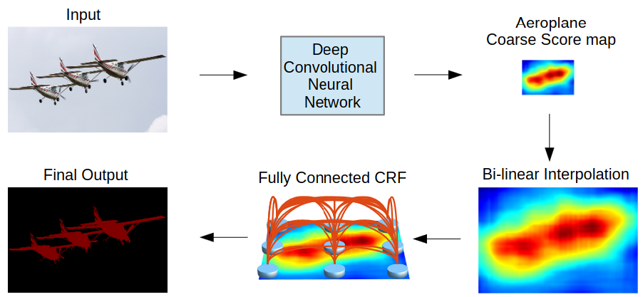

[Aprendizado Profundo](../../../index.md) · [Segmentação Semântica](../../index.md) · [Arquiteturas](../index.md)

<!-- wiki:original:inicio -->

# DeepLab V1 & V2

A DeepLabV1 é uma arquitetura de rede neural convolucional projetada para segmentação semântica, que utiliza **atrous convolution** para aumentar o campo receptivo da rede sem aumentar o número de parâmetros. Ela também utiliza **image pooling** para trazer contexto global da imagem para a rede.

*Figura 21. Arquitetura da DeepLabV1&V2*

Ambas seguem uma arquitetura muito semelhante, diferindo por um único conceito. Na DeepLab V1, passamos a imagem por uma Deep Convolutional Neural Network (DCNN) para extrair features utilizando camadas de Atrous Convolution. Depois, pegamos o score map obtido e aplicamos um processo de **interpolação bilinear** para aumentar a dimensionalidade do score map, e por fim aplicamos o um algoritmo de pós-processamento chamado **Conditional Random Field (CRF)** para refinar a segmentação. Já na DeepLab V2, o processo é o mesmo, mas ao invés de aplicarmos apenas uma Atrous Convolution, aplicamos múltiplas Atrous Convolutions com diferentes **rates** (ASPP).

<!-- wiki:original:fim -->

## Percurso de estudo

[Trilha: A1](../../../../../trilhas/aprendizado-profundo/a1.md) · [Apresentação e contexto da fonte](../../../../../trilhas/aprendizado-profundo/a1.md#apresentacao-original)

- Anterior: [ResUNet](../resunet/index.md)
- Próximo: [PARSENet](../parsenet/index.md)
