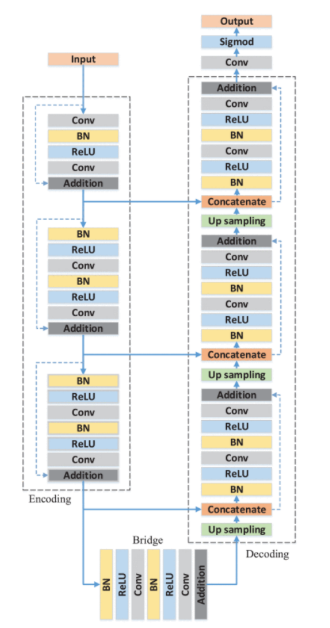

[Aprendizado Profundo](../../../index.md) · [Segmentação Semântica](../../index.md) · [Arquiteturas](../index.md)

<!-- wiki:original:inicio -->

# ResUNet

Na ResUNet, a arquitetura é uma combinação da U-Net com blocos residuais, permitindo que a rede aprenda a diferença entre as features de downsampling e upsampling, melhorando ainda mais a segmentação.

*Figura 19. Arquitetura da ResUNet*

*Figura 20. (a) Bloco padrão da UNet. (b) Bloco residual da ResUNet*

<!-- wiki:original:fim -->

## Percurso de estudo

[Trilha: A1](../../../../../trilhas/aprendizado-profundo/a1.md) · [Apresentação e contexto da fonte](../../../../../trilhas/aprendizado-profundo/a1.md#apresentacao-original)

- Anterior: [U-Net](../u-net/index.md)
- Próximo: [DeepLab V1 & V2](../deeplab-v1-v2/index.md)
