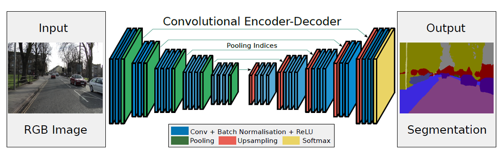

[Aprendizado Profundo](../../../index.md) · [Segmentação Semântica](../../index.md) · [Arquiteturas](../index.md)

<!-- wiki:original:inicio -->

# SegNet

A SegNet é uma arquitetura de rede neural convolucional projetada para segmentação semântica. Ela segue a arquitetura padrão que já demonstramos utilizando do método de max unpooling para realizar upscaling

*Figura 17. Arquitetura da SegNet*

<!-- wiki:original:fim -->

## Percurso de estudo

[Trilha: A1](../../../../../trilhas/aprendizado-profundo/a1.md) · [Apresentação e contexto da fonte](../../../../../trilhas/aprendizado-profundo/a1.md#apresentacao-original)

- Anterior: [Arquiteturas](../index.md)
- Próximo: [U-Net](../u-net/index.md)
