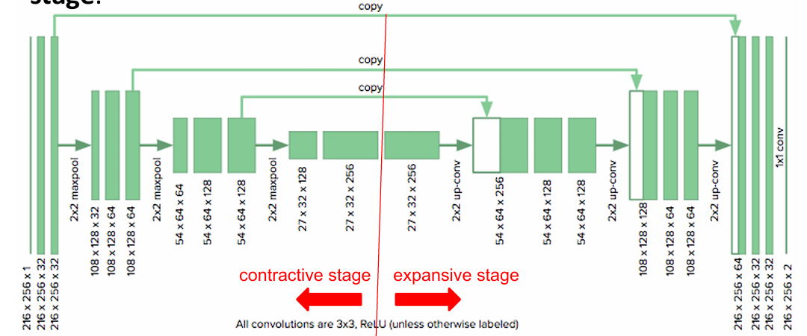

[Aprendizado Profundo](../../../index.md) · [Segmentação Semântica](../../index.md) · [Arquiteturas](../index.md)

<!-- wiki:original:inicio -->

# U-Net

Já na U-Net, a arquitetura é um pouco diferente, ela utiliza **skip connections** para conectar as camadas de downsampling com as camadas de upsampling, permitindo que a rede utilize informações de diferentes níveis de abstração para melhorar a segmentação.

*Figura 18. Arquitetura da U-Net*

Nas camadas de upsampling, a U-Net utiliza **transpose convolution** para aumentar a dimensionalidade das features unida com um **aumento** nos canais das features. Após o transpose convolution, a U-Net concatena as features da camada correspondente de downsampling, permitindo que a rede utilize informações de diferentes níveis de abstração para melhorar a segmentação, como se ela falasse: “depois de reconstruir a imagem, eu obtive o seguinte mapa de feature, mas lá atrás antes de eu ter feito o downsampling, eu tinha obtido o seguinte mapa de feature, então vou juntar os dois para melhorar a segmentação” (por exemplo, se eu tenho uma imagem 32x32 na escala de cinza, com apenas um canal de cor, na hora do último upsampling, a camada logo após a transpose convolution terá 2 canais “de cor”, que seria o mapa obtido pela rede anteriormente e o mapa obtido na camada de upsampling).

<!-- wiki:original:fim -->

## Percurso de estudo

[Trilha: A1](../../../../../trilhas/aprendizado-profundo/a1.md) · [Apresentação e contexto da fonte](../../../../../trilhas/aprendizado-profundo/a1.md#apresentacao-original)

- Anterior: [SegNet](../segnet/index.md)
- Próximo: [ResUNet](../resunet/index.md)
