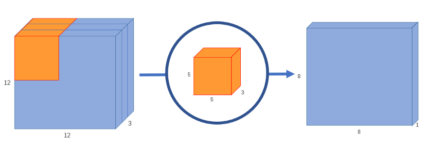
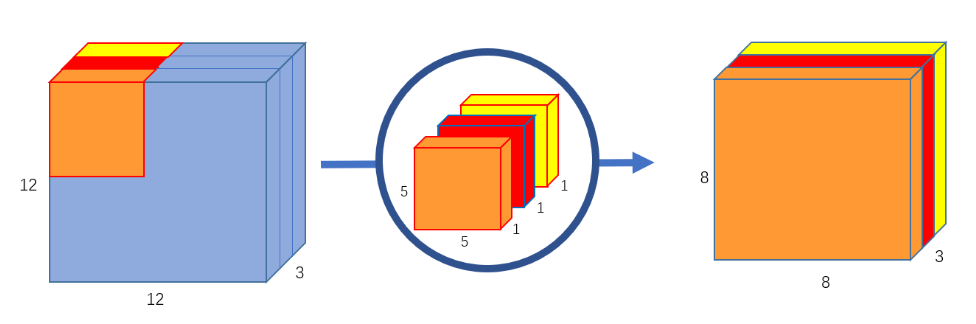
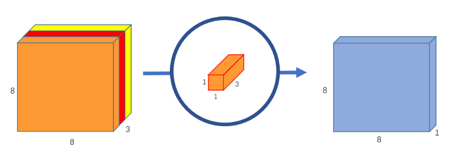
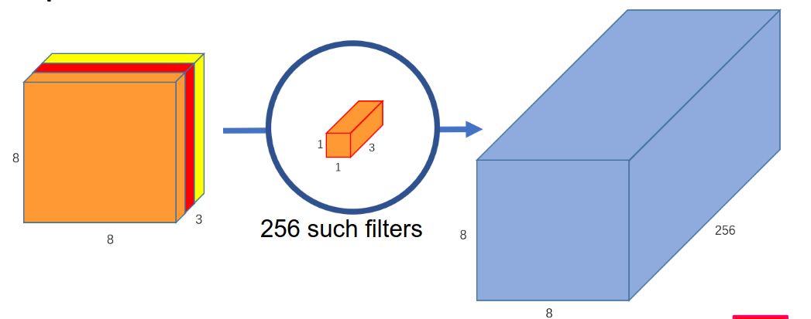

[Aprendizado Profundo](../../../index.md) · [Segmentação Semântica](../../index.md) · [Ferramentas Fundamentais](../index.md)

<!-- wiki:original:inicio -->

# Convoluções Eficientes

Como já discutimos $n$ vezes, as convoluções são operações matemáticas bem caras, e por isso estamos sequer discutindo essas arquiteturas, pois elas são pensadas não somente para a melhor classificação da rede, mas para que possam ser eficientes!

## Atrous Spatial Pyramid Pooling (ASPP)

Esse conceito é bem simples, vimos anteriormente sobre as Atrous Convolution, convoluções espaçadas para obtenção de contexto local da imagem. No entanto, esse passo pode ser tanto benéfico quanto maléfico! Imagine que a feature que queremos identificar é muito grande no conjunto das imagens, se a rate for muito pequena, isso pode prejudicar que os filtros consigam capturar essa feature, e o mesmo vale para features muito pequenas, se a rate for muito grande, isso pode prejudicar que os filtros a visualizem. A ideia do ASPP é justamente utilizar múltiplas rates de atrous convolution, para que possamos capturar features de diferentes tamanhos na imagem, de forma que elas rodem **paralelamente** e depois sejam concatenadas, permitindo que a rede utilize informações de diferentes escalas para melhorar a segmentação.

*Figura 11. Exemplo de atrous spatial pyramid pooling*

## Convolução Normal V.S Separable Convolution & Atrous Separable Convolution

Em uma convolução normal, cada filtro é aplicado a todos os canais da imagem, o que resulta em um grande número de operações. Veja a imagem a seguir, por exemplo

*Figura 12. Exemplo de imagem com 3 canais*

perceba que, ao aplicar o filtro na imagem com 3 canais, toda a informação foi sumarizada em um único canal (assim, se quiséssemos várias feature maps, nós aplicariamos $C$ filtros diferentes para obter $C$ feature maps). Como nosso filtro é $5 \times 5 \times 3$, temos um total de $75$ parâmetros. Como a imagem é de tamanho $12 \times 12$, o filtro vai percorrer a imagem $8 \times 8$ vezes, resultando em um total de $75 \ast 64 = 4800$ operações. Agora imagine o cenário que falei de utilizarmos múltiplos filtros, vamos usar por exemplo $C = 256$

*Figura 13. Exemplo de imagem com 3 canais e 256 filtros*

Nesse exemplo, temos $256$ filtros de tamanho $5 \times 5 \times 3$, resultando em um total de $75 \ast 256 = 19200$ parâmetros. Como a imagem é de tamanho $12 \times 12$, o filtro vai percorrer a imagem $8 \times 8$ vezes, resultando em um total de $19200 \cdot 64 = 1.228.800$ operações. Isso é muito caro computacionalmente, e por isso surgiram as convoluções separáveis.

Agora vamos entender como funciona o processo da **SEPARABLE CONVOLUTION**, ela é divida em 2 etapas, a **depthwise convolution** e a **pointwise convolution**. Na **depthwise convolution**, cada filtro é aplicado a apenas um canal da imagem, resultando em múltiplos feature maps, um para cada canal

*Figura 14. Exemplo de depthwise convolution com 3 canais*

ainda existem os mesmos $75$ parâmetros, já que são $3$ filtros de tamanho $5 \times 5$, mas agora temos $3$ feature maps, um para cada canal. Agora, na **pointwise convolution**, aplicamos um filtro $1 \times 1$ em cada feature map, resultando em múltiplos feature maps, um para cada filtro (no mesmo estilo que o filtro antigo era aplicado na convolução normal)

*Figura 15. Exemplo de pointwise convolution com 3 canais*

Agora temos que nosso número de parâmetros, além dos $75$ do filtro anterior, temos mais esse filtro menor, nos resultando em $78$ parâmetros. O número de multiplicações, na primeira etapa, é $75 \times 8 \times 8 = 4.800$, adicionando com a segunda etapa, temos $4800 + (1 \times 1 \times 3) \times 8 \times 8 = 4.800 + 192 = 4992$. No entanto, para obtermos múltiplos feature maps, vamos utilizar $C = 256$ filtros dos $1 \times 1$ que comentamos, dessa forma:

*Figura 16. Exemplo de pointwise convolution com 3 canais e 256 filtros*

Agora vamos ter que a quantidade de filtros é o filtro inicial mais os $256$ outros filtros, logo: $75 + (1 \times 1 \times 3) \times 256 = 75 + 768 = 843$ parâmetros. E como aumentamos apenas os filtros $1 \times 1$ para obter os nossos $256$ feature maps, o número de multiplicações passa a ser $4800 + (1 \times 1 \times 3) \times (8 \times 8) \times 256 = 4800 + 49152 = 53952$.

Esse conceito pode ser expandido para as convoluções Atrous, de forma que as mudanças necessárias são mínimas, mantendo tracking do rate $r$ conseguimos aplicar o mesmo conceito de **depthwise** e **pointwise** para as convoluções Atrous, resultando em uma redução significativa no número de parâmetros e operações, mantendo a capacidade da rede de capturar informações de diferentes escalas.

<!-- wiki:original:fim -->

## Percurso de estudo

[Trilha: A1](../../../../../trilhas/aprendizado-profundo/a1.md) · [Apresentação e contexto da fonte](../../../../../trilhas/aprendizado-profundo/a1.md#apresentacao-original)

- Anterior: [Mecanismos de Contexto e Campo Receptivo](../mecanismos-de-contexto-e-campo-receptivo/index.md)
- Próximo: [Blocos Residuais](../blocos-residuais/index.md)
