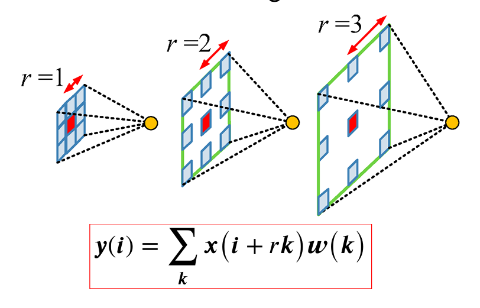

[Aprendizado Profundo](../../../index.md) · [Segmentação Semântica](../../index.md) · [Ferramentas Fundamentais](../index.md)

<!-- wiki:original:inicio -->

# Mecanismos de Contexto e Campo Receptivo

Antes de irmos de fato para as arquiteturas, temos que definir um conceito usado em algumas delas, se não vamos interromper o raciocínio no meio do caminho. O conceito é o de **contexto global**, que basicamente é a ideia de que, para classificar um pixel, precisamos levar em consideração não apenas os pixels vizinhos, mas também os pixels mais distantes da imagem. Só que usar filtros maiores consome mais memória, tempo de processamento e não permite que a rede aprenda a extrair características mais complexas.

## Atrous Convolution

Para resolver esse problema, surgiu a ideia de **atrous convolution**, que é uma técnica que permite aumentar o tamanho do filtro sem aumentar o número de parâmetros da rede nem redimensioná-la. A ideia é inserir “buracos” (ou **holes**) entre os pixels do filtro, permitindo que ele “veja” mais pixels da imagem sem aumentar o número de parâmetros.

**Definição: Atrous Convolution**

Dado um filtro $K$ de tamanho $kxk$, e uma feature map $X$, a **atrous convolution** é definida como $$Y(i,j) = \sum_{m = 0}^{k - 1}\sum_{n = 0}^{k - 1}X(i + r \ast m,j + r \ast n)K(m,n)$$ onde $r$ é o **rate** de atrous convolution, que determina o espaçamento entre os pixels do filtro.

*Figura 9. Exemplo de atrous convolution*

## Image Pooling (Global Average Pooling)

Essa é uma abordagem que permite trazer contexto global da imagem para a rede. Pegamos um feature map e aplicamos um average pooling em toda a imagem, obtendo um vetor de características que representa a imagem como um todo. Esse vetor é então redimensionado através de upsampling e concatenado com o feature map original, permitindo que a rede utilize informações de contexto global para melhorar a segmentação.

*Figura 10. Exemplo de image pooling*

<!-- wiki:original:fim -->

## Percurso de estudo

[Trilha: A1](../../../../../trilhas/aprendizado-profundo/a1.md) · [Apresentação e contexto da fonte](../../../../../trilhas/aprendizado-profundo/a1.md#apresentacao-original)

- Anterior: [Técnicas de Upsampling](../tecnicas-de-upsampling/index.md)
- Próximo: [Convoluções Eficientes](../convolucoes-eficientes/index.md)
