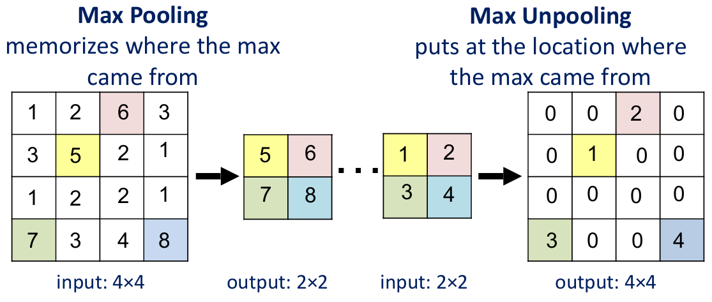
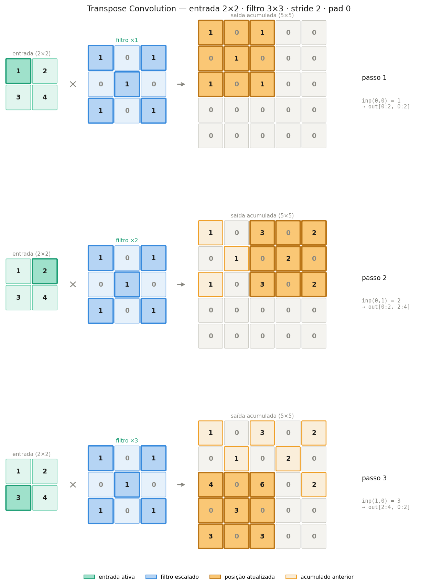

[Aprendizado Profundo](../../../index.md) · [Segmentação Semântica](../../index.md) · [Ferramentas Fundamentais](../index.md)

<!-- wiki:original:inicio -->

# Técnicas de Upsampling

O processo de upsampling é o processo de reconstrução da dimensão original das features internas da rede, que foram reduzidas pelo **downsampling**. Existem diversas técnicas para realizar o upsampling, como o **max unpooling** e a **transpose convolution**, que serão detalhadas a seguir.

## Max Unpooling

Relembrando o que é o **pooling**, ele é uma operação que reduz a dimensionalidade das features internas da rede, geralmente utilizando operações como **max pooling** ou **average pooling**. O **unpooling** é o processo inverso, onde tentamos reconstruir a dimensão original das features a partir das features reduzidas. No entanto, o **unpooling** não é uma operação trivial, pois não temos informações suficientes para reconstruir a dimensão original de forma precisa.

O que acontece é que, **antes** de fazer o **pooling**, nós guardamos os índices dos valores máximos (no caso do **max pooling**), e depois utilizamos esses índices para reconstruir a dimensão original durante o **unpooling**. Essa abordagem é conhecida como **max unpooling**.

*Figura 7. Exemplo de max unpooling*

## Transpose Convolution

A desvantagem do **max unpooling** é que ele depende dos índices dos valores máximos, o que pode limitar a capacidade da rede de aprender representações mais complexas. Uma alternativa é utilizar a **transpose convolution**, também conhecida como **deconvolution**. Essa operação é semelhante à convolução, mas ao invés de reduzir a dimensionalidade das features, ela aumenta.

*Figura 8. Exemplo de transpose convolution*

Como vimos na disciplina de **machine learning**, podemos obter uma matriz de filtro chamada $K_{\text{col}}$ a partir da operação *im2col*, que transforma a imagem em uma matriz de colunas. A **transpose convolution** é basicamente a operação inversa, onde aplicamos a matriz de filtro $K_{\text{col}}$ na matriz obtida anteriormente

Se $X$ é a entrada da convolução e $K$ é o filtro tal que $$Y = X \ast K$$

Já sabemos que $$Y = K_{\text{col }}X_{\text{col }}$$

temos então que a transpose convolution é definida como $$X_{\text{col }} = K_{\text{col}}^{T}Y$$

de tal forma que os $X_{\text{col}}$ são reconstruídos a partir dos $Y$ e do filtro $K_{\text{col}}$ (não de forma perfeita pois há perca de informação na compressão do $X$ para o $Y$, mas o objetivo é que a rede aprenda a reconstruir o $X$ da melhor forma possível)

<!-- wiki:original:fim -->

## Percurso de estudo

[Trilha: A1](../../../../../trilhas/aprendizado-profundo/a1.md) · [Apresentação e contexto da fonte](../../../../../trilhas/aprendizado-profundo/a1.md#apresentacao-original)

- Anterior: [Ferramentas Fundamentais](../index.md)
- Próximo: [Mecanismos de Contexto e Campo Receptivo](../mecanismos-de-contexto-e-campo-receptivo/index.md)
