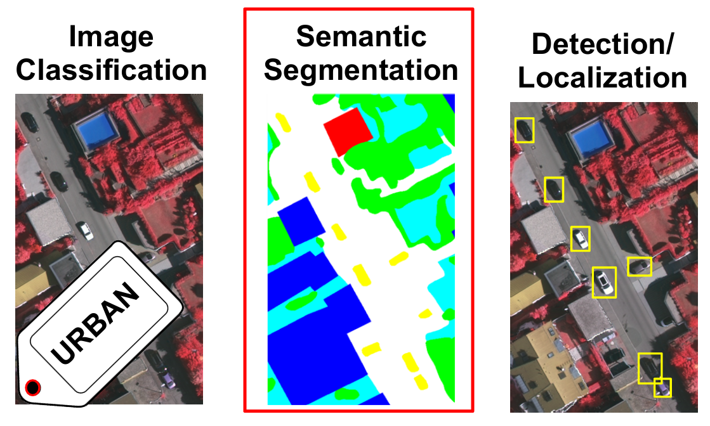
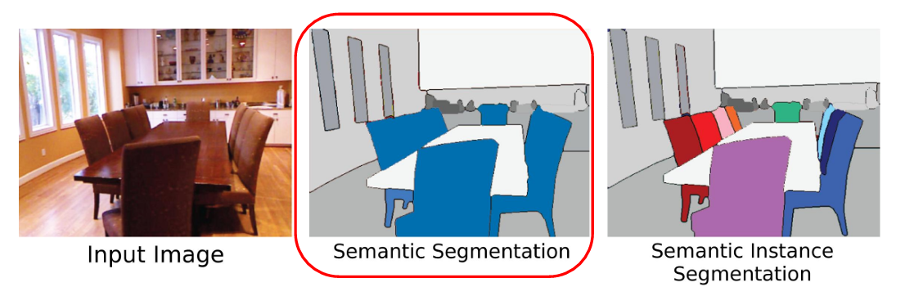

[Aprendizado Profundo](../../index.md) · [Segmentação Semântica](../index.md)

<!-- wiki:original:inicio -->

# Introdução e Métricas

A segmentação semântica é uma tarefa de visão computacional que consiste em classificar cada pixel de uma imagem em uma categoria específica. Essa tarefa é fundamental para diversas aplicações, como direção autônoma, análise médica e realidade aumentada.

*Figura 1. Áreas de visão computacional*

Dentro do contexto de segmentação, vale diferenciar entre segmentação semântica e segmentação de instâncias. A segmentação semântica atribui uma classe a cada pixel, enquanto a segmentação de instâncias não apenas classifica os pixels, mas também distingue entre diferentes objetos da mesma classe.

*Figura 2. Diferença entre segmentação semântica e segmentação de instâncias*

<!-- wiki:original:fim -->

## Tópicos desta página

1. [Métricas de Avaliação](metricas-de-avaliacao/index.md)
2. [Evolução das Abordagens](evolucao-das-abordagens/index.md)

## Percurso de estudo

[Trilha: A1](../../../../trilhas/aprendizado-profundo/a1.md) · [Apresentação e contexto da fonte](../../../../trilhas/aprendizado-profundo/a1.md#apresentacao-original)

- Anterior: [Segmentação Semântica](../index.md)
- Próximo: [Métricas de Avaliação](metricas-de-avaliacao/index.md)
