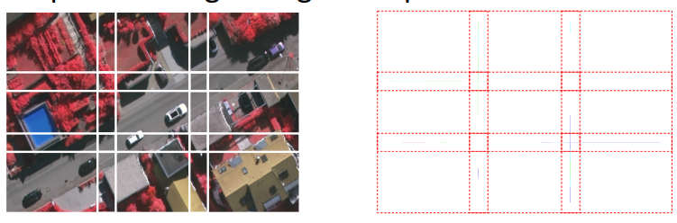

[Aprendizado Profundo](../../../index.md) · [Segmentação Semântica](../../index.md) · [Pontos Práticos](../index.md)

<!-- wiki:original:inicio -->

# A necessidade de Patches (Tiles)

Em aplicações reais, as imagens originais frequentemente possuem resoluções massivas (ex: $(4000 \times 4000$) pixels ou mais). Tentar passar uma imagem desse tamanho inteira por uma rede neural de uma só vez estoura o limite de memória VRAM da GPU.

Por isso, na prática, a imagem é fatiada em blocos menores (**patches** ou **tiles**) para serem processados individualmente durante o treinamento e a inferência, montando-se um **mosaico** com os resultados finais de cada bloco.

*Figura 26. Exemplo de fatiamento de uma imagem em blocos menores*

<!-- wiki:original:fim -->

## Percurso de estudo

[Trilha: A1](../../../../../trilhas/aprendizado-profundo/a1.md) · [Apresentação e contexto da fonte](../../../../../trilhas/aprendizado-profundo/a1.md#apresentacao-original)

- Anterior: [Pontos Práticos](../index.md)
- Próximo: [O Problema do Contexto nas Bordas (Border Context Loss)](../o-problema-do-contexto-nas-bordas-border-context-loss/index.md)
