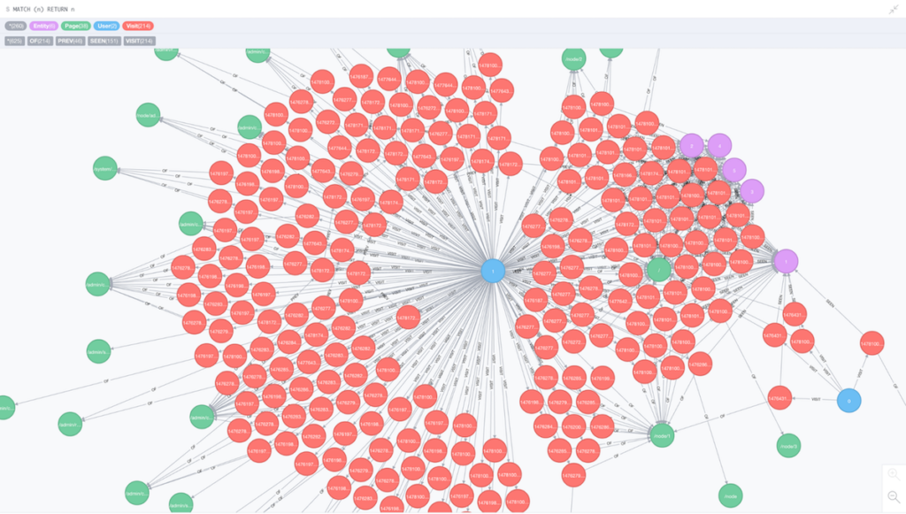
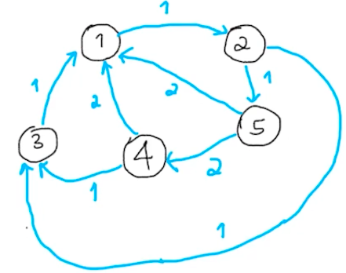
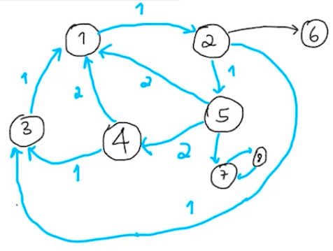

[Ciência de Redes](../index.md)

<!-- wiki:original:inicio -->

# Medidas de Centralidade

------------------------------------------------------------------------

Quando estamos vendo aplicações reais de grafos, é muito comum querermos ver o “quão importante” um nó é no contexto que estamos analisando. Por exemplo, se nosso grafo representa as conexões entre servidores que um pacote pode percorrer, faz muito sentido querermos ver qual o servidor que quase todos os pactes percorrem

Imagine que esse é o grafo que estávamos falando (Não importa o que ele representa de verdade, só finge que é o caso que falamos), então o nó azul tem uma importância MUITO grande, mas como podemos medir isso? Nem sempre o grafo vai ta arrumadinho assim pra gente. Daí que surgem as medidas de Centralidade.

**Definição: Farness/'Lonjura'**

Dado um grafo $G(V,E)$, a farness de um vértice $v_{i}$ é dada por $$L\left( v_{i} \right) ≔ \sum_{v_{i} \neq v_{j} \in V}d\left( v_{i},v_{j} \right)$$ onde $d\left( v_{i},v_{j} \right)$ é o tamanho do menor caminho entre $v_{i}$ e $v_{j}$

Essa medida mede o quão longe o nó está dos outros, de forma que, quanto maior essa medida é, menos importante o meu nó é (Depende do contexto analisado)

**Definição: Closeness/Proximidade**

Dado um grafo $G(V,E)$, a proximidade/closeness do vértice $v_{i} \in V$ é dada por: $$C\left( v_{i} \right) ≔ \frac{\vert V\vert }{L\left( v_{i} \right)}$$ Por convenção, se $v_{i}$ e $v_{j}$ estão em componentes conexas separadas em $G$, então $d\left( v_{i},v_{j} \right) = \infty$, o que torna a definição de antes inútil, então podemos redefinir como: $$C\left( v_{i} \right) ≔ \frac{1}{\vert V\vert }\sum_{v_{i} \neq v_{j} \in V}\frac{1}{d\left( v_{i},v_{j} \right)}$$

**Definição: Betweeness/Intermediação**

Dado um grafo $G(V,E)$ e $P\left( v_{i},v_{j} \right)$ o conjunto de todos os menores caminhos possíveis entre $v_{i}$ e $v_{j}$, então a intermediação de $v_{i}$ é: $$B\left( v_{i} \right) ≔ \sum_{v_{s},v_{t} \in V}\frac{\vert c \in P\left( v_{s},v_{t} \right);v_{i} \in c\vert }{\vert P\left( v_{s},v_{t} \right)\vert }$$

Saindo um pouco dessas definições, vamos tentar pensar em alguma medida mais básica e intuitiva. Uma medida bem padrão que podemos pensar logo de cara é simplesmente o grau do vértice, já que, quanto mais vértices ele se ligar, mais importante ele é! Em muitas literaturas sobre redes o grau do vértice é chamado de **Centralidade de Grau**.

Um outro pensamento que pode surgir a partir desse é: “Poxa, meu vértice tem um grau alto, então ele é importante, mas eu quero valorizar aqueles vértices que se conectam com ele, afinal, se ele é importante, os vértices que estão diretamente ligados nele também são, não é?”, e esse pensamento não está errado! É dessa ideia que surge a centralidade por autovetor. Funciona assim: Vamos inicialmente assumir que todos os nossos vértices $v_{i}$ tem importância $x_{i}^{(0)} = 1$, o que não me é muito útil agora, porém, vamos tentar fazer uma nova estimativa baseada nos vizinhos, que tal a nova centralidade do vértice $v_{i}$ ser a soma da centralidade dos vizinhos? Isso faz com que a importância do $v_{i}$ se baseie no quão importante são seus vizinhos! Eu posso expressar isso com uma fórmula: $$x_{i}^{(1)} = \sum_{j}A_{ij}x_{j}^{(0)}$$ Onde $A$ é minha matriz de adjacência. Se meu nó $v_{i}$ não é vizinho de $v_{j}$, então $A_{ij} = 0$ o que faz com que minha centralidade $x_{j}^{(0)}$ não seja somada. Posso reformular isso de forma matricial: $$x^{(1)} = Ax^{(0)}$$ onde $x^{(k)}$ é o vetor com entradas $x_{i}^{(k)}$. Se fizermos esse processo várias vezes, depois de $k$ passos, vamos ter algo do tipo: $$x^{(k)} = A^{k}x^{(0)}$$ Tomemos a liberdade, então, de escrever $x^{(0)}$ como uma combinação linear dos autovetores $w_{j}$ de $A$ de forma que $$x^{(0)} = \sum_{j = 1}^{n}c_{j}w_{j}$$ Para alguma escolha apropriada de $c_{j}$. Então temos: $$x^{(k)} = A^{k}\sum_{j = 1}^{n}c_{j}w_{j} = \sum_{j = 1}^{n}c_{j}\lambda_{j}w_{j} = \lambda_{1}^{k}\sum_{j = 1}^{n}c_{j}\left( \frac{\lambda_{j}}{\lambda_{1}} \right)^{k}w_{j}$$

De forma que $\lambda_{j}$ são os autovalores de $A$ e $\lambda_{1}$ pode ser, sem perca de generalização, o maior de todos em módulo. Como $\lambda_{i}/\lambda_{1} < 1\ \forall\lambda_{i}\text{ com }i \neq j$, então: $$\lim\limits_{k \rightarrow \infty}\sum_{j = 1}^{n}c_{j}\lambda_{j}^{k}w_{j} = c_{1}\lambda_{1}w_{1}$$

Ou seja, o vetor de centralidades que limita as centralidades que eu fiz antes é proporcional ao autovetor associado ao maior autovalor de $A$, que é equivalente a dizer que o vetor de centralidades $x$ satisfaz: $$Ax = \lambda_{1}x$$

**Definição: Centralidade Autovalor**

Seja $r$ um vetor com as centralidades dos vértices $v_{i}$ de uma rede $G$ de forma que $r_{i} = \text{ centralidade de }v_{i}$, então: $$Ar = \lambda_{1}r$$ onde $\lambda_{1}$ é o maior autovalor de $A$

Agora temos outro problema. Quando temos um grafo dirigido, essa medida de centralidade autovalor já não funciona, já que se um nó não tem nenhuma aresta apontando para ele (Apenas saem arestas dele), ele não terá sequer uma centralidade, e isso afeta não só esse vértice como os vértices que ele aponta, que não terão nenhuma “pontuação” adicionada por serem apontados por esse vértice, e isso não pode ocorrer, já que não faz muito sentido na maioria das aplicações práticas. O que podemos fazer para contornar isso? Então entra a solução a seguir: $$x_{i} = \alpha\sum_{j}A_{ij}x_{j} + \beta$$

Onde $\alpha$ e $\beta$ são constantes positivas. O primeiro termo é a centralidade autovetor que vimos antes, porém o termo $\beta$ garante que os nós que comentei anteriormente (Sem grau de entrada) possuam uma pontuação e possam contribuir para a pontuação dos nós que eles apontam. Essa medida é interessante por conta do termo $\alpha$ que balanceia o termo constante e a medida de centralidade autovetor. Podemos expressar isso de forma matricial: $$x = \alpha Ax + \beta\mathbf{1}$$

Onde $1 = (1,\ldots,1)$. Se rearranjarmos para $x$, obtemos: $$x = {\beta(I - \alpha A)}^{- 1}\mathbf{1}$$

Normalmente colocamos $\beta = 1$ pois não estamos interessados em saber o valor exato das centralidades, mas saber quais vértices são ou não mais ou menos centrais. $$x = - \alpha\left( A - \frac{1}{\alpha}I \right)^{- 1}$$ Perceba que eu quero que $A - \frac{1}{\alpha}I$ seja invertível, e isso acontece quando $\frac{1}{\alpha} \neq \lambda_{j}$ onde $\lambda_{j}$ são os autovalores de $A$. Ou seja, o meu $\alpha$ não é completamente arbitrário, eu vou ter que analisar o contexto da minha aplicação. Porém, muito comumente, se é utilizado $\alpha = \frac{1}{\lambda_{1}}$ com $\lambda_{1}$ sendo o maior autovalor

**Definição: Centralidade de Katz**

Dado uma rede $G(V,E)$ e duas contantes $\alpha,\beta > 0$, o vetor de centralidades de katz de todos os nós em $V$ é: $$K(V) = \beta(I - \alpha A)^{- 1}\mathbb{1}$$ Onde $A$ é a matriz de adjacência de $G$. ($K(V) \in {\mathbb{R}}^{\vert V\vert }$)

Um outro tipo de medida surge quando queremos responder a questão: “Se eu estou navegando entre meus nós, ao longo prazo, qual é o nó que eu mais vou percorrer/parar nele?”. Um exemplo são páginas na internet que referenciam entre si, daí surge o nome da medida: **PageRank**. O que fazemos essencialmente é transformar a rede em uma cadeia de markov. Por exemplo:

*Figura 1. Grafo de Exemplo 1*

Vamos supor que estamos no nó 4 e queremos escolher aleatoriamente entre os nós 3 e 1 para irmos, como podemos ver na distribuição dos pesos (Nesse exemplo, isso indica que a página 4 tem 2 links referenciando a página 1 e apenas 1 link referenciando a página 3), então teríamos: $$\begin{array}{r} {\mathbb{P}}(4 \rightarrow 3) = \frac{1}{3} \\ {\mathbb{P}}(4 \rightarrow 1) = \frac{2}{3} \end{array}$$

E fazemos isso definindo uma matriz estocástica $H$ de tal forma que: $$H_{ij} = \frac{A_{ij}}{\sum_{k}^{n}A_{ik}}$$

Com $A$ sendo a matriz de adjacência. De forma que a soma de todos os elementos de uma coluna dê $1$. Agora que vem o truque interessante. Dado um vetor $p \in {\mathbb{R}}^{n}$ de forma que cada entrada de $p_{i}$ representa a chance de eu ir do nó que eu estou para o nó $v_{i}$ (Ou seja, $p$ tem que ser alguma coluna de $H$), ao fazer a operação: $$Hp$$ Eu estou ponderando as probabilidades de $p$ com os seus respectivos nós, ou seja, $(Hp)_{k}$ representa a probabilidade esperada de que, ao sair do nó $v_{i}$, eu vá para o nó $v_{k}$. Se isso é verdade e, como eu defini antes, eu quero saber qual nó é mais visitado conforme se passa o tempo, faz sentido eu refazer esse processo inúmeras vezes, então eu tenho uma centralidade do vértice $v_{i}$: $$r = \lim\limits_{t \rightarrow \infty}H^{t}p$$

Com $p$ sendo a $i$-ésima coluna de $H$. Porém isso ainda nos trás um problema, veja essa outra rede:

*Figura 2. Grafo de Exemplo 2*

Veja que, por conta do nó 6, eu não posso transformar meu esquema em uma cadeia de markov, pois eu teria uma coluna de 0, e no caso dos nós 7 e 8 eu teria um problema por conta que eles sempre vão um para o outro. Como podemos resolver isso? O PageRank vem para resolver isso. Vamos pensar no caso da internet, você navegador aleatório, uma hora, pode se cansar de estar onde estar, e visitar uma página aleatoriamente dentro da sua rede, e é nessa ideia que trabalhamos em cima.

Definimos um $\alpha \in (0,1)$, onde podemos interpretar $\alpha$ como a chance do meu navegador permanecer no meu nó. Definimos então nossa nova matriz de chances da seguinte forma: $${\mathbb{G}} = \alpha H + (1 - \alpha)C$$ De forma que $C$ é uma matriz $n \times n$ com todas as entradas iguais a $1/n$ para representar um dirigido onde todos os nós apontam para todos os outros nós (Representando a ideia de que eu posso ir para o nó que eu quiser). Porém, há uma propriedade que, se eu tenho uma combinação convexa entre duas matrizes estocásticas/markovianas, então o resultado é uma matriz markoviana. Ou seja, eu ainda posso aplicar a mesma ideia de antes do vetor $p_{0}$ inicial e aplicar o limite, assim, eu vou obter meu vetor de centralidades $r$, de tal forma que $$\lim\limits_{t \rightarrow \infty}{\mathbb{G}}^{t}p_{0} = r$$

**Definição: PageRank**

Sejam a matriz $\mathbb{G}$ como definida anteriormente e o vetor inicial $p_{i}$ sendo a $i$-ésima coluna de $\mathbb{G}$, então o vetor de centralidades PageRank $r$ onde a $k$-ésima entrada é a centralidade de $v_{k}$, então: $$r = \lim\limits_{t \rightarrow \infty}{\mathbb{G}}^{t}p_{0}$$

------------------------------------------------------------------------

<!-- wiki:original:fim -->

## Percurso de estudo

[Trilha: A1](../../../trilhas/ciencia-de-redes/a1.md) · [Apresentação e contexto da fonte](../../../trilhas/ciencia-de-redes/a1.md#apresentacao-original)

- Anterior: [Grafos](../grafos/index.md)
- Próximo: [Redes Aleatórias](../redes-aleatorias/index.md)
