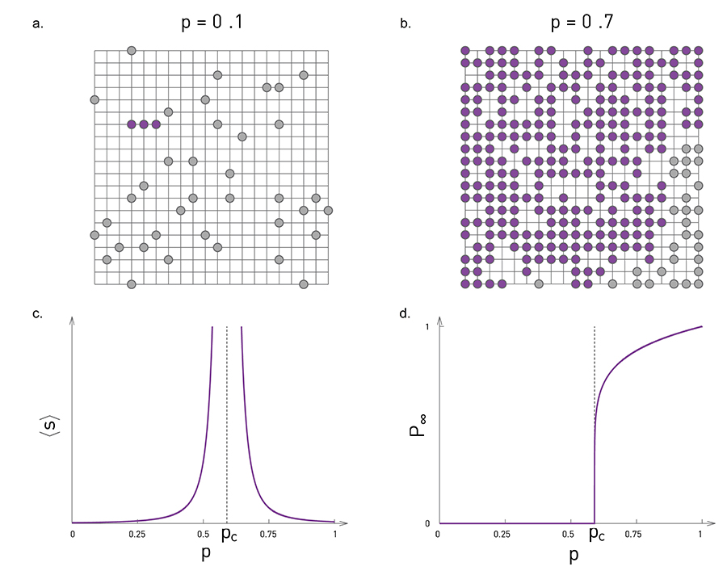

[Ciência de Redes](../../index.md) · [Percolação e Robustez](../index.md)

<!-- wiki:original:inicio -->

# Percolação

Em nosso contexto, vamos definir da seguinte forma. Queremos olhar a **capacidade da rede** de **se manter conexa após perder uma fração de seus nós**. Para começar, não vamos partir para a teoria em si, vamos analisar **um caso específico** primeiro para pegar a noção

*Figura 3. Rede quadrada onde cada cruzamento representa um nó (Pode ou não existir)*

Vamos imaginar um grid onde cada intersecção de linhas é um nó que pode ou não existir com probabilidade $p$ e há uma aresta entre dois nós se eles forem vizinhos. Podemos fazer então duas perguntas:

- Qual o tamanho esperado do maior cluster?

- Qual o tamanho médio dos clusters?

Olhando o gráfico presente na [\[square-lattice\]](#square-lattice), o tamanho médio dos clusters não muda gradativamente de acordo com o valor de $p$, mas ele se explode conforme se aproxima de um valor crítico $p_{c}$. Isso ocorre porque, conforme $p \rightarrow p_{c}$, os pequenos clusters se aglutinam e formam uma componente maior muito grande

Então, de acordo com o observado podemos fazer algumas definições e observações:

- Tamanho médio de clusters:

$${\mathbb{E}}\lbrack S\rbrack \propto \vert p - p_{c}\vert ^{- \gamma_{p}}$$

- Parâmetro de ordem (Probabilidade de um nó selecionado aleatoriamente pertencer ao maior cluster):

$$p_{\infty} \propto \left( p - p_{c} \right)^{\beta_{p}}$$

- Correlação de tamanho (Distância média entre dois nós do mesmo cluster):

$$\xi \propto \vert p - p_{c}\vert ^{- \upsilon}$$

Perceba que, em $p_{c}$, o maior cluster tem tamanho infinito, assim ele cobre todo o quadriculado. $\gamma_{p},\beta_{p}$ e $\upsilon$ são chamados de expoentes críticos e a teoria da percolação diz que eles são universais (Não dependem da natureza do grid, pode ser triangular, hexagonal, enfim)

Agora que entendemos um pouco melhor o comportamento do nosso caso específico, vamos analisar ele como uma rede em si. Imagine que vamos remover uma fração $f$ dos nós da rede antes mencionada. Conforme aumentamos a fração $f$, em algum momento, a componente gigante vai se desfazer e, para algum $f_{c}$, vale que $\forall f > f_{c} \Rightarrow p_{\infty} = 0$, logo, não há mais uma componente gigante

Para redes aleatórias, **sob falhas aleatórias**, compartilham os mesmos expoentes críticos que uma rede de percolação dimensional-infinita: $$\gamma_{p} = 1\text{\quad\quad}\beta_{p} = 1\text{\quad\quad}\upsilon = \frac{1}{2}$$

Já em uma rede livre-de-escala, os expoentes são: $$\beta_{p} = \begin{cases} \frac{1}{3 - \gamma}\text{ se }2 < \gamma < 3 \\ \frac{1}{\gamma - 3}\text{ se }3 < \gamma < 4 \\ 1\text{ se }4 < \gamma \end{cases}\text{\quad\quad}\gamma_{p} = \begin{cases} 1\text{ se }\gamma > 3 \\ - 1\text{ se }2 < \gamma < 3 \end{cases}$$

Perceba que no regime $2 < \gamma < 3$ **sempre há uma componente gigante**. Temos também a relação da **quantidade de componentes de tamanho $s$** ($n_{s}$) $$n_{s} \propto s^{- \tau}e^{- s/s^{\ast}}$$ $$s^{\ast} \propto \vert p - p_{c}\vert ^{- \sigma}$$ $$\tau = \begin{cases} \frac{5}{2}\text{ se }\gamma > 4 \\ \frac{2\gamma - 3}{\gamma - 2}\text{ se }2 < \gamma < 4 \end{cases}$$ $$\sigma = \begin{cases} \frac{3 - \gamma}{\gamma - 2}\text{ se }2 < \gamma < 3 \\ \frac{\gamma - 3}{\gamma - 2}\text{ se }3 < \gamma < 4 \\ \frac{1}{2}\text{ se }\gamma > 4 \end{cases}$$

<!-- wiki:original:fim -->

## Percurso de estudo

[Trilha: A2](../../../../trilhas/ciencia-de-redes/a2.md) · [Apresentação e contexto da fonte](../../../../trilhas/ciencia-de-redes/a2.md#apresentacao-original)

- Anterior: [Percolação e Robustez](../index.md)
- Próximo: [Robustez](../robustez/index.md)
