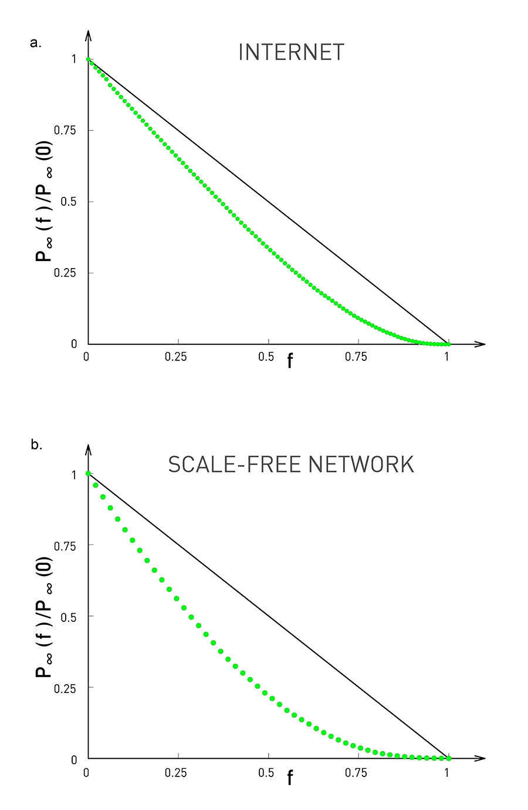

[Ciência de Redes](../../index.md) · [Percolação e Robustez](../index.md)

<!-- wiki:original:inicio -->

# Robustez

Vimos um exemplo específico com redes quadriculadas, mas e se não seguirmos esse padrão? O que fazemos? Na verdade a ideia é bem parecida! Isso nos vai revelar um comportamento muito interessante sobre as redes livre-de-escala.

*Figura 4. Comparação do tamanho relativo de uma rede livre-de-escala qualquer e da rede de internet conforme removemos uma fração **aleatória** $f$ de seus nós*

Os gráficos acima indicam uma resistência muito forte das redes livre-de-escala contra falhas aleatórias dentro da mesma. Será que podemos encontrar um meio matemático de entender o porquê que isso acontece?

<!-- wiki:original:fim -->

## Percurso de estudo

[Trilha: A2](../../../../trilhas/ciencia-de-redes/a2.md) · [Apresentação e contexto da fonte](../../../../trilhas/ciencia-de-redes/a2.md#apresentacao-original)

- Anterior: [Percolação](../percolacao/index.md)
- Próximo: [Critério de Molloy-Reed](../criterio-de-molloy-reed/index.md)
