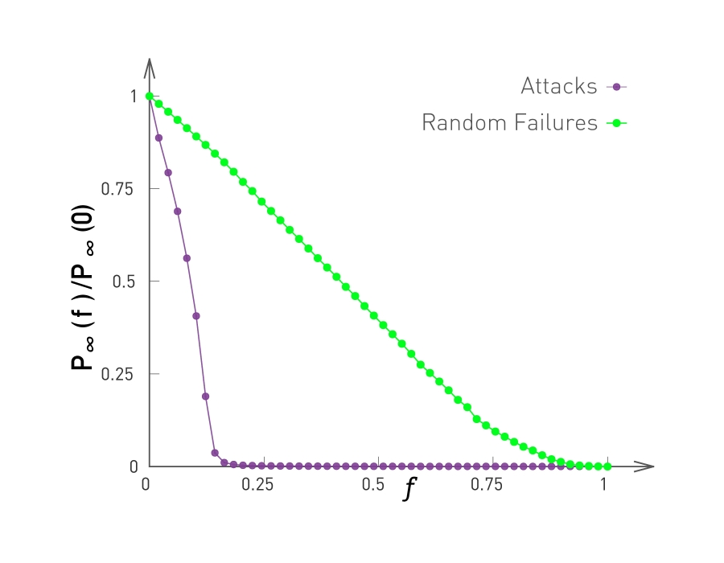

[Ciência de Redes](../../index.md) · [Percolação e Robustez](../index.md)

<!-- wiki:original:inicio -->

# Tolerância a Ataques

Até agora, vimos apenas falhas aleatórias, na rede de internet, por exemplo, se alguns roteadores falharem aleatoriamente, a rede tem estrutura suficiente para se manter, porém, e se um ataque planejado for feito e derrubar todos os pontos com maiores conexões? Esse é o contexto que vamos analisar, em vez de retirarmos nós aleatoriamente, vamos retirar sempre os nós com **maior grau**

*Figura 5. Tamanho relativo do maior cluster conforme retiramos os nós seguindo o regime de falhas aleatórias e de ataques em uma rede **livre-de-escala***

Perceba que, para redes livre-de-escala, elas são **muito** mais sucetíveis a ataques direcionados. O que faz bastante sentido, já que a presença de hubs é muito marcante nesse tipo de rede.

Agora a gente gostaria de entender como que a remoção dos hubs afeta a rede e o limite para que ela colapse. Para entender isso, devemos saber que remover um hub afeta a rede de duas formas:

- Muda o grau máximo de $k_{\text{max}}$ para $k'_{\text{max}}$

- A distribuição de graus muda de $p_{k}$ para $p'_{k}'$

Lembrando que, para o problema das redes livre-de-escala, temos: $$\begin{array}{r} p_{k} = ck^{- \gamma} \\ k \in \left\{ k_{\text{min}},\ldots,k_{\text{max}} \right\} \\ c \approx \frac{\gamma - 1}{k_{\text{min}}^{- \gamma + 1} - k_{\text{max}}^{- \gamma + 1}} \end{array}$$

Após removermos a fração $f$ de nós, temos que: $$\begin{aligned} f & = {\int_{k'_{\max}}^{k}}_{\max}p_{k}dk \\ & = (\gamma - 1)k_{\text{min}}^{\gamma - 1}{\int_{k'_{\max}}^{k}}_{\max}k^{- \gamma}dk \\ & = (\gamma - 1)k_{\text{min}}^{\gamma - 1}\left\lbrack \frac{k^{1 - \gamma}}{1 - \gamma} \right\rbrack_{k'_{\text{max}}}^{k_{\text{max}}} \\ & = k_{\text{min}}^{\gamma - 1}\left( k'_{\text{max}}^{1 - \gamma} - k_{\text{max}}^{1 - \gamma} \right) \end{aligned}$$

Normalmente em redes livre-de-escala, o cutoff natural é MUITO grande ($k_{\text{max }} \gg k'_{\text{max}}$), ou seja, o termo $k_{\text{max}}^{1 - \gamma}$ é desprezível, logo, a expressão se torna: $$f \approx \left( k\frac{'_{\max}}{k_{\min}} \right)^{1 - \gamma}$$

Então chegamos na relação: $$k'_{\max} \approx k_{\min}f^{\frac{1}{1 - \gamma}}$$

Agora vamos olhar para a segunda consequência, que é a alteração da distribuição dos graus da rede. Na absência da correlação entre os nós, vamos assumir que os links dos hubs se ligam aleatoriamente entre si. Vamos agora tentar encontrar a fração de **links** removidos da rede: $$\begin{aligned} \widetilde{f} & = \frac{\int_{k'_{\max}}^{k_{\max}}kp_{k}dk}{{\mathbb{E}}\lbrack K\rbrack} \\ & = \frac{c}{\mathbb{E}}\lbrack K\rbrack\int_{k'_{\max}}^{k_{\max}}k^{- \gamma + 1}dk \\ & = \frac{1}{\mathbb{E}}\lbrack K\rbrack \cdot \frac{1 - \gamma}{2 - \gamma} \cdot \frac{k'_{\max}^{- \gamma + 2} - k_{\max}^{- \gamma + 2}}{k_{\min}^{- \gamma + 1} - k_{\max}^{- \gamma + 2}} \end{aligned}$$

Como sabemos que o cutoff natural costuma ser muito maior, então podemos ignorar $k_{\max}$ e, usando o fato que: $${\mathbb{E}}\lbrack K\rbrack \approx \frac{\gamma - 1}{\gamma - 2}k_{\min}$$ vamos obter que: $$\widetilde{f} \approx \left( k\frac{'_{\max}}{k_{\min}} \right)^{- \gamma + 2}$$ e assim, juntando com a equação [\[finding-the-cutoff\]](#finding-the-cutoff), vamos obter que: $$\widetilde{f} \approx f^{\frac{2 - \gamma}{1 - \gamma}}$$ O que essa fração nos diz? Conforme $\gamma \rightarrow 2$, temos que $\widetilde{f} \rightarrow 1$, ou seja, em redes que $\gamma \approx 2$, remover uma pequena parte dos hubs já remove quase todas as arestas (O que é compatível com a teoria vista no último resumo).

Agora vamos encontrar a nova distribuição dos graus! Usando o mesmo raciocínio visto para as falhas aleatórias, vamos assumir que $K$ é a variável aleatória de um nó selecionado aleatoriamente antes de remover a fração $f$ e $K'$ após remover a fração de vértices. Sabemos que, dado que eu selecionei um vértice que tem $K = k$, ele possui exatamente $k$ vizinhos, e depois da remoção dos vértices, cada um dos vértices vizinhos ao que escolhi **pode** ou **não** sobreviver e não ser removidos (com probabilidade $1 - \widetilde{f}$), logo, temos uma soma de $k$ variáveis de bernoulli que representam quantos vizinhos meu nó tem após o ataque na rede: $$\begin{aligned} & {\mathbb{P}}(K' = k'\vert K = k) = \begin{pmatrix} k \\ k' \end{pmatrix}{\widetilde{f}}^{k - k'}\left( 1 - \widetilde{f} \right)^{k'} \\ & \Rightarrow {\mathbb{P}}(K' = k') = \sum_{k' = k_{\min}}^{k'_{\max}}{\mathbb{P}}(K = k)\begin{pmatrix} k \\ k' \end{pmatrix}{\widetilde{f}}^{k - k'}\left( 1 - \widetilde{f} \right)^{k'} \end{aligned}$$

Agora que eu tenho essas informações, posso tentar achar o critério de Molloy-Reed da rede: $$\kappa = {\mathbb{E}}\frac{\left\lbrack K^{2} \right\rbrack}{\mathbb{E}}\lbrack K\rbrack = \frac{2 - \gamma}{3 - \gamma}k_{\min}\left( \frac{f^{\frac{3 - \gamma}{1 - \gamma} - 1}}{f^{\frac{2 - \gamma}{1 - \gamma} - 1}} \right)$$

Então consegumos chegar no limiar crítico da fração de nós $$f_{c}^{\frac{2 - \gamma}{1 - \gamma}} = 2 + \frac{2 - \gamma}{3 - \gamma}k_{\min}\left( f_{c}^{\frac{3 - \gamma}{1 - \gamma} - 1} \right)$$

Perceba que, se $\gamma \rightarrow \infty$, então $f_{c} \rightarrow 1 - \frac{1}{k_{\min} - 1}$

<!-- wiki:original:fim -->

## Percurso de estudo

[Trilha: A2](../../../../trilhas/ciencia-de-redes/a2.md) · [Apresentação e contexto da fonte](../../../../trilhas/ciencia-de-redes/a2.md#apresentacao-original)

- Anterior: [Limite Crítico](../limite-critico/index.md)
- Próximo: [Melhorando a Robustez](../melhorando-a-robustez/index.md)
