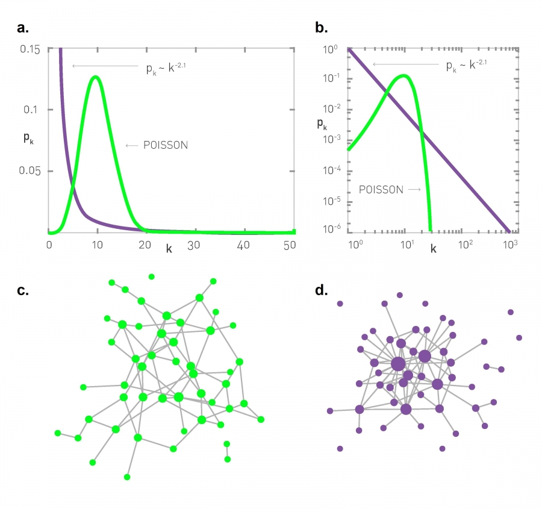

[Ciência de Redes](../../index.md) · [Redes Livres de Escala](../index.md)

<!-- wiki:original:inicio -->

# Centros

Vamos analisar a seguinte imagem:

*Figura 8. Distribuição de Poisson e Distribuição de Potência*

A gente pode analisar em 3 pontos principais:

- Antes de $\hat{k}$ a rede livre de escala é maior, ou seja, há mais nós com grau pequeno nela do que na poisson

- Na vizinhança de $\hat{k}$, a poisson é maior, logo, existe um excesso de nós com grau $\hat{k}$ na rede Poisson

- Depois a rede livre de escala volta a ser maior

Isso significa que, em redes livre de escala, temos altas chances, ou de obter **um nó com grau muito grande (Hub)** ou obter vários nós com grau pequeno

## Maior Centro

Também chamados de **hubs**, são os nós mais centrais, aqueles que representam uma maior importância dependendo do contexto, aqui, sendo aqueles com o maior grau. Podemos querer saber como eles se comportam nessas redes livres de escala! Para isso, temos que calcular qual é o maior grau da distribuição $k_{\text{max}}$, também chamado de corte natural da distribuição. Representa o tamanho esperado do maior hub. Antes de partir para o caso complicado geral de $p(k) = Ck^{- \gamma}$, vamos primeiro fazer um caso mais simples, vamos fazer para a **exponencial**: $$p(k) = Ce^{- \lambda k}$$ Para uma rede com grau mínimo $k_{\min}$, temos que a normalização vai ficar: $$\int_{k_{\min}}^{\infty}p(k)dk = 1 \Rightarrow C = \lambda e^{\lambda k_{\min}}$$ Agora, para saber $k_{\max}$, fazemos o mesmo processo que vimos antes, vamos supor que, em uma rede com $N$ nós, o valor esperado do grau para o regime $\left( k_{\max},\infty \right)$ seja $1$, ou seja: $$\begin{array}{r} {\mathbb{E}}\left\lbrack K\vert k > k_{\max} \right\rbrack = 1 \Rightarrow N \cdot {\mathbb{P}}(K \geq k_{\max}) = 1 \\ \Leftrightarrow \int_{k_{\max}}^{\infty}p(k)dk = \frac{1}{N} \end{array}$$

Resolvendo a integral, vamos obter: $$k_{\max} = k_{\min} + \frac{\ln(N)}{\lambda}$$

Essa equação nos indica algo interessante. $\ln(N)$ é uma função que cresce devagar conforme $N \rightarrow \infty$, já que a sua derivada tende a $0$, então quanto maior o $N$, mais devagar a função vai crescer. Ou seja, isso indica que, conforme o $N$ cresce, o grau máximo e mínimo não diferem tanto!

Esse cálculo pra distribuição de Poisson é um pouquinho mais evoluído, mas a gente chega que o resultado é muito parecido e que $N$ cresce mais lentamente ainda

Agora, para as redes livre de escala, resolvendo [\[kmin-and-kmax-equation\]](#kmin-and-kmax-equation), a gente obtém: $$k_{\max} = k_{\min} \cdot N^{\frac{1}{\gamma - 1}}$$

Ou seja, quanto maior é minha rede, maior vai ser o tamanho do meu centro (Maior é o grau do nó com mais graus). Isso é um resultado bem intuitivo, na verdade! Lembra que nós começamos dando o contexto da rede da internet (WWW)? Se pararmos para pensar, conforme as pessoas criam páginas na internet, elas tendem a colocar links para páginas famosas na internet, ou que tem alguma relevância em **comunidades**, ou seja, quanto mais links referenciando uma página, mais páginas vão referenciar ela, de forma que, quanto mais páginas vão sendo criadas, maior vai ser a quantidade de links referenciando páginas famosas ou reconhecidas!

<!-- wiki:original:fim -->

## Percurso de estudo

[Trilha: A1](../../../../trilhas/ciencia-de-redes/a1.md) · [Apresentação e contexto da fonte](../../../../trilhas/ciencia-de-redes/a1.md#apresentacao-original)

- Anterior: [Formalismo Discreto](../formalismo-discreto/index.md)
- Próximo: [Significado de Livre de Escala](../significado-de-livre-de-escala/index.md)
