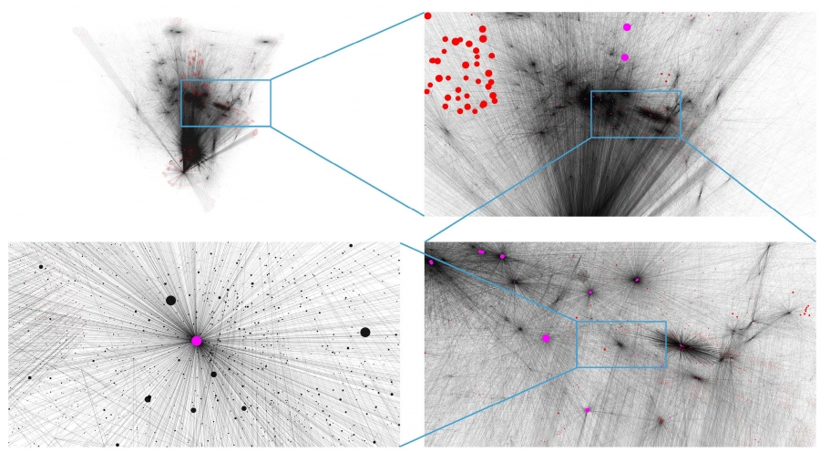
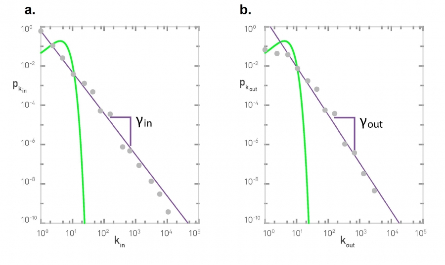

[Ciência de Redes](../index.md)

<!-- wiki:original:inicio -->

# Redes Livres de Escala

------------------------------------------------------------------------

São as redes geradas após um processo de **Anexação Preferencial**. Um grande exemplo é a rede da internet (WWW). Quando olhamos ela de relance, ela aparenta ser uma rede aleatória, porém, é notável que certos nós ficam agrupados em regiões com outros nós de grau **muito grande**. Veja essa representação em rede dos documentos da Internet gerada por Hawoong Jeong na Universidade de Notre-Dame

*Figura 6. Rede WWW*

Se a rede WWW fosse uma rede aleatória, os graus teriam uma distribuição Poisson, porém, como a imagem a seguir mostra, isso não ocorre:

*Figura 7. Distribuição dos graus em Log-Log*

Como podemos ver, os graus, no gráfico log-log, são bem aproximados por uma reta. Isso é um indicativo de que a sua distribuição é algo parecido com: $${\mathbb{P}}(K = k) = k^{- \gamma}$$

Isso é chamado de **Distribuição de Lei de Potência**, e $\gamma$ é o **expoente do grau**. A internet é uma rede direcionada, então todo documento tem um grau de entrada e de saída. Com esse contexto em mente, podemos finalmente definir:

**Definição: Redes livres de Escala**

Uma rede é dita livre de escala quando a distribuição do grau de seus vértices segue uma forma exponencial

<!-- wiki:original:fim -->

## Tópicos desta página

1. [Formalismo Discreto](formalismo-discreto/index.md)
2. [Centros](centros/index.md)
3. [Significado de Livre de Escala](significado-de-livre-de-escala/index.md)
4. [Propriedade *Ultra Small*](propriedade-ultra-small/index.md)
5. [O Papél do Expoente do Grau](o-papel-do-expoente-do-grau/index.md)

## Percurso de estudo

[Trilha: A1](../../../trilhas/ciencia-de-redes/a1.md) · [Apresentação e contexto da fonte](../../../trilhas/ciencia-de-redes/a1.md#apresentacao-original)

- Anterior: [Anexação Preferencial](../evolucoes-de-redes/anexacao-preferencial/index.md)
- Próximo: [Formalismo Discreto](formalismo-discreto/index.md)
